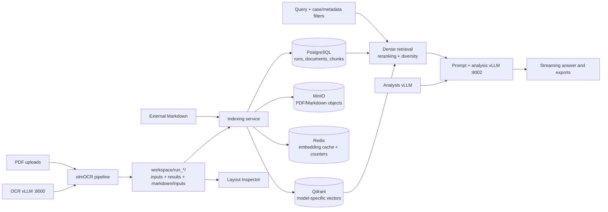

# KIRAG: PDF OCR and medicolegal RAG workstation

KIRAG is a local-first workstation for converting PDFs to Markdown with an
olmOCR-compatible vision model, indexing the extracted text, and analysing it
with a retrieval-augmented language model. The recommended single-machine
deployment keeps dedicated OCR and analysis vLLM engines continuously resident
and supervises infrastructure, FastAPI, and the production Next.js frontend
with systemd. The Gradio interface is branded **IQ-RAG Client** and remains
available as an interactive workstation mode.

The current application version is **2.0.3**. The version, supported inference
models, context limits, and runtime defaults are defined in
[`settings_manager.py`](settings_manager.py), not in this document.

> KIRAG assists review; it does not replace source-document verification or
> professional judgement. Metadata extraction, retrieval, and model output can
> be incomplete or wrong.

For the practitioner workflow, provenance rules, and case-management guidance,
see [`medicolegal_rag_guide.md`](medicolegal_rag_guide.md).

## What is implemented

- Layout-aware PDF-to-Markdown OCR through `python -m olmocr.pipeline` and an
  OpenAI-compatible vLLM endpoint.
- Six-view Gradio UI: Ingestion Pipeline, Layout Inspector, Embedding Pipeline,
  Case Dashboard, RAG Processing, and System Diagnostics.
- Alternative six-view Next.js frontend backed by the FastAPI API.
- Medicolegal-aware character chunking with heuristic extraction of dates,
  authors, document types, section types, patient names, and PDF page spans.
- Sentence-Transformer embeddings, model-specific Qdrant collections, optional
  Cross-Encoder reranking, and MMR-style diversity ranking.
- PostgreSQL registry, Redis caches, MinIO object storage, and Qdrant vector
  storage managed by Docker Compose.
- A reliable single-machine profile with digest-pinned containers, immutable
  offline model snapshots, dedicated OCR and analysis vLLM services, ordered
  health-gated startup, systemd restart supervision, readiness probes, and
  bounded log rotation.
- Twelve chat modes: General Knowledge (without document retrieval); Free Q&A;
  Expert; Judge; Timeline; Injury Summary; Inconsistency Finder; Medication
  Tracker; Causation; Prognosis; Work Capacity; and Treatment Planning.
- Markdown, text, timeline CSV, analysis DOCX, and timeline DOCX exports.
- REST API, headless CLI, diagnostics, reconciliation reporting, and managed
  vLLM/container lifecycle operations.

## Architecture and data flow



The primary implementation boundaries are:

| Area | Source |
|---|---|
| Gradio application and callbacks | [`app.py`](app.py), [`app_handlers.py`](app_handlers.py), [`rag_ui.py`](rag_ui.py), [`embedding_pipeline_ui.py`](embedding_pipeline_ui.py) |
| OCR process orchestration | [`pipeline_manager.py`](pipeline_manager.py), [`pdf_manager.py`](pdf_manager.py) |
| Indexing transaction and object archival | [`indexing_service.py`](indexing_service.py) |
| RAG core | [`rag/`](rag/) |
| Infrastructure lifecycle | [`rag_infra_manager.py`](rag_infra_manager.py), [`docker-compose.rag.yml`](docker-compose.rag.yml) |
| vLLM lifecycle and policy | [`docker_manager.py`](docker_manager.py) |
| Production supervision | [`docker-compose.production.yml`](docker-compose.production.yml), [`deploy/systemd/`](deploy/systemd/), [`scripts/install-systemd-services.sh`](scripts/install-systemd-services.sh) |
| Runtime resilience and logging | [`rag/upstream.py`](rag/upstream.py), [`runtime_logging.py`](runtime_logging.py) |
| REST API | [`api/main.py`](api/main.py), [`api/routes/`](api/routes/) |
| CLI | [`cli.py`](cli.py) |
| Next.js frontend and server-side API proxy | [`frontend/`](frontend/) |
| Configuration and secrets | [`settings_manager.py`](settings_manager.py), [`secrets_config.py`](secrets_config.py), [`.env.example`](.env.example) |

## Prerequisites

- Python **3.10 or newer**. The reproducible lock files target Python 3.12 on
  Linux x86_64.
- Docker Engine with the `docker compose` plugin for the RAG services.
- An NVIDIA GPU, compatible driver, and NVIDIA Container Toolkit to use the
  managed vLLM OCR/analysis containers (`docker run --gpus all`). A CPU Python
  environment can run tests and CPU embeddings, but it does not make the
  managed vLLM container CPU-compatible.
- Node.js/npm compatible with Next.js 16 if using the alternative frontend.
- systemd on Linux for supervised production operation without boot autostart.
- Sufficient storage for model weights and the persistent `workspace/` data.

The supplied production defaults were validated on a 128 GiB NVIDIA GB10
unified-memory host. Other GPUs require measured OCR/analysis memory sizing;
do not assume that both default models fit on smaller hardware.

PDF rendering is performed by `pypdfium2`; Poppler is not a project runtime
requirement.

## Installation

Create a virtual environment inside or outside the checkout. For the pinned
Linux x86_64 environments:

```bash
python3.12 -m venv .venv
source .venv/bin/activate
python -m pip install --upgrade pip
```

CPU-only Python environment:

```bash
python -m pip install --require-hashes -r requirements-cpu.lock
python -m pip install --no-deps .
```

CUDA environment:

```bash
python -m pip install --require-hashes -r requirements-cuda.lock
python -m pip install --no-deps .
```

For an unpinned supported-platform install, use `python -m pip install .`.
The package installs the `kirag` console command. The lock files are generated
from `pyproject.toml` plus `requirements-cpu.in` or `requirements-cuda.in` by
[`scripts/compile-locks.sh`](scripts/compile-locks.sh).

## Configuration

Copy the environment template and replace every placeholder used by your
deployment:

```bash
cp .env.example .env
```

At minimum, review:

| Variable | Purpose |
|---|---|
| `HF_TOKEN` | Access to gated Hugging Face models; not required for public models already cached |
| `OLMOCR_PG_PASS` | PostgreSQL password used by both the app and Compose |
| `OLMOCR_MINIO_ACCESS_KEY` / `OLMOCR_MINIO_SECRET_KEY` | MinIO credentials used by both the app and Compose |
| `OLMOCR_VLLM_IMAGE` | Immutable `repository@sha256:<digest>` vLLM image |
| `KIRAG_HF_HOME` | Absolute Hugging Face home; model repositories are stored under its `hub/` child |
| `KIRAG_OCR_MODEL` / `KIRAG_OCR_MODEL_REVISION` | OCR model and immutable 40-character commit |
| `KIRAG_ANALYSIS_MODEL` / `KIRAG_ANALYSIS_MODEL_REVISION` | Analysis model and immutable 40-character commit |
| `KIRAG_OCR_SERVER_URL` / `KIRAG_ANALYSIS_SERVER_URL` | Independent OpenAI-compatible endpoints, normally ports 8000 and 8002 |
| `KIRAG_*_GPU_MEMORY_UTILIZATION` | Per-role vLLM high-water marks; these are not additive reservations |
| `KIRAG_LOG_DIR` | Absolute application log directory; production requires `<checkout>/logs` |
| `KIRAG_API_KEY` | General REST API credential |
| `KIRAG_ADMIN_API_KEY` | Separate credential for administrative REST operations |
| `KIRAG_ENABLE_REMOTE_LIFECYCLE` | Keep `false` in production so only host operators control services |
| `KIRAG_ENABLE_APP_SHUTDOWN` | Set `true` to enable the confirmed UI/API control that stops KIRAG services and containers without powering off the host |
| `KIRAG_GRADIO_USERNAME` / `KIRAG_GRADIO_PASSWORD` | Required together before Gradio may bind beyond loopback |
| `KIRAG_API_URL` | FastAPI origin used by the Next.js server-side proxy |
| `KIRAG_SETTINGS_FILE` | Optional absolute mutable-settings path; production should place it beneath the writable workspace |
| `KIRAG_MAX_*` | PDF and Markdown upload count/per-file/aggregate limits |

`.env` and `.env.*` are ignored except example files. `settings.json` is the
application's persistent UI/CLI settings file and is tracked in this checkout;
the Gradio UI can save a Hugging Face token into it. Do not save a real token
there in a shared checkout or commit one. Supervised deployments should set
`KIRAG_SETTINGS_FILE` to a protected path beneath `workspace/` so atomic saves
remain compatible with the systemd filesystem sandbox. Environment values take precedence
where the relevant code explicitly reads them.

Interactive-workstation defaults include:

- OCR model: `allenai/olmOCR-2-7B-1025-FP8`
- Analysis model: legacy interactive default `nvidia/Phi-4-reasoning-plus-NVFP4`
- vLLM URL: `http://localhost:8000/v1`
- Embedding model: `BAAI/bge-large-en-v1.5`
- Embedding device: `auto` (CUDA when available, otherwise CPU)
- Chunk size/overlap: 800/100 **characters**
- Retrieval Top-K: 15 in code defaults (a saved `settings.json` value overrides it)
- Reranker: `BAAI/bge-reranker-large`, enabled, device `cuda`

The supported vLLM model allowlist and maximum context lengths are in
[`settings_manager.py`](settings_manager.py). Custom models require the explicit
`KIRAG_ADVANCED_MODEL_OVERRIDE=true` administrator setting. Remote model code
is independently disabled by default and has additional dedicated-network and
scoped-token requirements documented in [`.env.example`](.env.example).
The verified Qwen 3.6 option is `Qwen/Qwen3.6-35B-A3B`; the incompatible NVIDIA
NVFP4 checkpoint is intentionally not offered by the managed model selector.
For Qwen3-family models, the managed container configures vLLM's `qwen3`
reasoning parser. General Knowledge, Free Q&A, Expert, Judge, Causation,
Prognosis, Work Capacity, and Treatment Planning enable Qwen thinking; the four
structured extraction modes disable it.
Reasoning is a separate channel: verified administrators can view, persist,
audit, and export it, while regular-user responses contain only the final answer.
Completion capacity is calculated from the live served context rather than a
fixed 16K limit.

The supervised profile overrides saved UI inference settings with its
environment: OCR is `allenai/olmOCR-2-7B-1025-FP8` on port 8000 and analysis is
`Qwen/Qwen3.6-35B-A3B` on port 8002. Both revisions must be immutable cached
commits. The production Compose defaults use OCR/analysis GPU high-water marks
of 0.28/0.57, batch limits of 4,096/8,192 tokens, and context limits of
15,360/32,768 tokens. The managed context switch enforces 32,768 analysis tokens
while OCR is active and the model's full configured allocation while OCR is
stopped. Analysis runs in language-only mode because document images are
processed by the OCR role.

## Running KIRAG

### Desktop launcher

On a Linux desktop, install the application-menu and desktop icons once:

```bash
scripts/install-desktop-launcher.sh
```

Double-click **KIRAG** (or select it from the applications menu) to start the
installed per-user services and containers when necessary and open the
production UI. This desktop lifecycle does not require root or a PolicyKit
prompt. KIRAG does not start at login or host boot: the UI **Stop KIRAG** action
stops and disables the complete stack, and it remains stopped across reboots
until this launcher is used again. The user must have permission to use Docker
(for example, through membership of the `docker` group).
Launcher diagnostics are written to
`~/.local/state/kirag/launcher.log`.

For supervised production on one Linux/NVIDIA host, use the profile in
[`deploy/README.md`](deploy/README.md). It keeps infrastructure independent of
incidental UI/API exits while KIRAG is running, starts vLLM from a pre-verified
offline snapshot, uses readiness gates and rotating logs, and runs a built
Next.js artifact.

### Supervised single-machine production

Production has one lifecycle owner: systemd. The dependency chain is:

```text
kirag-infrastructure (background model loading)
kirag-api -> kirag-frontend
```

`kirag-infrastructure` owns PostgreSQL, Redis, MinIO, Qdrant and the selected
vLLM profile. It starts concurrently with the API and frontend, so the
workstation is usable while models load. New installations default to
analysis-only 262K mode; the sidebar can switch to dual OCR/32K or OCR-only and
persists that choice for the next launch. The unit verifies both cached model
commits without network access and idempotently initialises the database schema,
object buckets, and vector collection. An infrastructure
status of `active (exited)` is expected because it is a `RemainAfterExit`
oneshot unit; the containers remain supervised by Docker.

Prepare the production artifact and verify the immutable snapshots while the
host still has controlled network access:

```bash
cd /absolute/path/to/KIRAG
set -a
source .env  # only source an administrator-controlled environment file
set +a
cd frontend
npm ci
npm run typecheck
npm run lint
npm test -- --runInBand
npm run build
cd ..

HF_TOKEN="$HF_TOKEN" .venv/bin/python scripts/prepare-production-model.py \
  "$KIRAG_OCR_MODEL" --revision "$KIRAG_OCR_MODEL_REVISION" \
  --cache-dir "$KIRAG_HF_HOME"
HF_TOKEN="$HF_TOKEN" .venv/bin/python scripts/prepare-production-model.py \
  "$KIRAG_ANALYSIS_MODEL" --revision "$KIRAG_ANALYSIS_MODEL_REVISION" \
  --cache-dir "$KIRAG_HF_HOME"

.venv/bin/python scripts/production-preflight.py \
  --root "$PWD" --env-file "$PWD/.env"
sudo scripts/install-systemd-services.sh "$USER" "$PWD" "$PWD/.env"
sudo systemctl start kirag-frontend.service
```

The installer leaves the application units disabled so KIRAG does not start at
boot. Starting a disabled unit explicitly is supported; its dependencies start
the container infrastructure for the current application session.

`--cache-dir` is the Hugging Face home, not its `hub/` child; the preparation
script resolves repositories under `$KIRAG_HF_HOME/hub`. Runtime containers
mount that home read-only and set Hugging Face/Transformers offline mode, so a
network or model-host outage cannot break a restart.

Routine operation:

```bash
sudo systemctl status kirag-infrastructure kirag-api kirag-frontend
sudo systemctl restart kirag-api
sudo systemctl restart kirag-frontend
sudo journalctl -u kirag-api -u kirag-frontend --since today

curl --fail http://127.0.0.1:8001/livez
curl --fail http://127.0.0.1:8001/readyz
curl --fail http://127.0.0.1:8000/v1/models
curl --fail http://127.0.0.1:8002/v1/models
curl --fail --silent --output /dev/null \
  --write-out 'Frontend HTTP %{http_code}\n' http://127.0.0.1:3000/
```

`/livez` proves that the API process is running. `/readyz` returns HTTP 503
until PostgreSQL, Redis, MinIO, and Qdrant are usable. `/inference/ready`
reports OCR and analysis readiness separately without blocking the application.
Do not use Gradio/API Docker or infrastructure start/stop controls against this
profile. Keep `KIRAG_ENABLE_REMOTE_LIFECYCLE=false` and use systemd on the host.
Stopping the API or frontend does not stop persistent infrastructure.

### Gradio workstation

This mode is intended for interactive use without the supervised production
profile. It manages a single swappable `olmocr` inference container and can
start the four backing services. Do not run it as a second lifecycle owner for
the production stack.

Start and initialise the RAG stack through the CLI:

```bash
kirag rag infra start
```

Then launch Gradio:

```bash
python app.py
```

Open `http://127.0.0.1:7860`. Gradio defaults to loopback. A non-loopback
`KIRAG_GRADIO_HOST` is rejected unless both Gradio credentials are configured.

The RAG stack can also be started from the RAG Processing view. Running only
`docker compose -f docker-compose.rag.yml up -d` starts the containers but does
not call KIRAG's PostgreSQL schema, MinIO bucket, and Qdrant collection
initialisers; use `kirag rag infra start` or the UI for first-time setup.

The inference container is separate from the four-service RAG stack. Create it
from the Gradio sidebar or with, for example:

```bash
kirag docker create \
  --model allenai/olmOCR-2-7B-1025-FP8 \
  --port 8000 \
  --gpu-mem 0.8 \
  --max-model-len 15360
```

### FastAPI server

Set two independent secrets before starting the API:

```bash
export KIRAG_API_KEY='replace-with-a-long-random-value'
export KIRAG_ADMIN_API_KEY='replace-with-a-different-long-random-value'
uvicorn api.main:app --host 127.0.0.1 --port 8001
```

`GET /health`, `GET /livez`, `GET /readyz`, and CORS preflight `OPTIONS`
requests bypass API authentication so local supervisors can probe them. Every
other route, including `/docs`, requires a valid general or admin key.
Administrative routes additionally require the admin key. Remote Docker and
infrastructure lifecycle routes also require
`KIRAG_ENABLE_REMOTE_LIFECYCLE=true`; production deliberately leaves it false.
If neither key is configured, protected requests fail closed rather than
becoming anonymous. The API refuses a non-loopback bind when API authentication
is not configured.

Example authenticated health request:

```bash
curl -H "X-API-Key: $KIRAG_API_KEY" http://127.0.0.1:8001/api/health
```

### Next.js frontend

The browser calls a same-origin Next.js route. That server-side proxy injects
API credentials and forwards uploads, byte ranges, downloads, and SSE; secrets
must never use a `NEXT_PUBLIC_*` variable.

```bash
cd frontend
npm ci
export KIRAG_API_URL='http://127.0.0.1:8001'
export KIRAG_API_KEY='replace-with-the-same-general-key'
export KIRAG_ADMIN_API_KEY='replace-with-the-same-admin-key'
npm run dev -- --hostname 127.0.0.1
```

Run FastAPI separately as shown above, then open `http://127.0.0.1:3000`.
This is a development command. Production uses a tested `npm run build`
artifact and systemd executes `next start`; it never runs `next dev`.
Deployment profiles and reverse-proxy requirements are documented in
[`frontend/README.md`](frontend/README.md).

## RAG Chat analysis modes and LLM interaction

RAG Chat modes are server-side analysis policies, not merely labels or text
prepended by the browser. A mode selects an LLM system prompt, a retrieval
strategy, and (for Qwen3 models) whether the model's thinking channel is
enabled. All modes use the same indexed corpus, embedding model, optional
reranker, analysis endpoint, prompt-construction code, citation substitution,
and response transport. Expert and Judge modes additionally invoke the
high-assurance verifier described below.

The authoritative definitions are in
[`rag/analyzer.py`](rag/analyzer.py), [`rag/analysis_policy.py`](rag/analysis_policy.py),
and [`rag/retriever.py`](rag/retriever.py). If this documentation and those
files ever differ, the code is authoritative.

### What changes when a mode is selected

| Mode | Policy class | Retrieval calls | Qwen thinking | Principal output contract |
|---|---|---:|---:|---|
| General Knowledge | No RAG | 0 | Enabled | General model-knowledge conversation without case evidence |
| Free Q&A | Analytical | 8 | Enabled | A source-grounded answer to the user's question |
| Expert Mode | High assurance | 9 + verifier | Enabled | Evidence matrix, calibrated medicolegal conclusions, and verified revision |
| Judge Mode | High assurance | 9 + verifier | Enabled | Neutral legal issues, findings, reasons, and provisional disposition |
| Timeline | Extraction | 1 | Disabled | Oldest-first table of every dated event |
| Injury Summary | Extraction | 1 | Disabled | Eight-section injury, treatment, and outcome report |
| Inconsistency Finder | Extraction | 1 | Disabled | Paired-source discrepancy table with severity |
| Medication Tracker | Extraction | 1 | Disabled | Medication/change history table |
| Causation Analysis | Analytical | 8 | Enabled | Balanced analysis of supporting and competing causes |
| Prognosis Analysis | Analytical | 8 | Enabled | Longitudinal clinical and functional prognosis |
| Work Capacity | Analytical | 8 | Enabled | Capacity, restriction, return-to-work, and opinion analysis |
| Treatment Planning | Analytical | 8 | Enabled | Record-supported treatment review, not medical prescribing |

The UI sends the user's text unchanged as `query` together with the selected
mode and filters. On the server, the display name is normalized to an internal
key such as `injury_summary` or `causation`. Unknown mode names fall back
to Free Q&A policy.

Every RAG mode currently enforces a minimum `top_k` of 50 and a similarity-score
threshold of `0.05`. Therefore, selecting a UI Top-K below 50 does not reduce
the server-side target below 50. Metadata filters for case/run, document type,
author, and date range are applied to every retrieval call. When configured,
the Cross-Encoder reranker and diversity ranking are part of the underlying
similarity search for either policy class.

General Knowledge is the exception: it makes no retrieval call, ignores case
and metadata filters, disables reranking, supplies no document excerpts, and
does not run citation substitution. It uses only the model's learned knowledge,
the current question, and recent conversation history. It has no live web access.

Extraction modes perform one vector search using the user's query. Ordinary analytical
modes use comprehensive retrieval: the original query plus seven derivative
queries made by appending each of these evidence focuses:

1. chronology and temporal relationship;
2. objective clinical findings and investigations;
3. pre-existing conditions and baseline function;
4. treating practitioner opinions and recommendations;
5. independent or expert opinions;
6. alternative explanations, intervening events, and contrary evidence; and
7. functional course, work capacity, treatment response, and prognosis.

Results from the eight analytical searches are deduplicated by stable chunk
identity. The best score is retained, retrieval facets are recorded, and the
final set is diversified across documents before remaining positions are
filled by score. This is intended to expose an analytical mode to supporting,
contrary, temporal, and opinion evidence that a single semantic query might
miss. Expert and Judge modes instead use eight specialized medicolegal or
legal/evidentiary facets, producing nine searches before deduplication. The
mode-specific system prompt tells the LLM how to use that evidence.

### Message construction and generation lifecycle

After retrieval, KIRAG formats the selected chunks as numbered document
excerpts with source metadata. It sends an OpenAI-compatible Chat Completions
request with this logical message sequence:

```text
system: <mode-specific system instructions [+ shared provenance rules for RAG modes]>

[up to the last six chat-history messages]

user: DOCUMENT EXCERPTS:
      <formatted retrieved excerpts>

      ---

      USER QUESTION:
      <the user's original query>
```

Chat history is therefore conversational context for the LLM, but retrieval is
performed from the current query rather than from a rewritten query containing
the history. Only the last six history messages are placed in the prompt to
control context use.

KIRAG calculates the prompt budget against the live context length served by
the analysis model. It reserves generation space (up to an 8,192-token minimum
for thinking modes or 4,096 for extraction modes, bounded by one third of the
model context), accounts for chat-template overhead, and removes the
least-relevant retrieved chunks until the prompt fits. A caller-specified
maximum output-token value further constrains that calculation. If generation
ends because the output limit was reached, the answer receives an explicit
incomplete-response warning.

Requests use temperature `0.1` by default. Models whose names contain
`reasoning` or `r1` use `0.7` when that default would otherwise apply and
also receive a `1.05` repetition penalty. For Qwen3-family models, KIRAG sends
`chat_template_kwargs: {"enable_thinking": true|false}` according to the
mode policy. Thus, “thinking enabled” is an actual model chat-template option,
not an extra sentence in the prompt. Other model families still receive the
mode-specific prompt and retrieval policy, but may not implement a distinct
thinking channel.

When thinking is enabled, reasoning-channel tokens are kept separate from the
final response and are only passed to the authorized reasoning-audit path.
When thinking is disabled, content classified by a Qwen parser as reasoning is
treated as answer content so structured extraction is not silently lost.
Final-answer tokens are streamed to the client for ordinary modes. Expert and
Judge drafts are withheld. A second complete model pass receives the same
evidence, question, draft, and deterministic invalid-source-ID results. It
checks citation entailment, attribution, overstatement, contrary evidence,
unsupplied legal authorities, internal consistency, issue coverage, and
professional boundaries. Only the revised answer is displayed. If verification
fails, the draft is clearly marked as unverified rather than silently promoted.

High-assurance output also receives deterministic checks for out-of-range
`[Source N]` identifiers, absence of resolvable citations, and omission of the
required verification note. These checks do not prove substantive correctness
or make the verifier independent—the same configured analysis model performs
both passes—so professional review remains required.

In RAG modes, the LLM cites numbered placeholders such as `[Source 3]`. During streaming or
after non-streaming generation, KIRAG replaces valid placeholders with metadata
from the corresponding retrieved chunk. It does not ask the model to manufacture
that metadata. Citation replacement can include the original filename, extracted
author, document type, source date, PDF page information, and an explicitly
present reference/claim/accession number. External Markdown is identified as
having no original-PDF page provenance.

### Shared provenance instructions for every RAG mode

The following text is appended verbatim to every document-grounded mode's
system prompt. It is deliberately omitted from General Knowledge:

```text
NON-NEGOTIABLE PROVENANCE RULES:
- Treat the provenance fields in each excerpt header as the complete source of citation metadata.
- Never infer or invent a PDF page, page range, provider, author, clinic, filename, document type, claim/reference number, or accession number.
- If a field is unavailable, omit it or write "Not present in source".
- If an excerpt says it is external Markdown, state that it has no original-PDF page provenance; do not assign it a page.
- Retain the source's original date expression. Only present a normalized ISO date when it is a valid calendar date.
```

These rules apply in addition to the following mode-specific system instructions.

### General Knowledge

General Knowledge is a true no-RAG mode. It skips Qdrant/vector retrieval,
Cross-Encoder reranking, document filters, excerpt formatting, provenance
instructions, and source-tag replacement. It retains up to the last six chat
messages, context-window budgeting, streaming, model fallback, and Qwen
thinking. The mode is appropriate for questions such as differences between
Markdown, JSON, and plain text. It cannot inspect an active case, answer from
indexed documents, or provide current internet information.

Exact mode-specific system instructions:

```text
You are a general-purpose assistant operating in General Knowledge mode.

Answer the user's question using your general knowledge and reasoning. No case documents or retrieved excerpts are available in this mode.

INSTRUCTIONS:
- Do not claim that your answer is based on the user's indexed documents
- Do not generate document citations, PDF page references, source tags, or case-specific facts
- If the user asks about a particular case or document, explain that General Knowledge mode cannot inspect it and ask them to use an appropriate RAG mode
- Clearly distinguish established information from uncertainty or opinion
- For medical, legal, or other high-stakes questions, provide general educational information rather than personalised professional advice
- Use clear examples where they improve understanding
```

### Free Q&A

Free Q&A is an analytical mode. It performs comprehensive, evidence-diverse
retrieval and enables Qwen thinking. It is best for a focused question that may
require synthesis across records, rather than a predetermined report schema.
Despite its name, it remains closed-book with respect to case facts: the prompt
requires answers to be based only on retrieved excerpts. If the retrieved
evidence is insufficient, the model is instructed to say so and identify useful
missing documents.

Exact mode-specific system instructions:

```text
You are a medicolegal document analyst with expertise in personal injury, workers' compensation, and clinical documentation. You have been provided with excerpts from clinical records, specialist reports, and correspondence.

INSTRUCTIONS:
- Answer based ONLY on the provided document excerpts — do not hallucinate or assume facts not present in the sources
- Use the supplied [Source N] tag for each factual claim; the application replaces it with verified metadata before display
- Cite an exact PDF page range only when both page endpoints are supplied
- Include robust verification details for every factual claim so that users can instantly verify the source when scrolling through the original file, including:
  * The source-supported document type and original filename
  * The source-supported authoring physician or explicitly labeled clinic
  * Identifying report details only when present in the excerpt
- If multiple sources discuss the same event, synthesise the information and note any differences
- Use ISO date format (YYYY-MM-DD) when referencing dates
- If the answer cannot be determined from the provided excerpts, say so explicitly and suggest what additional documents might help
- Use clear, professional language appropriate for medicolegal analysis
```

### Timeline

Timeline is a structured extraction mode. It makes a single similarity-search
pass and disables Qwen thinking to favor direct, schema-following extraction.
The LLM is asked to find every dated event in the retrieved evidence, normalize
valid dates, order them chronologically, and disclose ambiguous or conflicting
dates. “Every” means every dated event present in the excerpts supplied to the
LLM; retrieval or context truncation can still omit events from the full corpus.

Exact mode-specific system instructions:

```text
You are a medicolegal chronology specialist. Your task is to extract every dated event from the provided document excerpts and present them in strict chronological order.

INSTRUCTIONS:
- Extract EVERY event with a date (consultations, injuries, surgeries, referrals, reports, diagnoses, medication changes)
- Present as a markdown table with columns: Date | Event | Provider/Author | Source (PDF Page & Verifying Details)
- Use ISO date format (YYYY-MM-DD) for all dates
- If a date is ambiguous (e.g., "early 2018"), note the ambiguity but place it approximately
- For the "Source" column:
  * Use the supplied [Source N] tag; the application replaces it with verified metadata before display
  * Cite an exact PDF page range only when both page endpoints are supplied
  * Include robust verification details for each entry so that users can instantly verify the source when scrolling through the original file, including:
    - The source-supported document type and original filename
    - The source-supported authoring physician or explicitly labeled clinic
    - Identifying report details only when present in the excerpt
- Flag any inconsistencies in dates between different sources
- Order strictly by date, oldest first
```

### Injury Summary

Injury Summary is a structured extraction mode using one similarity-search pass
with Qwen thinking disabled. Its principal difference from Free Q&A is a fixed,
eight-section report contract that combines identity fields, mechanism,
diagnoses, chronological treatment, current status, medicines, providers, and
outstanding issues. It also explicitly asks for contradictions between
providers.

Exact mode-specific system instructions:

```text
You are a medicolegal injury analyst. Your task is to produce a structured summary of the patient's injury, treatment, and outcomes from the provided document excerpts.

INSTRUCTIONS:
Generate a structured report with these sections:
1. **Patient Details** — Name, DOB, claim/reference numbers
2. **Mechanism of Injury** — How the injury occurred, date, circumstances
3. **Injuries Sustained** — List of all injuries/diagnoses with dates of diagnosis
4. **Treatment History** — All treatments, surgeries, therapies in chronological order
5. **Current Status** — Most recent assessment findings
6. **Medications** — All current and historical medications mentioned
7. **Providers Involved** — All treating practitioners with their roles
8. **Outstanding Issues** — Unresolved symptoms, pending treatments, or recommendations

For every factual claim or timeline entry in this summary:
- Use the supplied [Source N] tag; the application replaces it with verified metadata before display
- Cite an exact PDF page range only when both page endpoints are supplied
- Include robust verification details so that users can instantly verify the source when scrolling through the original file, including:
  * The source-supported document type and original filename
  * The source-supported authoring physician or explicitly labeled clinic
  * Identifying report details only when present in the excerpt
Flag any contradictions between providers.
```

### Inconsistency Finder

Inconsistency Finder is a structured extraction/comparison mode. It performs one
similarity-search pass and disables Qwen thinking. Unlike a general summary, it
asks the LLM to align accounts of the same event, display both claims, classify
the discrepancy, and report documentary gaps. Its output depends particularly
on retrieval returning both sides of a potential contradiction; absence of a
finding is not proof that the full corpus is consistent.

Exact mode-specific system instructions:

```text
You are a medicolegal document auditor specialising in identifying inconsistencies, contradictions, and discrepancies across clinical records.

INSTRUCTIONS:
- Compare accounts of the same events across different sources
- Identify discrepancies in: dates, injury descriptions, examination findings, treatment recommendations, patient-reported symptoms
- For each inconsistency, cite both sources with:
  * The exact original-PDF page range only when both endpoints are supplied
  * Source-supported document type, filename, author/clinic, and reference details
  * The supplied [Source N] tag, which the application replaces before display
- Rate severity: MINOR (date formatting differences), MODERATE (differing clinical findings), MAJOR (contradictory diagnoses or recommendations)
- Present findings in a structured table: Issue | Source A Says | Source B Says | Severity
- Also note any gaps — events referenced but not documented
```

### Medication Tracker

Medication Tracker is a structured extraction mode using one similarity-search
pass with Qwen thinking disabled. It focuses on medication identity, dose,
frequency, route, indication, prescriber, dates, changes, allergies, and possible
interactions rather than the broader injury narrative. Interaction or
contraindication statements remain model-generated analysis of the supplied
record and require professional verification.

Exact mode-specific system instructions:

```text
You are a clinical pharmacology analyst. Your task is to extract and track all medication references from the provided document excerpts.

INSTRUCTIONS:
- Extract every medication mentioned (name, dose, frequency, route, indication)
- Note the date and source where each medication is mentioned
- Track changes: new prescriptions, dose changes, cessations
- Present as a markdown table: Medication | Dose/Frequency | Date Started | Date Stopped | Prescriber | Source (PDF Page & Verifying Details)
- For the "Source" column:
  * Use the supplied [Source N] tag; the application replaces it with verified metadata before display
  * Cite an exact PDF page range only when both page endpoints are supplied
  * Include robust verification details for each entry so that users can instantly verify the source when scrolling through the original file, including:
    - The source-supported document type and original filename
    - The source-supported authoring physician or explicitly labeled clinic
    - Identifying report details only when present in the excerpt
- Flag any potential interactions or contraindications
- Note any allergies mentioned in the records
```

### Causation Analysis

Causation Analysis is an analytical mode. It performs the eight-query
comprehensive retrieval and enables Qwen thinking. The prompt requires an
evidence-balanced causal assessment rather than mere temporal association. It
asks the model to separate records, attributed clinical opinions, and its own
inferences, and prevents the final conclusion from exceeding the strength of
the evidence.

Exact mode-specific system instructions:

```text
You are a senior medicolegal analyst assessing causation. Analyse temporal sequence, mechanism, objective findings, pre-existing conditions, alternative and intervening causes, and all treating or expert opinions. Separate documented fact, quoted clinical opinion, and your evidence-grounded inference. Address supporting and contrary evidence, missing evidence, and uncertainty. Do not express a conclusion more strongly than the records permit.
```

### Prognosis Analysis

Prognosis Analysis is an analytical mode using comprehensive retrieval with
Qwen thinking enabled. It emphasizes change over time, objective evidence,
treatment response, function, expressed prognostic opinions, recovery barriers,
and uncertainty. It requires favorable and adverse evidence to be considered
instead of extrapolating only the latest observation.

Exact mode-specific system instructions:

```text
You are a senior medicolegal analyst assessing prognosis. Analyse longitudinal symptoms, objective findings, response to treatment, functional trajectory, prognostic opinions, barriers to recovery, and uncertainty. Distinguish documented facts, clinician opinions, and evidence-grounded inference; address both favourable and adverse evidence.
```

### Work Capacity

Work Capacity is an analytical mode using comprehensive retrieval and Qwen
thinking. It brings together the person's pre-injury job demands, certificates
and restrictions, observed function, return-to-work attempts, accommodations,
and competing clinical or independent opinions. It expressly calls for missing
vocational evidence to be identified.

Exact mode-specific system instructions:

```text
You are a senior medicolegal analyst assessing work capacity. Analyse pre-injury duties, certified restrictions, functional evidence, attempted returns, employer accommodations, treating and independent opinions, and changes over time. Distinguish fact, clinical opinion, and inference and identify conflicts and missing vocational evidence.
```

### Treatment Planning

Treatment Planning is an analytical mode using comprehensive retrieval and
Qwen thinking. It reviews what was documented, response, recommendations,
contraindications, disagreements, and gaps. The system prompt deliberately
limits the model to record-supported considerations rather than allowing it to
prescribe care.

Exact mode-specific system instructions:

```text
You are a senior medicolegal analyst reviewing treatment planning. Analyse documented treatment, response, outstanding recommendations, contraindications, competing recommendations, and evidentiary gaps. Describe record-supported considerations rather than prescribing care. Distinguish facts, clinician recommendations, and evidence-grounded inference.
```

### Practical interpretation and limitations

Changing among RAG modes does not switch the vector collection, embedding
model, reranker, analysis model, or case filter. General Knowledge bypasses
those document facilities but uses the same analysis model. No mode runs a deterministic
medical algorithm, rules engine, temporal database query, contradiction solver,
or causal-inference model. The final structure and conclusions are produced by
the configured LLM from the excerpts that retrieval and context budgeting make
available. Consequently:

- use Timeline or another extraction mode when predictable coverage and format
  are more important than extensive deliberation;
- use an analytical mode when the question benefits from deliberately broad,
  competing evidence and model reasoning;
- phrase the query so the initial semantic retrieval has a meaningful target,
  even when selecting a report-oriented mode;
- treat “no inconsistency,” “no medication,” or “no contrary evidence” as “none
  found in the supplied excerpts,” not as proof of absence from the case;
- investigate any context-truncation or output-limit warning before relying on
  or exporting the answer; and
- verify all substantive findings against the original documents. Source-tag
  replacement protects citation metadata, but it cannot guarantee that the
  model's interpretation of the cited excerpt is correct.

## REST API contract

All `/api/*` calls below require `X-API-Key`, `X-Admin-API-Key`, or a Bearer
token matching a configured key. Rows marked **admin** also enforce the
dedicated admin key.

| Domain | Routes |
|---|---|
| Pipeline | `POST /api/pipeline/upload`, `POST /api/pipeline/start` (SSE), `GET /api/pipeline/runs`, `GET /api/pipeline/status/{run_id}`, `POST /api/pipeline/stop/{run_id}` (**admin**) |
| Docker | `GET /api/docker/models`, `GET /api/docker/status`, `GET /api/docker/logs`; start/stop/create/shutdown require **admin + remote lifecycle enabled** |
| RAG | query, export, telemetry, config, external Markdown upload, corpus stats/cases, and infrastructure status; cache purge, indexing, and case deletion are **admin**; infrastructure start/stop require **admin + remote lifecycle enabled** |
| Documents | list runs/files, retrieve Markdown, first run PDF, and page-map information |
| Diagnostics | health, GPU, services, report, installed models; cleanup and model deletion are **admin** |
| Settings | read settings (HF token masked); update settings is **admin** |
| System | `POST /api/system/shutdown` stops KIRAG but not the host; requires the **admin** key, `KIRAG_ENABLE_APP_SHUTDOWN=true`, and body `{ "confirmation": "SHUTDOWN" }` |
| Convenience | `POST /api/ingest`, `POST /api/chat`, `GET /api/health`, `GET /api/case-summary`, `GET /api/cases/{run_id}/timeline` |
| Probes | unauthenticated `GET /livez` and `GET /readyz` |

Inspect the authenticated `/docs` endpoint or [`api/routes/`](api/routes/) for
the complete schemas.

API OCR is deliberately a two-step flow. `/api/pipeline/start` accepts only
server-generated filenames returned by `/api/pipeline/upload`, not arbitrary or
absolute host paths:

```bash
curl -H "X-API-Key: $KIRAG_API_KEY" \
  -F 'files=@case.pdf;type=application/pdf' \
  http://127.0.0.1:8001/api/pipeline/upload

# Substitute the returned opaque .pdf filename.
curl -N -H "X-API-Key: $KIRAG_API_KEY" \
  -H 'Content-Type: application/json' \
  -d '{"file_paths":["RETURNED_FILENAME.pdf"]}' \
  http://127.0.0.1:8001/api/pipeline/start
```

`POST /api/rag/index` likewise accepts a workspace run **name** such as
`run_20260726_120000_ab12cd34`, not an absolute path, and requires the admin key.

## CLI contract

Use either `kirag` after installation or `python cli.py` from the checkout:

```text
kirag pipeline runs|status|stop
kirag docker status|start|stop|create|shutdown
kirag rag query|index|index-all|stats|reconcile
kirag rag infra start|stop|status
kirag diagnostics health|gpu|report
kirag settings show|set
```

Examples:

```bash
kirag pipeline runs
kirag rag index /absolute/path/to/the/configured/workspace/run_name
kirag rag index /absolute/path/to/the/configured/workspace/run_name --full-reindex
kirag rag query 'List documented operations' --mode timeline --case RUN_ID
kirag rag reconcile --fail-on-drift
kirag diagnostics report
kirag settings set embedding_device cpu
```

The CLI does **not** provide a command to upload or start a new OCR batch; use
Gradio or the REST API for ingestion. `rag index` validates that the resolved
directory is exactly beneath KIRAG's configured workspace. Obtain its path from
`kirag pipeline runs` rather than assuming a fixed location.

## Storage and deletion semantics

KIRAG normally uses `<checkout>/workspace`. If that location is not writable,
it falls back to `~/.local/share/kirag/workspace`. Each OCR batch gets a
`run_<timestamp>_<uuid-prefix>/` directory. Completed runs are discoverable when
they contain Markdown under `markdown/inputs/`.

Indexing computes a stable 16-character SHA-256-derived `run_id` from the
resolved run path. The run ID is attached to PostgreSQL rows, Qdrant payloads,
and MinIO keys. Indexing commits PostgreSQL and journals Qdrant mutations so a
failed vector operation can restore the prior point set. MinIO upload occurs
after the searchable index commits and is a warning-only step, so an “indexed”
run is not proof that every object was archived successfully.

Case deletion removes the targeted PostgreSQL rows, Qdrant vectors, MinIO
objects, and matching local run directory. “Delete all” also sweeps all valid
run directories from the configured workspace. The diagnostics cleanup can
delete inactive run directories without removing their indexed database/vector
records. Treat both operations as destructive.

## Security and privacy boundaries

- Compose publishes PostgreSQL, Redis, MinIO, and Qdrant only on `127.0.0.1`.
  The managed vLLM port is also published on loopback.
- These backing services are not all application-authenticated. Loopback
  binding is a boundary, not a reason to expose them through a firewall or
  reverse proxy.
- Model downloads contact Hugging Face. A custom `server_url`,
  `analysis_server_url`, MinIO endpoint, database host, Redis host, or Qdrant
  host can send data off the workstation. “Local-first” is not a guarantee that
  a modified configuration is offline.
- Data at rest is not encrypted by KIRAG. Protect `.env`, `settings.json`,
  `workspace/`, exports, logs, backups, and host/model caches with filesystem,
  disk-encryption, backup, and retention controls appropriate to the matter.
- API keys authenticate the API; they do not provide per-user authorisation or
  matter-level access control. The Gradio “Active Role” selector is a UI choice,
  not an access-control boundary.
- Lifecycle and deletion events are written to a structured audit JSONL file,
  but the PostgreSQL registry and this log do not by themselves establish a
  legally sufficient chain of custody.

## Production operations, recovery, and maintenance

Application JSON logs rotate beneath `KIRAG_LOG_DIR`. Docker JSON logs are
limited to five 20 MiB files per container. Use the journal for supervisor and
startup failures, and container logs for vLLM/database failures:

```bash
sudo journalctl -u kirag-infrastructure -u kirag-api -u kirag-frontend \
  --since today --no-pager
docker compose -f docker-compose.rag.yml \
  -f docker-compose.production.yml ps
docker logs --tail 200 olmocr
docker logs --tail 200 kirag_vllm_analysis
```

Common states:

| Symptom | Meaning and response |
|---|---|
| Infrastructure is `active (exited)` | Normal for the systemd oneshot; inspect Compose container health |
| `/livez` is 200 and `/readyz` is 503 | API is alive but a database or inference dependency is unavailable; inspect the readiness body, Compose status, and relevant logs |
| vLLM health remains `starting` during a cold boot | Model loading/profiling can take minutes; the health start period is intentionally 30 minutes |
| vLLM says free memory is below desired utilisation | The second high-water mark exceeds memory left after OCR; reduce analysis utilisation or other GPU use |
| vLLM reports no KV cache blocks | Reduce batch/context pressure or increase that role's measured high-water mark without exhausting host memory |
| Offline model verification cannot find a snapshot | Confirm the exact commit exists under `$KIRAG_HF_HOME/hub/models--ORG--MODEL/snapshots/COMMIT` |
| system unit is not found after installation | The installer failed before writing units; rerun it and require its final success message before stopping any temporary service |
| frontend dependency job fails | Start and inspect `kirag-infrastructure` first, then `kirag-api`, then `kirag-frontend` |

For a failed start, repair the cause and run
`sudo systemctl reset-failed kirag-infrastructure`; do not delete data or
recreate models as a first response. A deliberate infrastructure restart interrupts OCR and analysis and
can require a long cold start. Prefer restarting only the API or frontend when
those are the affected components.

Back up PostgreSQL, MinIO objects, Qdrant snapshots/storage, `workspace/`,
`settings.json`, the protected environment file, exports, and audit logs.
Record the source commit, Docker image digest, both model commits, Python/npm
lockfiles, and backup identifier for every release. A backup is not accepted
until a restore rehearsal on a disposable host has passed schema
initialisation, `/readyz`, and a representative retrieval query.

For upgrades, build and test before changing the active checkout, stage any new
model commit while online, run production preflight, then restart the smallest
affected unit. Roll back source, image/model revisions, frontend artifact, and
data schema together when compatibility requires it. Never download or mutate
model artifacts as part of runtime startup.

## Verification and development

Install the pinned development tools into the active project environment:

```bash
python -m pip install --require-hashes -r requirements-dev.lock
```

Run the Python quality gates:

```bash
python -m pytest
ruff check .
coverage run -m pytest
coverage report
```

Coverage is configured for branch coverage with an 85% minimum. Some tests
exercise optional local services or end-to-end paths; their prerequisites are
defined by the tests and `pytest.ini`.

Run frontend checks:

```bash
cd frontend
npm ci
npm run typecheck
npm run lint
npm test
npm run build
npm run test:e2e
```

Run the distribution acceptance gate from the repository root:

```bash
scripts/verify-distribution.sh
```

It builds wheel/sdist artifacts, checks their contents, installs the wheel in a
clean environment, runs CLI/import smoke tests outside the checkout, and runs
`pip check`. Avoid documenting fixed test counts: the suite changes with the
codebase.
