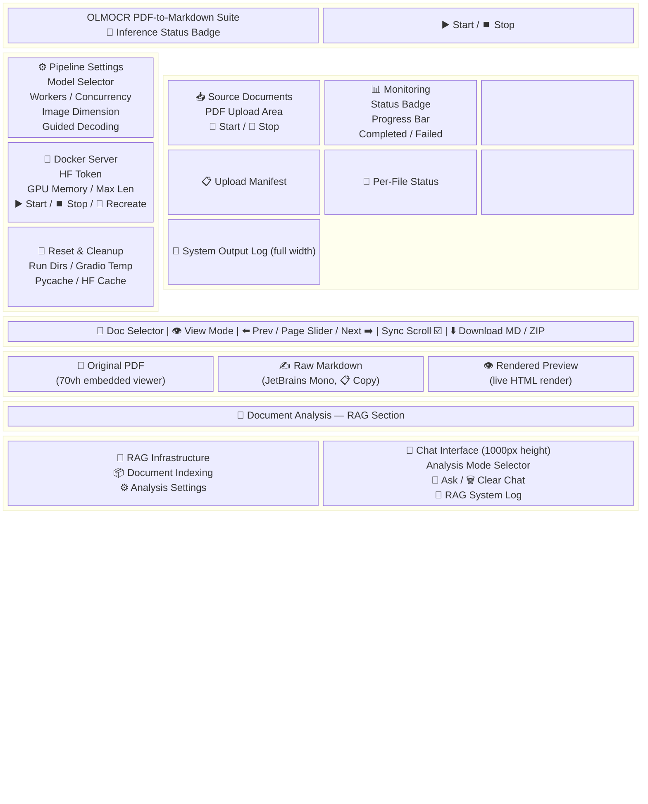
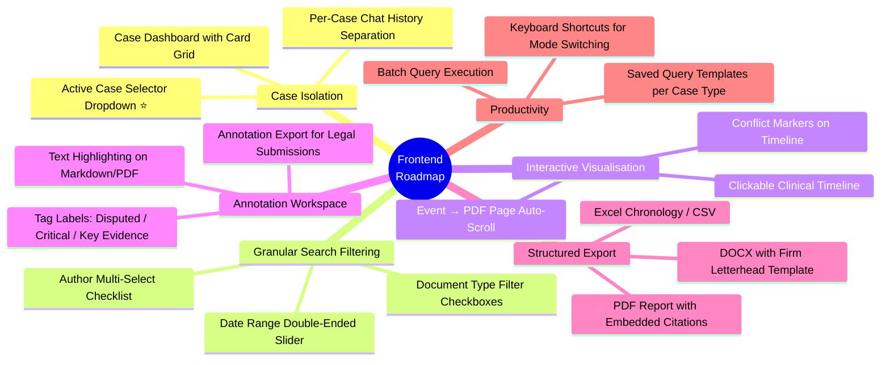

# OLMOCR PDF-to-Markdown Extraction & RAG Analysis Suite

A high-performance, layout-aware PDF OCR pipeline and interactive analysis dashboard built with Gradio and tailored to interface with multiple vision-language and reasoning models (including [nvidia/Phi-4-reasoning-plus-NVFP4](https://huggingface.co/nvidia/Phi-4-reasoning-plus-NVFP4) by default, and [allenai/olmOCR-2-7B-1025-FP8](https://huggingface.co/allenai/olmOCR-2-7B-1025-FP8)).

The suite features **built-in Docker lifecycle management** to dynamically run the vLLM inference backend, alongside a **fully integrated local RAG (Retrieval-Augmented Generation) analysis pipeline** optimized for large, complex medicolegal files.

---

## 📁 Repository Directory Structure

- OLMOCR/
  - [app.py](file:///home/owner/OLMOCR/app.py) - Main Gradio application entry point
  - [cleanup_manager.py](file:///home/owner/OLMOCR/cleanup_manager.py) - Disk cache and run file cleanup manager
  - [conftest.py](file:///home/owner/OLMOCR/conftest.py) - Pytest configuration redirecting Hugging Face cache
  - [docker-compose.rag.yml](file:///home/owner/OLMOCR/docker-compose.rag.yml) - Orchestration file for RAG local database/store stack
  - [docker_manager.py](file:///home/owner/OLMOCR/docker_manager.py) - Local vLLM Inference container lifecycle manager
  - [download_models.py](file:///home/owner/OLMOCR/download_models.py) - Downloader script for quantized NVFP4 models from Hugging Face
  - [html_utils.py](file:///home/owner/OLMOCR/html_utils.py) - HTML generators for progress bars, manifests, and tables
  - [pdf_manager.py](file:///home/owner/OLMOCR/pdf_manager.py) - PDF rendering (PDFium), page mapping, and zip operations
  - [pipeline_manager.py](file:///home/owner/OLMOCR/pipeline_manager.py) - Batch OCR pipeline engine & process wrapper
  - [pytest.ini](file:///home/owner/OLMOCR/pytest.ini) - Pytest configuration file to ignore RAG database directories
  - [rag_infra_manager.py](file:///home/owner/OLMOCR/rag_infra_manager.py) - RAG services (PG, Redis, MinIO, Qdrant) lifecycle orchestrator
  - [rag_ui.py](file:///home/owner/OLMOCR/rag_ui.py) - Gradio layout and callbacks for the RAG Analysis tab
  - [requirements.txt](file:///home/owner/OLMOCR/requirements.txt) - Python packages and third-party dependencies
  - [settings.json](file:///home/owner/OLMOCR/settings.json) - Persistent user configuration settings
  - [settings_manager.py](file:///home/owner/OLMOCR/settings_manager.py) - Loading, saving, and validation utility for configurations
  - [state.py](file:///home/owner/OLMOCR/state.py) - Thread-safe global active runs and state variables
  - [ui_theme.py](file:///home/owner/OLMOCR/ui_theme.py) - Styling parameters (custom CSS and dark mode theme)
  - rag/ - Local RAG Core Module:
    - [__init__.py](file:///home/owner/OLMOCR/rag/__init__.py) - Module initialization
    - [analyzer.py](file:///home/owner/OLMOCR/rag/analyzer.py) - Chat compiler, prompt templates, and streaming LLM client
    - [cache.py](file:///home/owner/OLMOCR/rag/cache.py) - Redis client for caching queries, embeddings, and chat history
    - [chunker.py](file:///home/owner/OLMOCR/rag/chunker.py) - Medicolegal-aware chunker, metadata (dates, authors) extractor
    - [db.py](file:///home/owner/OLMOCR/rag/db.py) - PostgreSQL client for run history, documents, and chunk metadata
    - [embedding.py](file:///home/owner/OLMOCR/rag/embedding.py) - Sentence-Transformer client and Qdrant collection manager
    - [retriever.py](file:///home/owner/OLMOCR/rag/retriever.py) - Dense vector retriever with cosine search and Jaccard-based MMR
    - [storage.py](file:///home/owner/OLMOCR/rag/storage.py) - MinIO client for PDF and Markdown blob archives
  - tests/ - Extensive unit and integration test suite:
    - [test_app.py](file:///home/owner/OLMOCR/tests/test_app.py), [test_app_callbacks.py](file:///home/owner/OLMOCR/tests/test_app_callbacks.py), [test_cleanup_manager.py](file:///home/owner/OLMOCR/tests/test_cleanup_manager.py), [test_docker_manager.py](file:///home/owner/OLMOCR/tests/test_docker_manager.py)
    - [test_e2e_app.py](file:///home/owner/OLMOCR/tests/test_e2e_app.py), [test_html_utils_all.py](file:///home/owner/OLMOCR/tests/test_html_utils_all.py), [test_integration_rag.py](file:///home/owner/OLMOCR/tests/test_integration_rag.py)
    - [test_pdf_manager.py](file:///home/owner/OLMOCR/tests/test_pdf_manager.py), [test_pdf_manager_all.py](file:///home/owner/OLMOCR/tests/test_pdf_manager_all.py), [test_pipeline_manager.py](file:///home/owner/OLMOCR/tests/test_pipeline_manager.py)
    - [test_rag.py](file:///home/owner/OLMOCR/tests/test_rag.py), [test_rag_analyzer_all.py](file:///home/owner/OLMOCR/tests/test_rag_analyzer_all.py), [test_rag_cache_all.py](file:///home/owner/OLMOCR/tests/test_rag_cache_all.py), [test_rag_db_errors.py](file:///home/owner/OLMOCR/tests/test_rag_db_errors.py)
    - [test_rag_embedding_all.py](file:///home/owner/OLMOCR/tests/test_rag_embedding_all.py), [test_rag_extended.py](file:///home/owner/OLMOCR/tests/test_rag_extended.py), [test_rag_infra_manager_all.py](file:///home/owner/OLMOCR/tests/test_rag_infra_manager_all.py)
    - [test_rag_retriever_all.py](file:///home/owner/OLMOCR/tests/test_rag_retriever_all.py), [test_rag_storage_all.py](file:///home/owner/OLMOCR/tests/test_rag_storage_all.py)
    - [test_state.py](file:///home/owner/OLMOCR/tests/test_state.py), [test_ui_callbacks.py](file:///home/owner/OLMOCR/tests/test_ui_callbacks.py)

---

## 🎨 Comprehensive Frontend Design

> For the complete practitioner routine and detailed workflow instructions, see [medicolegal_rag_guide.md](file:///home/owner/OLMOCR/medicolegal_rag_guide.md).

The frontend is a single-page Gradio application ([app.py](file:///home/owner/OLMOCR/app.py)) built around a dark-mode glassmorphism design system with four distinct interface zones. The design is optimised for the daily workflow of medicolegal practitioners managing 3–5 separate client cases per day.

### 🗺️ Full-Page UI Layout Map



---

### 🎨 Design System

The visual identity is defined in [ui_theme.py](file:///home/owner/OLMOCR/ui_theme.py) and applies globally via a Gradio `Base` theme override plus custom CSS injection.

#### Colour Palette

| Token | Value | Usage |
|:---|:---|:---|
| `body_background_fill` | `#090d16` | Deep navy page background |
| `block_background_fill` | `rgba(17, 24, 39, 0.7)` | Glassmorphism panel fill |
| `block_border_color` | `rgba(255, 255, 255, 0.08)` | Subtle frosted glass edges |
| `body_text_color` | `#e2e8f0` | Primary text (slate-200) |
| `body_text_color_subdued` | `#9ca3af` | Secondary/hint text (gray-400) |
| `input_background_fill` | `#1e293b` | Input fields (slate-800) |
| `button_primary` | `linear-gradient(135deg, #6366f1, #3b82f6)` | Indigo → blue gradient for primary actions |
| `button_secondary` | `rgba(30, 41, 59, 0.8)` | Muted panel buttons |
| `border_color_accent` | `rgba(99, 102, 241, 0.5)` | Focus rings and active borders |
| Log console text | `#38bdf8` | Sky-400 on `#020617` for high-contrast code output |
| Badge — idle | `#1e293b` bg / `#94a3b8` text | Neutral state |
| Badge — running | `#1e3a8a` bg / `#60a5fa` text | Pulsing animation (`2s infinite`) |
| Badge — success | `#064e3b` bg / `#34d399` text | Healthy / completed |
| Badge — failed/stopped | `#7f1d1d` bg / `#fca5a5` text | Error or halted |

#### Typography

| Element | Font | Weight | Size |
|:---|:---|:---:|:---|
| Body / UI text | [Outfit](https://fonts.google.com/specimen/Outfit) (Google Fonts) | 300–700 | System default |
| Page title | Outfit | 800 | `2.2rem`, gradient-filled (`#818cf8 → #3b82f6 → #60a5fa`) |
| Log consoles | [JetBrains Mono](https://fonts.google.com/specimen/JetBrains+Mono) | 400 | `0.85rem` |
| Stat card values | Outfit | 700 | `1.8rem` |
| Stat card labels | Outfit | 400 | `0.85rem`, uppercase, `0.05em` letter-spacing |

#### Glassmorphism Panel System

Every content region uses the `.glass-panel` CSS class:
```css
background: rgba(17, 24, 39, 0.7);
border: 1px solid rgba(255, 255, 255, 0.08);
border-radius: 16px;
box-shadow: 0 8px 32px 0 rgba(0, 0, 0, 0.5);
padding: 20px;
```
This creates the frosted-glass appearance with subtle depth layering throughout the UI.

#### Scrollbar Styling

Custom WebKit scrollbars for premium feel:
- Track: `rgba(255, 255, 255, 0.03)` — nearly invisible
- Thumb: `rgba(255, 255, 255, 0.25)` — subtle visibility
- Thumb hover: `rgba(129, 140, 248, 0.6)` — indigo accent highlight
- Width/height: `8px`

---

### 🏗️ Interface Zones — Detailed Panel Reference

#### Zone 1: Header Bar ([app.py:L66-L78](file:///home/owner/OLMOCR/app.py#L66-L78))

| Element | Component | Description |
|:---|:---|:---|
| **Application Title** | `gr.HTML` | Gradient-filled `<h1>` with subtitle: *"High-performance layout-aware PDF OCR pipeline using vision-language models"* |
| **Inference Status Badge** | `gr.HTML` | Real-time container health indicator. Auto-refreshes every 5 seconds via `gr.Timer` ([app.py:L524-L536](file:///home/owner/OLMOCR/app.py#L524-L536)). States: `Checking Backend...`, `Offline`, `Starting`, `Ready` |
| **Quick Start/Stop** | `gr.Button` (×2) | Compact ▶️ Start / ⏹️ Stop buttons for one-click inference server control without opening the sidebar |

---

#### Zone 2: OCR Pipeline — Left Sidebar + Centre Panel ([app.py:L80-L233](file:///home/owner/OLMOCR/app.py#L80-L233))

**Left Sidebar** (`scale=1`, max-width `320px`, `.sidebar-panel`):

| Accordion | Contents | Key Settings |
|:---|:---|:---|
| **⚙️ Pipeline Settings** | Model selector dropdown, advanced parameter sliders, 💾 Save Configuration button | `server_url`, `model_name`, `workers` (1–64), `max_concurrent_requests` (1–2000), `target_longest_image_dim` (512–2048px), `max_page_retries` (1–20), `guided_decoding` (checkbox) |
| **🐳 Local Inference Server** | HF token field, Docker port, GPU memory slider (0.1–1.0), max model length (2048–32768), Start/Stop/Recreate buttons | Creates and manages the `vllm/vllm-openai` Docker container with `--gpus all` and configurable VRAM allocation |
| **🧹 Reset & Cleanup** | Four checkboxes: obsolete run dirs, Gradio temp, pycache, HF cache. Warning label for HF cache deletion | Calls [perform_reset_cleanup()](file:///home/owner/OLMOCR/cleanup_manager.py) |

**Centre Panel** (`scale=4`):

| Component | Layout | Purpose |
|:---|:---|:---|
| **📥 Source Documents** | File upload widget (multi-file `.pdf`), 🚀 Start / 🛑 Stop buttons | Drag-and-drop PDF ingestion. Stop button toggles interactivity on run start/stop |
| **📊 Monitoring** | Status badge, progress bar (animated HTML), Completed/Failed page counter cards | Real-time batch tracking with stat-cards (`1.8rem` bold values) |
| **📋 Upload Manifest** | HTML table (scrollable, max 200px) | Lists uploaded files with sizes |
| **📁 Per-File Status** | HTML table (scrollable, max 200px) | Per-document processing results |
| **📜 System Output Log** | `gr.Code` (shell syntax, 10 lines, `.log-console`, max 250px) | Live subprocess stdout/stderr from pipeline execution |

---

#### Zone 3: Document Viewer — Three-Panel Symmetrical Layout ([app.py:L234-L303](file:///home/owner/OLMOCR/app.py#L234-L303))

**Control Bar:**

| Control | Type | Function |
|:---|:---|:---|
| **📄 Select Processed Document** | `gr.Dropdown` | Lists all markdown outputs from the active run |
| **👁️ View Mode** | `gr.Radio` | Toggle between `Page-by-Page` and `Full Document` |
| **Page Navigation** | ⬅️ Prev / `gr.Slider` / Next ➡️ | Page-by-page navigation (1-indexed) |
| **Sync Scroll** | `gr.Checkbox` (`#sync-scroll-checkbox`) | Enables proportional scroll synchronisation across all three panels |
| **Downloads** | `gr.File` (×2) | Individual Markdown file download + ZIP archive of all outputs |

**Three-Panel Viewer** (each panel `scale=1`, height `70vh`):

| Panel | Element ID | Styling | Content |
|:---|:---|:---|:---|
| **📄 Original PDF** | `#pdf-scroll-container` | Black background (`#000000`), 70vh scroll container | Embedded `<iframe>` rendering of the source PDF via PDFium |
| **✍️ Raw Markdown** | `#raw-scroll-container` | `#020617` background, JetBrains Mono (`0.85rem`), sky-400 text (`#38bdf8`) | Syntax-highlighted raw Markdown with **📋 Copy** button (clipboard via JS) |
| **👁️ Rendered Preview** | `#preview-scroll-container` | Semi-transparent slate background, 20px padding | Live HTML render of the Markdown output via `gr.Markdown` |

**Scroll Synchronisation Engine** ([app.py:L617-L675](file:///home/owner/OLMOCR/app.py#L617-L675)):
- Listens for scroll events across all three containers
- Calculates scroll percentage: `scrollTop / (scrollHeight - clientHeight)`
- Propagates proportional scroll position to sibling panels
- Uses a 100ms debounce with `activeScrollSource` locking to prevent feedback loops
- `findScrollableElement()` recursively walks the DOM to locate the actual scrollable child

---

#### Zone 4: RAG Document Analysis — Full-Width Section ([rag_ui.py](file:///home/owner/OLMOCR/rag_ui.py))

This section is injected via [build_analysis_ui()](file:///home/owner/OLMOCR/rag_ui.py#L423-L737) and contains a sidebar + chat layout:

**RAG Sidebar** (`scale=1`, `.sidebar-panel`):

| Accordion | Contents | Key Interactions |
|:---|:---|:---|
| **🔧 RAG Infrastructure** | Status badges for PostgreSQL, Redis, MinIO, Qdrant (colour-coded: ✓ healthy / ↻ running / ✗ unhealthy / ⏹ stopped / ? unknown). ▶️ Start / ⏹️ Stop buttons | Starts/stops all 4 services via `docker compose -f docker-compose.rag.yml`. Initialises PostgreSQL schema, MinIO buckets, and Qdrant collection on start |
| **📦 Document Indexing** | Corpus statistics table (Indexed Runs / Documents / Chunks / Vectors / Unique Authors / Date Range). 🔄 Refresh Stats, Run selector dropdown, 📥 Index Selected Run, 📥 Index All Runs. Status markdown output | Triggers the chunking → embedding → upsert pipeline. Displays progress in real-time |
| **⚙️ Analysis Settings** | Analysis Mode dropdown (5 modes), Analysis LLM Server URL, Analysis Model Name dropdown (5 models with custom value support), Retrieval Top-K slider (3–20), Embedding Model dropdown (`all-MiniLM-L6-v2`, `bge-large-en-v1.5`), 💾 Save Analysis Configuration | All settings persisted to [settings.json](file:///home/owner/OLMOCR/settings.json) via [settings_manager.py](file:///home/owner/OLMOCR/settings_manager.py) |

**RAG Chat Interface** (`scale=3`, `.glass-panel`):

| Component | Specification | Details |
|:---|:---|:---|
| **Chat Window** | `gr.Chatbot`, height `1000px`, copy buttons enabled, `.analysis-chatbot` styling | Bot messages: `rgba(30, 41, 59, 0.7)` background. User messages: `rgba(99, 102, 241, 0.15)` (indigo tint). Font: `0.95rem`, line-height `1.6` |
| **Chat Input** | `gr.Textbox`, 2 lines, `scale=4` | Placeholder: *"e.g., What injuries did the patient sustain and when?"* |
| **🚀 Ask Button** | `gr.Button`, primary variant, `scale=1` | Triggers `user_message_submit()` → `bot_respond()` chain with streaming |
| **🗑️ Clear Chat** | `gr.Button`, secondary, `size=sm` | Resets chat history to empty list |
| **Mode Hint** | `gr.Markdown`, `.mode-hint` (italic, `0.85rem`, gray-400) | *"💡 Tip: Switch analysis mode for specialised outputs..."* |
| **📜 RAG System Log** | `gr.Code`, shell syntax, 10 lines, `.log-console` | Timestamped backend log: indexing progress, retrieval status, LLM streaming events |

**Five Analysis Modes** (selectable from the sidebar dropdown):

| Mode | System Prompt Focus | Output Format |
|:---|:---|:---|
| 💬 **Free Q&A** | Answer based strictly on retrieved excerpts; cite `[Source N]`, filename, page, date for every claim; flag gaps | Cited narrative paragraphs |
| 📅 **Timeline Generator** | Extract every dated clinical event in strict chronological order | Markdown table: `Date \| Event \| Provider/Author \| Source` |
| 🏥 **Injury Summary** | Structured report: Patient Details → Mechanism → Injuries → Treatment → Status → Medications → Providers → Outstanding Issues | Numbered heading report with citations |
| 🔍 **Inconsistency Finder** | Cross-reference accounts of the same events; rate severity (Minor/Moderate/Major) | Table: `Issue \| Source A Says \| Source B Says \| Severity` |
| 💊 **Medication Tracker** | Track prescriptions, dose changes, cessations, allergies | Table: `Medication \| Dose/Freq \| Date Started \| Date Stopped \| Prescriber \| Source` |

---

### ♿ Accessibility & WCAG Compliance

The frontend implements accessibility features via runtime JavaScript ([app.py:L544-L677](file:///home/owner/OLMOCR/app.py#L544-L677)):

| Feature | Standard | Implementation |
|:---|:---|:---|
| **Focus indicators** | WCAG 2.2 SC 2.4.7 | `2px solid #818cf8` outline + `4px rgba(129, 140, 248, 0.4)` box-shadow on all focusable elements |
| **Dark mode enforcement** | — | `MutationObserver` ensures `dark` class is never removed from `<html>` |
| **Language declaration** | WCAG 2.2 SC 3.1.1 | Sets `lang="en"` on `document.documentElement` |
| **ARIA labels** | WCAG 2.2 SC 1.1.1 | Dynamically applies `aria-label` to all buttons based on emoji/text content |
| **Decorative SVG hiding** | WCAG 2.2 SC 1.1.1 | Sets `aria-hidden="true"` on SVGs without `<title>` elements |
| **Dynamic re-application** | — | `MutationObserver` on `document.body` re-applies ARIA labels when Gradio re-renders components |

---

### 🗓️ UX/UI Optimisation Roadmap

The following enhancements are documented in the [Medicolegal RAG Guide](file:///home/owner/OLMOCR/medicolegal_rag_guide.md) and are prioritised for implementation to maximise practitioner productivity:



#### Priority 1 — Active Case Selector ⭐

| Aspect | Detail |
|:---|:---|
| **Problem** | Chat queries the entire corpus across all indexed cases — risk of cross-case data leakage violating legal privilege |
| **Solution** | Add an **"Active Case"** dropdown above the chat window that applies `run_id_filter` to [search_similar()](file:///home/owner/OLMOCR/rag/retriever.py#L32). Include an "All Cases" option for deliberate cross-case analysis |
| **Backend readiness** | The `run_id_filter` parameter is **already fully implemented** in the retriever — requires only a Gradio dropdown wired to the `analyze()` call |
| **Impact** | Prevents confidential clinical data from Client A appearing in reports generated for Client B |

#### Priority 2 — Interactive Metadata Filters

| Aspect | Detail |
|:---|:---|
| **Problem** | Metadata filters (`doc_type_filter`, `author_filter`, `date_from`, `date_to`) are implemented in [retriever.py:L25-L48](file:///home/owner/OLMOCR/rag/retriever.py#L25-L48) but **not exposed in the UI** |
| **Solution** | Collapsible **"🔍 Search Filters"** panel with: author multi-select checklist, document type checkboxes, date range double-ended slider |
| **Impact** | Enables targeted queries (e.g., "show only post-accident specialist letters") — dramatically reduces noise and hallucination |

#### Priority 3 — Structured Report Export

| Aspect | Detail |
|:---|:---|
| **Problem** | RAG output is plain text in the chat window; practitioners must copy-paste and manually format for legal submissions |
| **Solution** | Download buttons under chat: **📅 Export Chronology (Excel)**, **🏥 Export Summary (DOCX)**, **📋 Export Full Analysis (PDF)** |
| **Impact** | Converts RAG answers into court-ready deliverables with one click |

#### Priority 4 — Interactive Clinical Timeline

| Aspect | Detail |
|:---|:---|
| **Problem** | Timeline Generator outputs a static Markdown table requiring manual cross-referencing |
| **Solution** | Render events as interactive nodes on a visual timeline; clicking an event scrolls the PDF viewer to the cited source page; overlay conflict markers for inconsistencies |
| **Impact** | Transforms static data into an auditable, visual source of truth for litigation |

#### Priority 5 — Annotation Workspace

| Aspect | Detail |
|:---|:---|
| **Problem** | The three-panel viewer is read-only — no way to flag evidence during review |
| **Solution** | Allow text highlighting on the Markdown/PDF panels with labels (`Disputed`, `Critical`, `Prior Condition`, `Key Evidence`); persist annotations as searchable metadata |
| **Impact** | Creates a permanent evidence audit trail directly within the case workspace |

#### Priority 6 — Case Dashboard & Keyboard Shortcuts

| Aspect | Detail |
|:---|:---|
| **Problem** | Corpus statistics are aggregated; no per-case overview; mode switching requires mouse interaction |
| **Solution** | Card/grid dashboard showing all indexed cases with per-case metrics, status indicators, and quick-action buttons. Keyboard shortcuts: `Ctrl+Enter` (submit), `Ctrl+1–5` (switch mode), `Ctrl+Shift+C` (copy last response), `Ctrl+Shift+N` (clear chat) |
| **Impact** | Bird's-eye caseload view + reduced mouse overhead for practitioners handling 3–5 cases/day |

---

## 🛠️ Architecture Stack

| Tier | Component | Container | Port | Persistent Directory | Purpose |
|---|---|---|---|---|---|
| **Web UI** | Gradio Dashboard | Host Process | `7860` | — | Document management, batch execution, log viewer, and chat |
| **Inference** | vLLM Engine | `olmocr` | `8000` | `~/.cache/huggingface` | Executes olmOCR OCR model and swaps to analysis LLMs |
| **Local Cache** | Hugging Face Cache | Host Process | — | `workspace/huggingface` | Redirected HF cache for sentence-transformers and test suite |
| **Registry** | PostgreSQL 16 | `olmocr_postgres` | `5432` | `workspace/pg_data` | Tracks document registry, chunk mappings, metadata and runs |
| **Caching** | Redis 7.2 | `olmocr_redis` | `6379` | `workspace/redis_data` | Caches query answers, token embeddings, and chat history |
| **Storage** | MinIO | `olmocr_minio` | `9000/9001` | `workspace/minio_data` | PDF and Markdown blob archives |
| **Similarity** | Qdrant | `olmocr_qdrant` | `6333/6334` | `workspace/qdrant_storage` | Dense vector database |

---

## 📦 Dependencies

The application relies on the following key dependencies:
- **`gradio`**: Interactive web interface.
- **`psycopg2-binary`**: PostgreSQL database connector for run and document schemas.
- **`redis`**: Caching layer for responses, embeddings, and chat session variables.
- **`minio`**: Object storage access for archiving source PDFs and markdown content.
- **`qdrant-client`**: Client for dense vector indices (supports range `>=1.9.0,<1.11.0`).
- **`sentence-transformers`**: Generates high-dimensional vector representations.
- **`tiktoken`**: Token count measurement.
- **`pypdf` / `pypdfium2`**: PDF validation and high-performance page rendering.
- **`httpx`**: Asynchronous HTTP client for communicating with the vLLM server and equivalent checks.
- **`numpy`**: Multidimensional array operations (used in embeddings/retrievals).
- **`pytest` / `coverage`**: Core framework and statistics gathering for the comprehensive testing suite.

---

## 📋 Prerequisites

1. **System Tools**: Install `poppler-utils` for PDF rendering:
   ```bash
   # Ubuntu/Debian
   sudo apt-get update && sudo apt-get install -y poppler-utils
   ```
2. **Docker**: Ensure Docker is installed and the current user has permissions to run containers without `sudo`.
3. **NVIDIA Container Toolkit**: Required to pass GPU control to the vLLM containers (`--gpus all`).

---

## ⚙️ Installation & Setup

1. **Clone the Repository & Navigate**:
   ```bash
   cd OLMOCR
   ```

2. **Create and Activate Python Environment**:
   ```bash
   python3 -m venv ~/olmocr-env
   source ~/olmocr-env/bin/activate
   ```

3. **Install Dependencies**:
   ```bash
   pip install -U pip
   pip install olmocr
   pip install -r requirements.txt
   ```

4. **Pre-download Models (Optional)**:
   Pre-fetch the required NVFP4 models using the downloader script to avoid download latency during application start:
   ```bash
   python download_models.py
   ```

---

## 🚦 Running the Application

1. **Bring Up the RAG Services Stack**:
   Start the background databases and engines using Docker Compose:
   ```bash
   docker compose -f docker-compose.rag.yml up -d
   ```
   *(Alternatively, you can start/stop the RAG services directly from the Gradio UI inside the **🔧 RAG Infrastructure** panel).*

2. **Launch the Dashboard**:
   ```bash
   python app.py
   ```

3. **Access the GUI**:
   Open your browser and navigate to `http://localhost:7860/`.

4. **Analyze Documents**:
   - Run a batch OCR process in the center panel.
   - Go to the **🧠 Document Analysis (RAG)** tab at the bottom of the page.
   - Click **🔄 Refresh Stats** to load available indexes.
   - Select your completed OCR run and click **📥 Index Selected Run**.
   - Type your questions in the Chat input block or select a template analysis mode from the accordion settings.

---

## 🧪 Verification & Testing

The repository includes a comprehensive testing suite comprising **250+ unit and integration tests** (specifically 258 tests) validating components, lifecycle states, callbacks, and processing operations.

To run the test suite, ensure the virtual environment is active, then execute:

```bash
# Execute all unit and integration tests
pytest
```

> [!NOTE]
> The project includes a `pytest.ini` configuration file that automatically ignores the `workspace/` directory. This prevents the testing engine from attempting to scan Docker-mounted database directories (PostgreSQL, Redis), which would otherwise cause a permission error. Additionally, `conftest.py` ensures the Hugging Face cache path `HF_HOME` is dynamically isolated to `workspace/huggingface`.

### Tested Components:
- **`tests/test_app*.py` / `tests/test_ui*.py`**: Verification of Docker inference lifecycles, progress bar components, settings manager, and Gradio panel callbacks.
- **`tests/test_pipeline*.py` / `tests/test_pdf*.py`**: Unit tests for batch pipeline execution, PDF segmentation, file zip packaging, and PDFium image rendering.
- **`tests/test_rag*.py`**: Validation of the custom medicolegal chunker, PostgreSQL schema registration, MinIO upload pipelines, Redis key cache functions, Qdrant search cosine similarity, and LLM prompt compilers.
- **`tests/test_cleanup_manager.py`**: Ensures cache space metrics and reset cleanup routines run safely.
