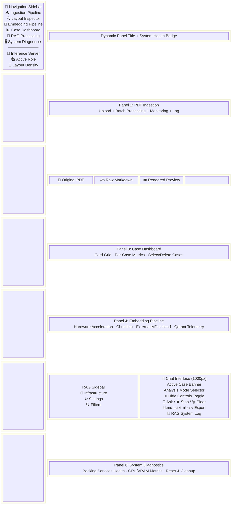

# OLMOCR PDF-to-Markdown Extraction & RAG Analysis Suite

> **Note on naming:** This repository lives in the `KIRAG` directory. The Gradio
> UI brands itself as **"IQ-RAG Client"**, while the local vLLM inference
> container is named `olmocr`. These all refer to the same suite.

A high-performance, layout-aware PDF OCR pipeline and interactive analysis dashboard built with Gradio and tailored to interface with multiple vision-language and reasoning models (including [nvidia/Phi-4-reasoning-plus-NVFP4](https://huggingface.co/nvidia/Phi-4-reasoning-plus-NVFP4) by default, and [allenai/olmOCR-2-7B-1025-FP8](https://huggingface.co/allenai/olmOCR-2-7B-1025-FP8)).

The suite features **built-in Docker lifecycle management** to dynamically run the vLLM inference backend, alongside a **fully integrated local RAG (Retrieval-Augmented Generation) analysis pipeline** optimised for large, complex medicolegal files.

---

## 📁 Repository Directory Structure

- OLMOCR/
  - [app.py](file:///home/owner/KIRAG/app.py) — Main Gradio application entry point. Constructs the 6-panel layout (Ingestion, Layout Inspector, Embedding Pipeline, Case Dashboard, RAG Processing, System Diagnostics), wires all event handlers, validates backing-service credentials at startup, and launches the server
  - [app_handlers.py](file:///home/owner/KIRAG/app_handlers.py) — UI callback functions for 6-view navigation toggling (`select_view`), settings persistence, Docker controls, and periodic diagnostics polling
  - [cleanup_manager.py](file:///home/owner/KIRAG/cleanup_manager.py) — Disk cache and run file cleanup manager (`perform_reset_cleanup()`)
  - [conftest.py](file:///home/owner/KIRAG/conftest.py) — Pytest configuration redirecting Hugging Face cache to `workspace/huggingface`
  - [docker-compose.rag.yml](file:///home/owner/KIRAG/docker-compose.rag.yml) — Docker Compose orchestration for the RAG services stack (PostgreSQL 16, Redis 7.2, MinIO, Qdrant 1.10)
  - [docker_manager.py](file:///home/owner/KIRAG/docker_manager.py) — Local vLLM inference container lifecycle manager (`start`, `stop`, `create`, `cleanup`)
  - [download_models.py](file:///home/owner/KIRAG/download_models.py) — Downloader script for quantised NVFP4 models from Hugging Face with retry logic and IPv4 DNS forcing
  - [embedding_pipeline_ui.py](file:///home/owner/KIRAG/embedding_pipeline_ui.py) — **NEW** — Standalone Embedding & Vector Indexing Pipeline workspace: device acceleration (`auto` CUDA / CPU), batch size slider, chunking hyperparameters, direct external markdown upload, live Qdrant telemetry, and execution logging
  - [html_utils.py](file:///home/owner/KIRAG/html_utils.py) — HTML generators for progress bars, upload manifests, file status tables, service health cards, GPU metrics, and case dashboard cards
  - [indexing_service.py](file:///home/owner/KIRAG/indexing_service.py) — `CorpusIndexingService` class: orchestrates chunk → embed → upsert pipeline for single runs, bulk runs, and external markdown uploads
  - [pdf_manager.py](file:///home/owner/KIRAG/pdf_manager.py) — PDF rendering (pypdfium2), page mapping from JSONL, base64 image conversion, and zip archive operations
  - [pipeline_manager.py](file:///home/owner/KIRAG/pipeline_manager.py) — Batch OCR pipeline engine: pre-flight checks, subprocess management, live log parsing, and `PipelineResult` named tuple
  - [process_state.py](file:///home/owner/KIRAG/process_state.py) — Thread-safe global `active_runs` dict and lock for tracking in-flight pipeline processes
  - [pytest.ini](file:///home/owner/KIRAG/pytest.ini) — Pytest configuration to ignore `workspace/`, `venv/`, and Docker-mounted database directories
  - [rag_export.py](file:///home/owner/KIRAG/rag_export.py) — Chat session export: Markdown (`.md`), plain text (`.txt`), and CSV timeline (`.csv`) with timestamped filenames
  - [rag_infra_manager.py](file:///home/owner/KIRAG/rag_infra_manager.py) — RAG services (PostgreSQL, Redis, MinIO, Qdrant) lifecycle orchestrator via Docker Compose with sequential initialisation
  - [rag_ui.py](file:///home/owner/KIRAG/rag_ui.py) — Gradio layout builder for Case Dashboard and RAG Chat panels; forwarding wrappers, progress card rendering, and `RagUiModule` dynamic module class
  - [rag_ui_dashboard.py](file:///home/owner/KIRAG/rag_ui_dashboard.py) — Case Dashboard UI: card grid builder, select/deselect-all JS handlers, single/multi/all case deletion from PostgreSQL + Qdrant + MinIO
  - [rag_ui_handlers.py](file:///home/owner/KIRAG/rag_ui_handlers.py) — RAG business logic: indexing, infrastructure control, corpus stats, chat submission, streaming bot responses, analysis settings, and chat export dispatch
  - [rag_ui_state.py](file:///home/owner/KIRAG/rag_ui_state.py) — Shared RAG state: thread-safe log buffer (`RAG_LOG_BUFFER`), `LAST_CREATED_RUN_ID`, `extract_text_content()` for Gradio 6 format handling
  - [requirements.txt](file:///home/owner/KIRAG/requirements.txt) — Python packages and third-party dependencies (FastAPI, Uvicorn, multipart added)
  - [settings.json](file:///home/owner/KIRAG/settings.json) — Persistent user configuration (pipeline, Docker, analysis, embedding, reranker settings)
  - [settings_manager.py](file:///home/owner/KIRAG/settings_manager.py) — Loading, saving, and validation utility for configurations; defines `SUPPORTED_MODELS`, `MODEL_MAX_CONTENT_LENGTHS`, `WORKSPACE_DIR`
  - [system_diagnostics.py](file:///home/owner/KIRAG/system_diagnostics.py) — Service latency probes (PostgreSQL, Redis, MinIO, Qdrant, vLLM), `nvidia-smi` GPU metrics parser, and vLLM model loading progress tracker
  - [ui_adapters.py](file:///home/owner/KIRAG/ui_adapters.py) — UI translation layer converting plain Python backend data structures into Gradio `gr.update` payloads
  - [ui_theme.py](file:///home/owner/KIRAG/ui_theme.py) — Dark theme definition (Gradio `Base` theme override) and external CSS loader from `assets/theme.css`
  - [cli.py](file:///home/owner/KIRAG/cli.py) — Command-line interface providing headless management of RAG infra, queries, container operations, settings, and indexing
  - [api/](file:///home/owner/KIRAG/api) — FastAPI REST API layer:
    - [main.py](file:///home/owner/KIRAG/api/main.py) — Main app definition, middleware config, lifespan hooks
    - [models.py](file:///home/owner/KIRAG/api/models.py) — Pydantic models mapping REST request/response contracts
    - [deps.py](file:///home/owner/KIRAG/api/deps.py) — Shared API dependencies
    - [routes/](file:///home/owner/KIRAG/api/routes) — API routers per domain (pipeline, docker, rag, diagnostics, settings, documents)
  - [.env.example](file:///home/owner/KIRAG/.env.example) — Template environment file for PostgreSQL, Redis, MinIO, embedding, and the vLLM container image configuration. **`.env` is git-ignored** — only `secrets_config.py` and `docker-compose.rag.yml` consume these variables.
  - assets/
    - [accessibility.js](file:///home/owner/KIRAG/assets/accessibility.js) — Runtime WCAG accessibility enhancements (ARIA labels, focus indicators, keyboard shortcuts, dark mode enforcement, scroll synchronisation)
    - [theme.css](file:///home/owner/KIRAG/assets/theme.css) — Complete CSS design system: glassmorphism panels, badge styles, log consoles, chatbot customisation, responsive layout utilities
  - rag/ — Local RAG Core Module:
    - [__init__.py](file:///home/owner/KIRAG/rag/__init__.py) — Module initialisation and feature documentation
    - [analyzer.py](file:///home/owner/KIRAG/rag/analyzer.py) — LLM prompt assembly with 5 medicolegal system prompt templates, streaming/non-streaming chat completions via vLLM API, automatic context truncation, model equivalence mapping, and reasoning model detection
    - [cache.py](file:///home/owner/KIRAG/rag/cache.py) — Redis caching layer for queries (1h TTL), embeddings (24h TTL), and chat sessions (2h TTL) with bulk `mget`/`mset` pipelining
    - [chunker.py](file:///home/owner/KIRAG/rag/chunker.py) — Medicolegal-aware document chunker with section boundary detection, paragraph-aware splitting (800 char / 100 char overlap), and rich metadata extraction (dates, authors, doc types, sections, patient names)
    - [db.py](file:///home/owner/KIRAG/rag/db.py) — PostgreSQL database layer with connection pooling (`ThreadedConnectionPool`), schema management (`ocr_runs`, `documents`, `chunks` tables), CRUD operations, corpus statistics, and cascading deletion
    - [embedding.py](file:///home/owner/KIRAG/rag/embedding.py) — Sentence-Transformer embedding with auto-CUDA acceleration, Qdrant collection management (auto-named per model to prevent dimension collisions), batch upsert with backoff retries, and Cross-Encoder reranker model loader
    - [metadata_helper.py](file:///home/owner/KIRAG/rag/metadata_helper.py) — Automated case metadata extraction: client names, DOB, and injury/diagnosis from PostgreSQL chunks using heuristic regex patterns
    - [retriever.py](file:///home/owner/KIRAG/rag/retriever.py) — Dense vector retriever with cosine similarity search, metadata filtering (run_id, doc_type, author, date range), Cross-Encoder reranking, Jaccard-based MMR diversity re-ranking, and PostgreSQL metadata enrichment
    - [storage.py](file:///home/owner/KIRAG/rag/storage.py) — MinIO blob storage for PDFs and Markdown files with bucket auto-creation, upload/download/delete operations, and run-level cleanup
  - tests/ — Comprehensive unit and integration test suite (28 files, 443 tests):
    - [test_app.py](file:///home/owner/KIRAG/tests/test_app.py), [test_app_callbacks.py](file:///home/owner/KIRAG/tests/test_app_callbacks.py), [test_cleanup_manager.py](file:///home/owner/KIRAG/tests/test_cleanup_manager.py), [test_docker_manager.py](file:///home/owner/KIRAG/tests/test_docker_manager.py)
    - [test_download_models.py](file:///home/owner/KIRAG/tests/test_download_models.py), [test_e2e_app.py](file:///home/owner/KIRAG/tests/test_e2e_app.py), [test_external_md_upload.py](file:///home/owner/KIRAG/tests/test_external_md_upload.py), [test_html_utils_all.py](file:///home/owner/KIRAG/tests/test_html_utils_all.py)
    - [test_indexing_service.py](file:///home/owner/KIRAG/tests/test_indexing_service.py), [test_integration_rag.py](file:///home/owner/KIRAG/tests/test_integration_rag.py), [test_metadata_helper.py](file:///home/owner/KIRAG/tests/test_metadata_helper.py)
    - [test_pdf_manager.py](file:///home/owner/KIRAG/tests/test_pdf_manager.py), [test_pdf_manager_all.py](file:///home/owner/KIRAG/tests/test_pdf_manager_all.py), [test_pipeline_manager.py](file:///home/owner/KIRAG/tests/test_pipeline_manager.py)
    - [test_rag.py](file:///home/owner/KIRAG/tests/test_rag.py), [test_rag_analyzer_all.py](file:///home/owner/KIRAG/tests/test_rag_analyzer_all.py), [test_rag_cache_all.py](file:///home/owner/KIRAG/tests/test_rag_cache_all.py), [test_rag_db_errors.py](file:///home/owner/KIRAG/tests/test_rag_db_errors.py)
    - [test_rag_embedding_all.py](file:///home/owner/KIRAG/tests/test_rag_embedding_all.py), [test_rag_export.py](file:///home/owner/KIRAG/tests/test_rag_export.py), [test_rag_extended.py](file:///home/owner/KIRAG/tests/test_rag_extended.py), [test_rag_infra_manager_all.py](file:///home/owner/KIRAG/tests/test_rag_infra_manager_all.py)
    - [test_rag_retriever_all.py](file:///home/owner/KIRAG/tests/test_rag_retriever_all.py), [test_rag_storage_all.py](file:///home/owner/KIRAG/tests/test_rag_storage_all.py), [test_rag_ui_handlers.py](file:///home/owner/KIRAG/tests/test_rag_ui_handlers.py)
    - [test_settings_manager.py](file:///home/owner/KIRAG/tests/test_settings_manager.py), [test_system_diagnostics.py](file:///home/owner/KIRAG/tests/test_system_diagnostics.py), [test_ui_callbacks.py](file:///home/owner/KIRAG/tests/test_ui_callbacks.py)


---

## 🎨 Comprehensive Frontend Design

> For the complete practitioner routine and detailed workflow instructions, see [medicolegal_rag_guide.md](file:///home/owner/KIRAG/medicolegal_rag_guide.md).

The frontend is a single-page Gradio application ([app.py](file:///home/owner/KIRAG/app.py)) built around a dark-mode glassmorphism design system with a **6-panel navigation architecture**. A persistent left sidebar provides global navigation and Docker inference controls. The design is optimised for the daily workflow of medicolegal practitioners managing 3–5 separate client cases per day.

### 🗺️ Full-Page UI Layout Map



---

### 🎨 Design System

The visual identity is defined in [ui_theme.py](file:///home/owner/KIRAG/ui_theme.py) (theme tokens) and [assets/theme.css](file:///home/owner/KIRAG/assets/theme.css) (full CSS design system), applied globally via a Gradio `Base` theme override plus CSS injection at launch.

#### Colour Palette

| Token | Value | Usage |
|:---|:---|:---|
| `body_background_fill` | `#090d16` | Deep navy page background |
| `block_background_fill` | `rgba(17, 24, 39, 0.7)` | Glassmorphism panel fill |
| `block_border_color` | `rgba(255, 255, 255, 0.08)` | Subtle frosted glass edges |
| `body_text_color` | `#e2e8f0` | Primary text (slate-200) |
| `body_text_color_subdued` | `#9ca3af` | Secondary/hint text (gray-400) |
| `input_background_fill` | `#1e293b` | Input fields (slate-800) |
| `button_primary` | `linear-gradient(135deg, #6366f1, #3b82f6)` | Indigo → blue gradient for primary actions |
| `button_secondary` | `rgba(30, 41, 59, 0.8)` | Muted panel buttons |
| `border_color_accent` | `rgba(99, 102, 241, 0.5)` | Focus rings and active borders |
| Log console text | `#38bdf8` | Sky-400 on `#020617` for high-contrast code output |
| Badge — idle | `#1e293b` bg / `#94a3b8` text | Neutral state |
| Badge — running | `#1e3a8a` bg / `#60a5fa` text | Pulsing animation (`2s infinite`) |
| Badge — success | `#064e3b` bg / `#34d399` text | Healthy / completed |
| Badge — failed/stopped | `#7f1d1d` bg / `#fca5a5` text | Error or halted |

#### Typography

| Element | Font | Weight | Size |
|:---|:---|:---:|:---|
| Body / UI text | [Outfit](https://fonts.google.com/specimen/Outfit) (Google Fonts) | 300–700 | System default |
| Page title | Outfit | 800 | `2.2rem`, gradient-filled (`#818cf8 → #3b82f6 → #60a5fa`) |
| Log consoles | [JetBrains Mono](https://fonts.google.com/specimen/JetBrains+Mono) | 400 | `0.85rem` |
| Stat card values | Outfit | 700 | `1.8rem` |
| Stat card labels | Outfit | 400 | `0.85rem`, uppercase, `0.05em` letter-spacing |

#### Glassmorphism Panel System

Every content region uses the `.glass-panel` CSS class:
```css
background: rgba(17, 24, 39, 0.7);
border: 1px solid rgba(255, 255, 255, 0.08);
border-radius: 16px;
box-shadow: 0 8px 32px 0 rgba(0, 0, 0, 0.5);
padding: 20px;
```
This creates the frosted-glass appearance with subtle depth layering throughout the UI.

#### Scrollbar Styling

Custom WebKit scrollbars for premium feel:
- Track: `rgba(255, 255, 255, 0.03)` — nearly invisible
- Thumb: `rgba(255, 255, 255, 0.25)` — subtle visibility
- Thumb hover: `rgba(129, 140, 248, 0.6)` — indigo accent highlight
- Width/height: `8px`

---

### 🏗️ Interface Architecture — 6-Panel Navigation

The application uses a persistent **left navigation sidebar** with 6 navigation buttons. Only one content panel is visible at a time. The sidebar also hosts global controls (Inference Server, Active Role, Layout Density). Navigation toggling is handled by [select_view()](file:///home/owner/KIRAG/app_handlers.py#L45-L65) which updates the page title, button active states, and panel visibility in a single return.

#### Global Navigation Sidebar ([app.py:L115-L179](file:///home/owner/KIRAG/app.py#L115-L179))

| Section | Contents | Key Features |
|:---|:---|:---|
| **Logo & Branding** | "IQ-RAG Client" title, "Mission Control" subtitle | Styled `.sidebar-logo-container` |
| **Panel Navigation** | 6 `gr.Button` components: 📥 Ingestion Pipeline, 🔍 Layout Inspector, 🧠 Embedding Pipeline, 📊 Case Dashboard, 💬 RAG Processing, 🖥️ System Diagnostics | Active button highlighted via `active-nav-btn` CSS class; `.click()` handlers call `select_view(idx)` |
| **🐳 Inference Server (Docker)** | HF token (password field), Model selector dropdown, Docker port (number), GPU memory slider (0.1–1.0), Max Content Length slider (2048–model max, up to 1M), Start/Stop/Recreate buttons | Creates and manages the `olmocr` vLLM container (default image `vllm/vllm-openai:v0.8.5`, overridable via `OLMOCR_VLLM_IMAGE`). Model change auto-syncs between Pipeline and Docker dropdowns and adjusts max content length limits via `MODEL_MAX_CONTENT_LENGTHS` |
| **Sidebar Footer** | Active Role dropdown (Admin, Clinical Reviewer, Legal Specialist), Comfortable/Compact layout toggle buttons, Version label (`IQ-RAG Workstation v2.0.3`) | Compact mode toggles `.layout-compact` CSS class via JS |

#### Panel 1: PDF Ingestion ([app.py:L199-L298](file:///home/owner/KIRAG/app.py#L199-L298))

| Component | Layout | Purpose |
|:---|:---|:---|
| **⚙️ Pipeline Settings** | Collapsible accordion (left column, `scale=1`): Server URL, Model Name, Workers (1–64), Max Concurrent (1–2000), Target Image Dim (512–2048px), Max Retries (1–20), Guided Decoding checkbox, 💾 Save Config | All settings persisted to `settings.json` via [trigger_save_settings()](file:///home/owner/KIRAG/app_handlers.py#L68-L84) |
| **📥 Source Documents** | File upload widget (multi-file `.pdf`), 🚀 Start / 🛑 Stop buttons (centre column, `scale=3`) | Drag-and-drop PDF ingestion. Stop button toggles `interactive` state. Start triggers [process_pdfs()](file:///home/owner/KIRAG/pipeline_manager.py#L128-L137) via `process_pdfs_ui_wrapper()` |
| **📊 Monitoring** | Status badge, animated progress bar (HTML), Completed/Failed counter stat-cards | Real-time batch tracking with ETA calculation |
| **📋 Upload Manifest** | HTML table (scrollable) | Lists uploaded files with sizes and page counts |
| **📁 Per-File Status** | HTML table (scrollable) | Per-document processing results (pending/done/failed) |
| **📜 System Output Log** | `gr.Code` (shell syntax, 30 lines, `.log-console`) | Live subprocess stdout/stderr from `pipeline_manager.py` |

#### Panel 2: Layout Inspector ([app.py:L303-L373](file:///home/owner/KIRAG/app.py#L303-L373))

**Control Bar:**

| Control | Type | Function |
|:---|:---|:---|
| **📄 Select Processed Document** | `gr.Dropdown` | Lists all markdown outputs from the active run |
| **👁️ View Mode** | `gr.Radio` | Toggle between `Page-by-Page` and `Full Document` |
| **Page Navigation** | ⬅️ Prev / `gr.Slider` / Next ➡️ | Page-by-page navigation (1-indexed). Handlers: [go_prev_page()](file:///home/owner/KIRAG/app_handlers.py#L87-L88), [go_next_page()](file:///home/owner/KIRAG/app_handlers.py#L91-L92) |
| **Sync Scroll** | `gr.Checkbox` (`#sync-scroll-checkbox`) | Enables proportional scroll synchronisation across all three panels |
| **Downloads** | `gr.File` (×2) | Individual Markdown file download + ZIP archive of all outputs |

**Three-Panel Viewer** (each panel `scale=1`, height `70vh`):

| Panel | Element ID | Content |
|:---|:---|:---|
| **📄 Original PDF** | `#pdf-scroll-container` | Embedded `<iframe>` rendering of the source PDF via pypdfium2 |
| **✍️ Raw Markdown** | `#raw-scroll-container` | Syntax-highlighted raw Markdown with **📋 Copy** button (clipboard via JS) |
| **👁️ Rendered Preview** | `#preview-scroll-container` | Live HTML render of the Markdown output via `gr.Markdown` |

**Scroll Synchronisation Engine** ([assets/accessibility.js](file:///home/owner/KIRAG/assets/accessibility.js)):
- Listens for scroll events across all three containers
- Calculates scroll percentage: `scrollTop / (scrollHeight - clientHeight)`
- Propagates proportional scroll position to sibling panels
- Uses a 100ms debounce with `activeScrollSource` locking to prevent feedback loops

#### Panel 3: Case Dashboard ([rag_ui_dashboard.py → build_case_dashboard_ui()](file:///home/owner/KIRAG/rag_ui_dashboard.py#L71-L340))

| Component | Description |
|:---|:---|
| **Dashboard HTML** | Rich card grid ([_build_dashboard_html()](file:///home/owner/KIRAG/rag_ui_dashboard.py#L10-L23)) showing all indexed cases with client names, DOB, extracted injury/diagnosis bullet points, and sub-stats (document count, chunk count, unique authors, date range, indexed timestamp). Built from data via [html_utils.make_case_dashboard_html()](file:///home/owner/KIRAG/html_utils.py) |
| **🔄 Refresh Dashboard** | Reloads case data from PostgreSQL via [_refresh_dashboard()](file:///home/owner/KIRAG/rag_ui_dashboard.py#L147-L154), resets checkbox selection state via JS |
| **☑️ Select All / ⬜ Clear Selection** | JavaScript handlers that toggle all `.case-select-checkbox` elements and update a hidden `selected_cases_input` textbox |
| **🗑️ Delete Selected** | Dynamic label showing selected count (via [_update_delete_button_label()](file:///home/owner/KIRAG/rag_ui_dashboard.py#L62-L68)). Triggers [_delete_selected_cases()](file:///home/owner/KIRAG/rag_ui_dashboard.py#L222-L265) — removes case records from PostgreSQL, vectors from Qdrant, and blobs from MinIO |
| **🚨 Delete All Cases** | [_delete_all_cases()](file:///home/owner/KIRAG/rag_ui_dashboard.py#L273-L321) — purges all indexed cases from all three stores |
| **Status** | Markdown output for operation feedback |

#### Panel 4: RAG Processing ([rag_ui.py → build_rag_chat_ui()](file:///home/owner/KIRAG/rag_ui.py#L538-L1058))

**RAG Sidebar** (`scale=1`, `.sidebar-panel`, collapsible via ⬅️ Hide Controls toggle):

| Accordion | Contents | Key Interactions |
|:---|:---|:---|
| **🔧 RAG Infrastructure** | Status badges for PostgreSQL, Redis, MinIO, Qdrant. ▶️ Start / ⏹️ Stop buttons | Starts/stops all 4 services via `docker compose`. Initialises schemas, buckets, and collections on start via [start_and_init_rag()](file:///home/owner/KIRAG/rag_infra_manager.py#L261-L293) |
| **📦 Document Indexing** | Corpus statistics table, 🔄 Refresh Stats, Run selector dropdown, 📥 Index Selected Run, 📥 Index All Runs | Triggers the 5-stage indexing pipeline with a live progress card showing: 📁 Creating case → ☁️ Uploading → 🧩 Chunking → 🧠 Embedding → ⚡ Indexing |
| **📥 Upload External Markdown** | File uploader (.md), Target Case dropdown (🆕 Create New Case / existing cases), New Case Name textbox (conditionally visible), 📥 Upload & Index button | Bypass OCR pipeline: upload pre-existing Markdown directly into a case via [CorpusIndexingService.add_markdown_to_case()](file:///home/owner/KIRAG/indexing_service.py#L182-L397) |
| **⚙️ Analysis Settings** | Analysis LLM Server URL, Analysis Model Name dropdown (8 models), Retrieval Top-K slider (3–500), Embedding Model dropdown, Cross-Encoder Reranker toggle + model selector + device selector (cuda/cpu), 💾 Save | All settings persisted to [settings.json](file:///home/owner/KIRAG/settings.json) via [save_analysis_settings()](file:///home/owner/KIRAG/rag_ui_handlers.py#L270-L293) |
| **🔍 Search Filters** | **Active Case** dropdown (case isolation), **Document Type** dropdown (7 types), **Author** dropdown (dynamically populated), **Date From / Date To** text fields (auto-populated from case metadata) | Filters apply to the next query; case selection triggers [on_case_selected()](file:///home/owner/KIRAG/rag_ui.py#L904-L943) which populates author and date fields |

**RAG Chat Interface** (`scale=5`, `.glass-panel`):

| Component | Specification | Details |
|:---|:---|:---|
| **Active Case Banner** | `gr.HTML`, dynamic | Displays the currently active case name for visual confirmation of query scope |
| **Analysis Mode** | `gr.Dropdown` (5 modes) | Free Q&A, Timeline Generator, Injury Summary, Inconsistency Finder, Medication Tracker |
| **⬅️ Hide Controls** | `gr.Button`, toggle | Collapses/expands the RAG sidebar via [toggle_sidebar()](file:///home/owner/KIRAG/rag_ui.py#L1012-L1015). Label changes to "➡️ Show Controls" when collapsed |
| **Chat Window** | `gr.Chatbot`, height `1000px`, copy buttons, `.analysis-chatbot` | Streaming responses via [bot_respond()](file:///home/owner/KIRAG/rag_ui_handlers.py#L164-L267) with Gradio progress tracking |
| **Chat Input** | `gr.Textbox`, 2 lines, `scale=4` | Placeholder: *"e.g., What injuries did the patient sustain and when?"*. Submits on Enter key or 🚀 Ask button |
| **🚀 Ask Button** | `gr.Button`, primary, `scale=1` | Triggers `user_message_submit()` → `bot_respond()` with streaming |
| **⏹️ Stop Button** | `gr.Button`, stop variant, `scale=1` | Cancels in-flight chat/inference via Gradio's `cancels=` mechanism on both submit events |
| **🗑️ Clear Chat** | `gr.Button`, secondary, `size=sm` | Resets chat history |
| **📝 Export .md / 📄 Export .txt / 📊 Export .csv** | `gr.Button` (×3), secondary, `size=sm` | One-click export via [rag_export.py](file:///home/owner/KIRAG/rag_export.py) to `workspace/exports/` |
| **Keyboard Shortcut Hints** | `gr.HTML` | `Ctrl+Enter` Send, `Ctrl+Shift+N` Clear, `Ctrl+Shift+C` Copy |
| **📥 Download Export** | `gr.File`, hidden until triggered | Becomes visible with download link after export |
| **📜 RAG System Log** | `gr.Code`, shell syntax, 30 lines, `.log-console` | Timestamped backend log from [rag_ui_state.py](file:///home/owner/KIRAG/rag_ui_state.py) |

**Five Analysis Modes** (selectable from the dropdown above the chat):

| Mode | System Prompt Focus | Output Format |
|:---|:---|:---|
| 💬 **Free Q&A** | Answer based strictly on retrieved excerpts; cite exact PDF page number range with document type, author, and identifying details for every claim; flag gaps (never use raw system tags like `[Source 26]`) | Cited narrative paragraphs |
| 📅 **Timeline Generator** | Extract every dated clinical event in strict chronological order | Markdown table: `Date \| Event \| Provider/Author \| Source (PDF Page Range & Verifying Details)` |
| 🏥 **Injury Summary** | Structured report: Patient Details → Mechanism → Injuries → Treatment → Status → Medications → Providers → Outstanding Issues | Numbered heading report with page-level citations & verifying details |
| 🔍 **Inconsistency Finder** | Cross-reference accounts of the same events; rate severity (Minor/Moderate/Major) | Table: `Issue \| Source A Says \| Source B Says \| Severity \| Citations & Verifying Details` |
| 💊 **Medication Tracker** | Track prescriptions, dose changes, cessations, allergies | Table: `Medication \| Dose/Freq \| Date Started \| Date Stopped \| Prescriber \| Source (PDF Page Range & Verifying Details)` |

#### Panel 5: System Diagnostics ([app.py:L390-L414](file:///home/owner/KIRAG/app.py#L390-L414))

| Component | Description |
|:---|:---|
| **Backing Services Health** | Real-time status cards for vLLM, PostgreSQL, Redis, MinIO, Qdrant — with latency probes and loaded model display via [check_backing_services_data()](file:///home/owner/KIRAG/system_diagnostics.py) |
| **Hardware Utilization** | GPU/VRAM metrics (nvidia-smi-based) with usage bars via [get_gpu_metrics_data()](file:///home/owner/KIRAG/system_diagnostics.py) |
| **🧹 Reset & Cleanup** | Four checkboxes: obsolete run dirs, Gradio temp, pycache, HF cache. Warning label for HF cache deletion. Executes [perform_reset_cleanup()](file:///home/owner/KIRAG/cleanup_manager.py#L32-L131) |

---

### ♿ Accessibility & WCAG Compliance

The frontend implements accessibility features via a runtime JavaScript module ([assets/accessibility.js](file:///home/owner/KIRAG/assets/accessibility.js)) loaded at `demo.load()`:

| Feature | Standard | Implementation |
|:---|:---|:---|
| **Focus indicators** | WCAG 2.2 SC 2.4.7 | `2px solid #818cf8` outline + `4px rgba(129, 140, 248, 0.4)` box-shadow on all focusable elements |
| **Dark mode enforcement** | — | `MutationObserver` ensures `dark` class is never removed from `<html>` |
| **Language declaration** | WCAG 2.2 SC 3.1.1 | Sets `lang="en"` on `document.documentElement` |
| **ARIA labels** | WCAG 2.2 SC 1.1.1 | Dynamically applies `aria-label` to all buttons based on emoji/text content |
| **Decorative SVG hiding** | WCAG 2.2 SC 1.1.1 | Sets `aria-hidden="true"` on SVGs without `<title>` elements |
| **Dynamic re-application** | — | `MutationObserver` on `document.body` re-applies ARIA labels when Gradio re-renders components |
| **Keyboard shortcuts** | WCAG 2.2 SC 2.1.1 | `Ctrl+Enter` (submit query), `Ctrl+Shift+N` (clear chat), `Ctrl+Shift+C` (copy last response) |
| **Scroll synchronisation** | — | Proportional scroll sync across Layout Inspector's three panels with debounce locking |

---

### 🗓️ UX/UI Implementation Status & Roadmap

The following enhancements are documented in the [Medicolegal RAG Guide](file:///home/owner/KIRAG/medicolegal_rag_guide.md). Features marked ✅ are fully implemented.

```mermaid
mindmap
  root(("Frontend<br/>Roadmap"))
    Case Isolation
      Active Case Selector Dropdown ✅
      Case Dashboard with Card Grid ✅
      Per-Case Delete & Cleanup ✅
      Bulk Select/Deselect & Delete All ✅
    Granular Search Filtering
      Author Filter Dropdown ✅
      Document Type Filter Dropdown ✅
      Date Range Text Fields ✅
      Cross-Encoder Reranker Toggle ✅
    Chat Export
      Markdown Export (.md) ✅
      Plain Text Export (.txt) ✅
      CSV Timeline Export (.csv) ✅
      Direct DOCX Export with Firm Letterhead
      PDF Report with Embedded Citations
    Productivity
      Keyboard Shortcuts ✅
      Stop Chat/Inference Button ✅
      Collapsible RAG Sidebar ✅
      Saved Query Templates per Case Type
      Batch Query Execution
    Interactive Visualisation
      Clickable Clinical Timeline
      Event → PDF Page Auto-Scroll
      Conflict Markers on Timeline
    Annotation Workspace
      Text Highlighting on Markdown/PDF
      Tag Labels: Disputed / Critical / Key Evidence
      Annotation Export for Legal Submissions
```

| Priority | Feature | Status | Details |
|:---:|:---|:---:|:---|
| 1 | **Active Case Selector** | ✅ Done | Dropdown in 🔍 Search Filters accordion. Applies `run_id_filter` to isolate queries per case |
| 2 | **Interactive Metadata Filters** | ✅ Done | Document Type, Author, Date From/To fields in Search Filters accordion |
| 3 | **Cross-Encoder Reranker** | ✅ Done | Toggle, model selector, and device selector in ⚙️ Analysis Settings. Uses `BAAI/bge-reranker-large` by default with sigmoid score normalisation |
| 4 | **Chat Session Export** | ✅ Done | Three export buttons (.md, .txt, .csv) via [rag_export.py](file:///home/owner/KIRAG/rag_export.py) |
| 5 | **Case Dashboard** | ✅ Done | Dedicated panel with card grid, per-case metrics, checkbox selection, and multi-case deletion |
| 6 | **Stop Chat/Inference** | ✅ Done | ⏹️ Stop button in chat row cancels both submit events via Gradio `cancels=` parameter |
| 7 | **Collapsible RAG Sidebar** | ✅ Done | ⬅️ Hide Controls / ➡️ Show Controls toggle button above the chat |
| 8 | **Keyboard Shortcuts** | ✅ Done | `Ctrl+Enter`, `Ctrl+Shift+N`, `Ctrl+Shift+C` |
| 9 | Interactive Clinical Timeline | 🔲 Planned | Visual timeline with clickable events and conflict markers |
| 10 | Annotation Workspace | 🔲 Planned | Text highlighting with labels (Disputed, Critical, Key Evidence) |
| 11 | Advanced Structured Export (DOCX/PDF) | 🟡 Partial | **DOCX export with firm letterhead** now available (chat report + timeline tables); PDF report with embedded citations still planned |

---

## 🛠️ Architecture Stack

| Tier | Component | Container | Port | Persistent Directory | Purpose |
|---|---|---|---|---|---|
| **Web UI** | Gradio Dashboard | Host Process | `7860` | — | Document management, batch execution, log viewer, and chat |
| **Inference** | vLLM Engine | `olmocr` | `8000` | `~/.cache/huggingface` | Executes olmOCR OCR model and swaps to analysis LLMs |
| **Local Cache** | Hugging Face Cache | Host Process | — | `workspace/huggingface` | Redirected HF cache for sentence-transformers and test suite |
| **Registry** | PostgreSQL 16 | `olmocr_postgres` | `5432` | `workspace/pg_data` | Tracks document registry, chunk mappings, metadata and runs |
| **Caching** | Redis 7.2 | `olmocr_redis` | `6379` | `workspace/redis_data` | Caches query answers, token embeddings, and chat history |
| **Storage** | MinIO | `olmocr_minio` | `9000/9001` | `workspace/minio_data` | PDF and Markdown blob archives |
| **Similarity** | Qdrant 1.10 | `olmocr_qdrant` | `6333/6334` | `workspace/qdrant_storage` | Dense vector database for cosine similarity search |

### Supported Models

| Model | Parameters | Max Context Length | Primary Use |
|:---|:---:|:---:|:---|
| `allenai/olmOCR-2-7B-1025-FP8` | 2.7B | 131,072 | Vision-language OCR extraction |
| `nvidia/Phi-4-reasoning-plus-NVFP4` | 14B | 32,768 | Reasoning-intensive analysis (inconsistencies, cross-referencing) |
| `nvidia/Llama-3.3-70B-Instruct-NVFP4` | 70B | 131,072 | Structured reports, timelines, instruction-following |
| `nvidia/NVIDIA-Nemotron-3-Super-120B-A12B-NVFP4` | 120B (12B active) | 1,048,576 | General-purpose medicolegal analysis (MoE) |
| `Qwen/Qwen3.6-35B-A3B` | 35B (3B active) | 262,144 | Fast inference, high-throughput queries |
| `nvidia/Qwen3.6-35B-A3B-NVFP4` | 35B (3B active) | 262,144 | Quantised fast inference |
| `openai/gpt-oss-120b` | 120B | 131,072 | Open-source large model |
| `google/gemma-4-31B-it` | 31B | 262,144 | Google's instruction-tuned model |

---

## 📦 Dependencies

The application relies on the following key dependencies ([requirements.txt](file:///home/owner/KIRAG/requirements.txt)):
- **`gradio`** (≥4.0.0): Interactive web interface with streaming support.
- **`psycopg2-binary`** (≥2.9.0): PostgreSQL database connector with connection pooling.
- **`redis`** (≥5.0.0): Caching layer for responses, embeddings, and chat session variables.
- **`minio`** (≥7.2.0): Object storage access for archiving source PDFs and markdown content.
- **`qdrant-client`** (≥1.9.0, <1.11.0): Dense vector indices with payload filtering.
- **`sentence-transformers`** (≥3.0.0): Generates high-dimensional vector representations and Cross-Encoder reranking.
- **`tiktoken`** (≥0.7.0): Token count measurement for context window management.
- **`pypdf`** (≥4.0.0) / **`pypdfium2`** (≥4.0.0): PDF validation and high-performance page rendering.
- **`httpx`** (≥0.27.0): HTTP client for communicating with the vLLM server (streaming SSE support).
- **`numpy`** (≥1.24.0): Multidimensional array operations (used in embeddings/retrievals).
- **`coverage`** (≥7.15.0) / **`pytest`** (≥9.1.0): Testing framework and coverage statistics.
- **`fastapi`** (≥0.111.0): REST API framework with automatic OpenAPI schema generation.
- **`uvicorn`** (≥0.30.0): ASGI web server implementation.
- **`python-multipart`** (≥0.0.9): Multipart parsing support for file uploads.

---

## 🚀 REST API

The suite exposes a complete backend REST API layer via FastAPI, allowing you to programmatically trigger OCR runs, query the RAG search pipeline, control container states, and poll system diagnostics.

### Starting the API Server

You can run the API server as a standalone service on a separate port (e.g., `8001`):
```bash
uvicorn api.main:app --host 0.0.0.0 --port 8001 --reload
```

Once started, interactive OpenAPI/Swagger documentation is available at:
👉 **`http://localhost:8001/docs`**

### Key API Endpoints

| Domain | Method | Path | Description |
|:---|:---:|:---|:---|
| **Pipeline** | `POST` | `/api/pipeline/start` | Start batch OCR processing (returns SSE stream) |
| | `GET` | `/api/pipeline/runs` | List available completed OCR runs |
| | `GET` | `/api/pipeline/status/{id}` | Check status of an in-flight OCR process |
| | `POST` | `/api/pipeline/stop/{id}` | Stop a running OCR pipeline process |
| **Docker** | `GET` | `/api/docker/status` | Get vLLM inference container status |
| | `POST` | `/api/docker/start` | Start the existing vLLM container |
| | `POST` | `/api/docker/stop` | Stop the running vLLM container |
| | `POST` | `/api/docker/create` | Recreate the vLLM container with new parameters |
| | `POST` | `/api/docker/shutdown` | Stop and remove the vLLM inference container |
| **RAG** | `POST` | `/api/rag/query` | Query RAG system (returns SSE text stream or JSON response) |
| | `POST` | `/api/rag/index` | Index a specific run directory into PostgreSQL + Qdrant |
| | `POST` | `/api/rag/index-all` | Scan and index all completed OCR runs in the workspace |
| | `POST` | `/api/rag/upload-markdown` | Upload and index external markdown files into corpus |
| | `GET` | `/api/rag/corpus/stats` | Retrieve aggregate corpus stats |
| | `GET` | `/api/rag/corpus/cases` | Retrieve list of all indexed cases |
| | `POST` | `/api/rag/infra/start` | Start PostgreSQL, Redis, MinIO, Qdrant stack & init schemas |
| | `POST` | `/api/rag/infra/stop` | Stop all RAG infrastructure services |
| | `GET` | `/api/rag/infra/status` | Retrieve RAG infrastructure services status |
| **Diagnostics**| `GET` | `/api/diagnostics/health` | Perform latency checks on all services & GPU metrics |
| | `GET` | `/api/diagnostics/gpu` | Retrieve GPU hardware metrics only |
| | `GET` | `/api/diagnostics/services` | Retrieve latency and health of backing services |
| | `GET` | `/api/diagnostics/report` | Download the full system markdown diagnostic report |
| **Documents** | `GET` | `/api/documents/runs` | Browse completed OCR runs and list extracted files |
| | `GET` | `/api/documents/runs/{run}/files` | List markdown files in a specific run |
| | `GET` | `/api/documents/runs/{run}/markdown/{file}`| Retrieve the raw text content of an extracted markdown file |
| **Settings** | `GET` | `/api/settings/` | Retrieve current application settings (with masked HF token) |
| | `PUT` | `/api/settings/` | Merge provided fields into application settings and save |

---

## 💻 Command-Line Interface (CLI)

The `cli.py` script provides a headless command-line interface for local control of the application without loading the Gradio web UI. It interacts directly with backend managers and service layers.

### General Usage
```bash
python cli.py [command_group] [subcommand] [arguments...]
```
Get general help:
```bash
python cli.py -h
```

### Common Commands

#### 1. RAG Core Commands
- **Run a streaming query on the corpus**:
  ```bash
  python cli.py rag query "List all diagnostic studies performed on the client" --mode timeline_generator
  ```
- **Query isolated to a specific case**:
  ```bash
  python cli.py rag query "Summarize injuries" --case run_20260719_082815
  ```
- **Index a specific run directory**:
  ```bash
  python cli.py rag index /home/owner/.local/share/kirag/workspace/run_20260719_082815
  ```
- **Index all completed runs**:
  ```bash
  python cli.py rag index-all
  ```
- **Show database and vector corpus statistics**:
  ```bash
  python cli.py rag stats
  ```
- **Control database backing services**:
  ```bash
  python cli.py rag infra status
  python cli.py rag infra start
  python cli.py rag infra stop
  ```

#### 2. System Diagnostics
- **Perform health checks on databases and GPU VRAM usage**:
  ```bash
  python cli.py diagnostics health
  ```
- **List active processes consuming GPU memory**:
  ```bash
  python cli.py diagnostics gpu
  ```
- **Write system report to `workspace/diagnostic_report.md`**:
  ```bash
  python cli.py diagnostics report
  ```

#### 3. Configuration Management
- **Display active settings**:
  ```bash
  python cli.py settings show
  ```
- **Set a custom configuration value**:
  ```bash
  python cli.py settings set retrieval_top_k 25
  python cli.py settings set embedding_device cpu
  ```

#### 4. Batch OCR Pipeline & Docker Container
- **List completed workspace OCR runs**:
  ```bash
  python cli.py pipeline runs
  ```
- **Get state of the local vLLM container**:
  ```bash
  python cli.py docker status
  ```
- **Recreate container with specialized resource settings**:
  ```bash
  python cli.py docker create --model allenai/olmOCR-2-7B-1025-FP8 --gpu-mem 0.85 --port 8000
  ```

---

## 🔒 Security & Deployment Notes

This workstation processes **medicolegal PII** (patient names, DOBs, injuries, clinical records). Treat it accordingly:

- **Never expose service ports publicly.** The Gradio app (`7860`) and vLLM (`8000`, bound to `127.0.0.1` only) have no built-in authentication, and the Docker Compose stack exposes Postgres, Redis, MinIO, and Qdrant with no auth beyond their passwords. Keep them on `127.0.0.1` / the internal `olmocr_net` network.
- **Use a reverse proxy for sharing.** To give practitioners remote access, front the app with `nginx`/`Caddy` + TLS and an auth layer (basic-auth, OAuth, or SSO). Do not bind Gradio to `0.0.0.0` directly.
- **Strong, unique credentials.** Set `OLMOCR_PG_PASS` and `OLMOCR_MINIO_SECRET_KEY` to values other than the documented defaults before any networked use; the app prints a startup warning otherwise (see `app.py`).
- **Hugging Face tokens.** The vLLM container receives `HF_TOKEN` via a temporary env-file (not `-e`), so it is not leaked into `docker inspect` output or process arguments.
- **Data at rest.** Postgres, Redis, MinIO, and Qdrant persist into `workspace/` on the host. Restrict filesystem permissions on that directory and on `.env`.

## 📋 Prerequisites

1. **System Tools**: Install `poppler-utils` for PDF rendering:
   ```bash
   # Ubuntu/Debian
   sudo apt-get update && sudo apt-get install -y poppler-utils
   ```
2. **Docker**: Ensure Docker is installed and the current user has permissions to run containers without `sudo`.
3. **NVIDIA Container Toolkit**: Required to pass GPU control to the vLLM containers (`--gpus all`).

---

## ⚙️ Installation & Setup

1. **Clone the Repository & Navigate**:
   ```bash
   cd KIRAG
   ```

2. **Create and Activate Python Environment**:
   ```bash
   python3 -m venv ~/olmocr-env
   source ~/olmocr-env/bin/activate
   ```

3. **Install Dependencies**:
   ```bash
   pip install -U pip
   pip install olmocr
   pip install -r requirements.txt
   ```

4. **Configure Environment** (copy and edit `.env`):
    ```bash
    cp .env.example .env
    # Edit .env to set your HF_TOKEN and service passwords
    ```
    > [!WARNING]
    > The `.env` file is **git-ignored** and must never be committed. Set strong, unique values for `OLMOCR_PG_PASS` and `OLMOCR_MINIO_SECRET_KEY` — the application prints a startup security warning if either is still using its documented default placeholder (`change_me_in_production` / `change_me_minio_secret`). The vLLM container image defaults to `vllm/vllm-openai:v0.8.5` and can be overridden with the `OLMOCR_VLLM_IMAGE` variable if you need a different CUDA-toolkit-matched tag.

5. **Pre-download Models (Optional)**:
   Pre-fetch the required NVFP4 models using the downloader script to avoid download latency during application start:
   ```bash
   python download_models.py
   ```

---

## 🚦 Running the Application

1. **Bring Up the RAG Services Stack**:
   Start the background databases and engines using Docker Compose:
   ```bash
   docker compose -f docker-compose.rag.yml up -d
   ```
   *(Alternatively, you can start/stop the RAG services directly from the Gradio UI inside the **🔧 RAG Infrastructure** accordion in the RAG Processing panel).*

2. **Launch the Dashboard**:
   ```bash
   python app.py
   ```

3. **Access the GUI**:
   Open your browser and navigate to `http://localhost:7860/`.

4. **Analyze Documents**:
   - Run a batch OCR process in the **📥 Ingestion Pipeline** panel.
   - Click **🔍 Layout Inspector** to review OCR output against the original PDF.
   - Click **📊 Case Dashboard** to view all indexed cases.
   - Click **💬 RAG Processing** to open the analysis chat.
   - Expand **📦 Document Indexing** and click **🔄 Refresh Stats** to load available indexes.
   - Select your completed OCR run and click **📥 Index Selected Run**.
   - Select the case from the **Active Case** dropdown in **🔍 Search Filters**.
   - Type your questions in the Chat input or select a template analysis mode.
   - Click **⏹️ Stop** to cancel in-flight chat inference at any time.
   - Export results using the **📝 .md**, **📄 .txt**, or **📊 .csv** export buttons.

---

## 🧪 Verification & Testing

The repository includes a comprehensive testing suite comprising **443 unit and integration tests** across **28 test files**, validating components, lifecycle states, callbacks, and processing operations.

To run the test suite, ensure the virtual environment is active, then execute:

```bash
# Execute all unit and integration tests
pytest
```

> [!NOTE]
> The project includes a `pytest.ini` configuration file that automatically ignores the `workspace/` and `venv/` directories. This prevents the testing engine from attempting to scan Docker-mounted database directories (PostgreSQL, Redis), which would otherwise cause a permission error. Additionally, `conftest.py` ensures the Hugging Face cache path `HF_HOME` is dynamically isolated to `workspace/huggingface`.

### Tested Components:
- **`tests/test_app*.py` / `tests/test_ui*.py`**: Verification of Docker inference lifecycles, progress bar components, settings manager, navigation toggling, and Gradio panel callbacks.
- **`tests/test_pipeline*.py` / `tests/test_pdf*.py`**: Unit tests for batch pipeline execution, PDF segmentation, file zip packaging, and pypdfium2 image rendering.
- **`tests/test_rag*.py`**: Validation of the custom medicolegal chunker, PostgreSQL schema registration, MinIO upload pipelines, Redis key cache functions, Qdrant search cosine similarity, LLM prompt compilers, Cross-Encoder reranking, and chat session export.
- **`tests/test_indexing_service.py`**: Tests for the `CorpusIndexingService` orchestration of chunk → embed → upsert pipeline.
- **`tests/test_external_md_upload.py`**: Tests for the external Markdown upload and indexing pipeline.
- **`tests/test_rag_ui_handlers.py`**: Tests for RAG UI handler functions (infrastructure control, indexing, chat submission, export).
- **`tests/test_download_models.py`**: Tests for the NVFP4 model downloader script with retry logic.
- **`tests/test_cleanup_manager.py`**: Ensures cache space metrics and reset cleanup routines run safely.
- **`tests/test_settings_manager.py`**: Tests for settings load/save, model lists, and workspace path configuration.
- **`tests/test_system_diagnostics.py`**: Tests for service latency probes, GPU metrics parsing, and vLLM loading progress detection.
