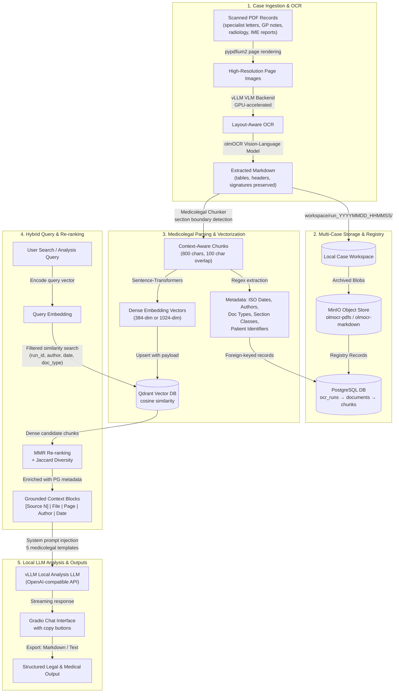
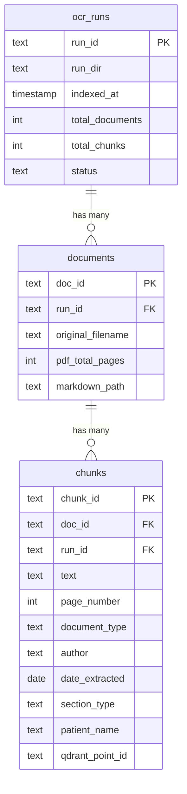
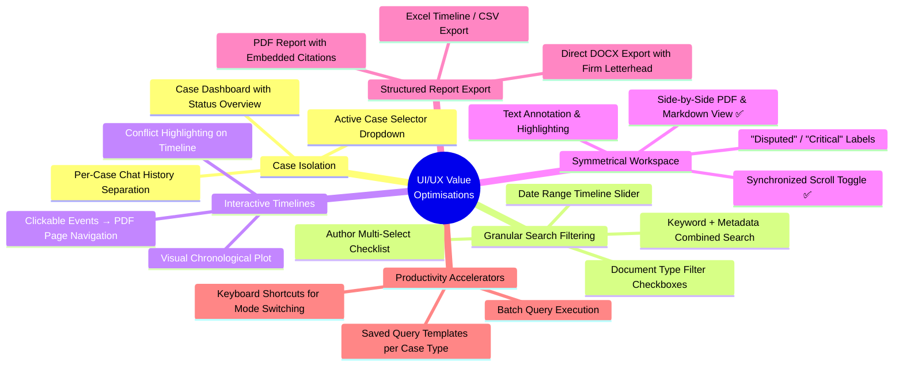

# Medicolegal Document Analysis & RAG Workflow
## A Practitioner's Guide for Legal & Medical Experts

This guide outlines the systematic, layout-aware PDF OCR extraction, indexing, and Retrieval-Augmented Generation (RAG) routine implemented within the **OLMOCR PDF-to-Markdown Suite**. It is written for lawyers, medicolegal assessors, independent medical examiners (IMEs), clinical auditors, and workers' compensation/TAC specialists who routinely manage **3–5 separate client cases per day** and require absolute case isolation, auditability, and structured clinical intelligence.

> **Privacy by Design**: The entire pipeline — from OCR to analysis — runs on **local hardware only**. No documents, vectors, or queries ever leave your workstation. This guarantees compliance with Protected Health Information (PHI) regulations such as HIPAA, the Australian Privacy Act, and professional legal privilege obligations.

---

## 🗺️ System Architecture Overview

The diagram below illustrates how unstructured clinical and legal records are ingested, parsed, stored, and queried entirely on local hardware.



---

## 🛠️ Daily Workflow Routine — Step by Step

### Phase 0: Infrastructure Start-Up

Before processing any case, the RAG infrastructure services must be running. This includes four containerised services managed via Docker Compose ([docker-compose.rag.yml](file:///home/owner/OLMOCR/docker-compose.rag.yml)):

| Service | Container | Port | Purpose |
|:---|:---|:---|:---|
| **PostgreSQL 16** | `olmocr_postgres` | `127.0.0.1:5432` | Document registry, chunk metadata, run tracking |
| **Redis 7.2** | `olmocr_redis` | `127.0.0.1:6379` | Query result cache, embedding cache, chat sessions |
| **MinIO** | `olmocr_minio` | `127.0.0.1:9000` | Blob storage for PDFs and markdown files |
| **Qdrant 1.10** | `olmocr_qdrant` | `127.0.0.1:6333` | Vector database for semantic search |

**Routine:**
1. Open the OLMOCR web application at `http://127.0.0.1:7860`.
2. Scroll to the **🧠 Document Analysis (RAG)** section.
3. Expand the **🔧 RAG Infrastructure** accordion.
4. Click **▶️ Start**. The [rag_infra_manager.py](file:///home/owner/OLMOCR/rag_infra_manager.py) orchestrator runs `docker compose up -d --wait` and then sequentially initialises:
    * PostgreSQL schema ([rag/db.py → init_schema()](file:///home/owner/OLMOCR/rag/db.py#L53-L110)): Creates the `ocr_runs`, `documents`, and `chunks` tables with cascading foreign keys and indexes on `page_number`, `date_extracted`, `author`, and `document_type`.
    * MinIO buckets ([rag/storage.py → init_buckets()](file:///home/owner/OLMOCR/rag/storage.py#L49-L54)): Creates `olmocr-pdfs` and `olmocr-markdown` buckets.
    * Qdrant collection ([rag/embedding.py → init_collection()](file:///home/owner/OLMOCR/rag/embedding.py#L167-L195)): Creates a cosine-similarity collection with auto-detected vector dimensions.
5. Verify all four badges show ✓ (green/healthy).

> [!TIP]
> Start the RAG infrastructure once at the beginning of the day. The containers persist between sessions and survive application restarts (configured with `restart: unless-stopped`).

---

### Phase 1: Layout-Aware PDF-to-Markdown OCR

In medicolegal work, missing a single sentence in a specialist report, or misinterpreting a date, can alter the outcome of a legal case. Standard OCR systems discard visual structures (columns, signature blocks, tabular clinical logs, side-by-side reports). The OLMOCR suite solves this using **vision-language models** (VLMs).

#### 1.1 Start the Inference Engine

*   **Backend**: A local vLLM container ([docker_manager.py](file:///home/owner/OLMOCR/docker_manager.py)) running under `vllm/vllm-openai` with full GPU control.
*   **Default OCR Model**: `allenai/olmOCR-2-7B-1025-FP8` — a vision-language model trained specifically to read PDFs and output pristine, layout-aware GitHub-flavored Markdown.

**Routine:**
1. In the header bar, check the **🐳 Inference Status** badge.
2. If not running, expand the **🐳 Local Inference Server (Docker)** accordion in the left sidebar.
3. Enter your Hugging Face token (required for gated models).
4. Set the OCR model to `allenai/olmOCR-2-7B-1025-FP8`.
5. Click **🔄 Recreate & Run** to pull and start the inference container.
6. Wait for the header badge to show ✓ Ready (the system polls every 5 seconds via [app.py → periodic_status_check()](file:///home/owner/OLMOCR/app.py#L526-L536)).

#### 1.2 Upload and Process Case PDFs

**Routine:**
1. In the **📥 Source Documents** section, drag-and-drop or upload all PDFs for the current case.
2. Adjust settings if needed:
    * **Workers**: Number of parallel page-processing workers (default: 4).
    * **Max Concurrent Requests**: Controls vLLM request concurrency (default: 20).
    * **Target Longest Image Dimension**: Set to **2048px** for fine print in clinical handwritten notes or low-contrast scans (default: 1288px).
    * **Max Page Retries**: Number of retry attempts per failed page (default: 8).
    * **Guided Decoding**: Enables YAML-structured output enforcement (default: on).
3. Click **🚀 Start Batch Processing**.
4. Monitor progress via the **📊 Monitoring** panel:
    * **Status badge**: Shows `Processing`, `Completed`, or `Error`.
    * **Progress bar**: Visual completion percentage.
    * **Completed/Failed page cards**: Real-time counters.
    * **📜 System Output Log**: Live subprocess output from the [pipeline_manager.py](file:///home/owner/OLMOCR/pipeline_manager.py) subprocess runner.

#### 1.3 The OCR Pipeline Internals

The [pipeline_manager.py → process_pdfs()](file:///home/owner/OLMOCR/pipeline_manager.py#L45) function executes the following sequence:

1. **Pre-flight check**: Verifies the vLLM server is reachable via `GET /v1/models`.
2. **Workspace creation**: Creates `workspace/run_YYYYMMDD_HHMMSS_XXXX/` with `inputs/` subdirectory.
3. **PDF copying**: Copies uploaded PDFs into the run's `inputs/` folder.
4. **Pipeline execution**: Spawns `olmocr.pipeline` as a subprocess, passing the server URL, model name, and all configured parameters.
5. **Page rendering**: Uses `pypdfium2` to render each PDF page into high-resolution images.
6. **VLM inference**: The vision-language model reads each page image and generates structured Markdown, preserving:
    * Tables (as Markdown tables)
    * Lists and bullet points
    * Headers (H1–H6)
    * Signature lines and letterhead blocks
    * Multi-column layouts
7. **Output writing**: Saves extracted Markdown to `workspace/run_*/markdown/inputs/`.
8. **Page mapping**: Records character-to-page mappings in JSONL results files for precise source citation.

---

### Phase 2: Reviewing Extracted Output

After processing completes, the results are immediately available for review.

**Routine:**
1. Select a document from the **📄 Select Processed Document** dropdown.
2. The three-panel symmetrical viewer activates:
    * **📄 Original PDF**: Embedded PDF viewer for the source document.
    * **✍️ Raw Markdown Output**: Syntax-highlighted raw Markdown text with a **📋 Copy** button.
    * **👁️ Rendered Preview**: Live HTML render of the Markdown.
3. Use **Page-by-Page** or **Full Document** view mode.
4. Enable **Sync Scroll** (checkbox) to synchronise scroll positions across all three panels — essential for verifying OCR accuracy against the original.
5. Use the ⬅️/➡️ page navigation buttons or the page slider for fine-grained page review.
6. Download individual Markdown files or a **ZIP archive** of all outputs.

> [!IMPORTANT]
> Always spot-check the raw Markdown against the original PDF before proceeding to indexing. The side-by-side viewer is designed specifically for this verification step.

---

### Phase 3: Choosing the Embedding Model

Before indexing, the Markdown content must be converted into numerical vectors for semantic search. The choice of embedding model directly impacts retrieval quality.

*   **Embedding Client**: Powered by HuggingFace `sentence-transformers` ([rag/embedding.py](file:///home/owner/OLMOCR/rag/embedding.py)).
*   **Singleton Pattern**: The model is loaded once and cached in memory via [load_embedding_model()](file:///home/owner/OLMOCR/rag/embedding.py#L85-L116). Switching models triggers a reload.
*   **Device Control**: Runs on CPU by default (`OLMOCR_EMBEDDING_DEVICE=cpu`) to avoid competing with the vLLM GPU inference engine.

| Model | Dimensions | Speed | Accuracy | Best For |
|:---|:---:|:---:|:---:|:---|
| `sentence-transformers/all-MiniLM-L6-v2` | 384 | ⚡ Fast | Good | Quick prototyping, short documents |
| `BAAI/bge-large-en-v1.5` | 1024 | 🐢 Slower | **Excellent** | **Recommended**: Complex medical jargon, legal arguments, multi-clinician records |

**Collision Prevention**: Different embedding models produce vectors of different dimensionality. The system automatically isolates collections using [get_collection_name(model_name)](file:///home/owner/OLMOCR/rag/embedding.py#L37-L53). For example:
* `all-MiniLM-L6-v2` → collection `olmocr_documents_all-minilm-l6-v2`
* `BAAI/bge-large-en-v1.5` → collection `olmocr_documents_baai_bge-large-en-v1_5`

This prevents data corruption or vector dimension clashes in Qdrant when switching between models.

**Routine:**
1. Expand **⚙️ Analysis Settings** in the RAG sidebar.
2. Select the embedding model from the **Embedding Model Name** dropdown.
3. Click **💾 Save Analysis Configuration**.

> [!WARNING]
> If you change the embedding model after indexing, previously indexed vectors remain in the old collection. You must re-index all runs with the new model, or queries will return no results.

---

### Phase 4: Medicolegal-Aware Ingestion & Indexing

Generic RAG systems split text strictly by character count, which breaks clinical lists, doctor signatures, and letter boundaries. The OLMOCR system uses a **custom medicolegal chunker** ([rag/chunker.py](file:///home/owner/OLMOCR/rag/chunker.py)).

#### 4.1 Intelligent Chunking Strategy

The chunker operates in three stages:

**Stage 1 — Section Boundary Detection** ([_split_into_sections()](file:///home/owner/OLMOCR/rag/chunker.py#L293-L323)):
Detects logical document boundaries using six pattern types:
* Date + Letter headers (e.g., `12/02/2018 Letter`)
* "Dear Dr..." salutations at line start
* Electronic Transmission markers
* "Re: Patient Name DOB:" headers
* "Clinical Notes of..." headers
* Scanned Document markers

Minimum section size: 200 characters (prevents micro-fragments).

**Stage 2 — Paragraph-Aware Chunk Splitting** ([_split_section_into_chunks()](file:///home/owner/OLMOCR/rag/chunker.py#L326-L405)):
Within each section:
* Splits at double-newlines (paragraph boundaries) first
* Falls back to single newlines
* Falls back to sentence boundaries (`. `)
* Maximum chunk size: **800 characters** (~200 tokens)
* Overlap: **100 characters** between consecutive chunks for narrative continuity

**Stage 3 — Rich Clinical Metadata Extraction** ([chunk_document()](file:///home/owner/OLMOCR/rag/chunker.py#L408-L498)):
For every text chunk, regex patterns extract:

| Metadata Field | Extraction Method | Examples |
|:---|:---|:---|
| **ISO Dates** | Multiple patterns via [_parse_date()](file:///home/owner/OLMOCR/rag/chunker.py#L185-L218) | `12.02.18` → `2018-02-12`, `Aug 27, 2020` → `2020-08-27` |
| **Authors** | Signature blocks, clinical headers, sender tags via [_extract_author()](file:///home/owner/OLMOCR/rag/chunker.py#L230-L236) | `Dr. Jane Smith (Physiotherapist)` |
| **Document Type** | Content pattern scoring via [_classify_document_type()](file:///home/owner/OLMOCR/rag/chunker.py#L239-L249) | `specialist_letter`, `clinical_notes`, `referral_letter`, `physiotherapy_report`, `radiology_report`, `medicolegal_report` |
| **Section Type** | Keyword patterns via [_classify_section_type()](file:///home/owner/OLMOCR/rag/chunker.py#L252-L257) | `clinical_findings`, `history`, `medications`, `diagnosis`, `treatment_plan`, `allergies`, `correspondence` |
| **Patient Name** | Header patterns via [_extract_patient_name()](file:///home/owner/OLMOCR/rag/chunker.py#L260-L266) | `Re: John Doe DOB: ...` → `John Doe` |
| **Page Number** | Character-to-page mapping via [_find_page_for_position()](file:///home/owner/OLMOCR/rag/chunker.py#L269-L284) | Maps each chunk to its source PDF page |

#### 4.2 Running the Indexing Process

**Routine:**
1. In the **📦 Document Indexing** accordion, click **🔄 Refresh Stats** to rescan the `workspace/` directory.
2. Select the target run from the **Select OCR Run** dropdown.
3. Click **📥 Index Selected Run** (or **📥 Index All Runs** for bulk indexing).
4. Monitor the **📜 RAG System Log** below the chat window. The system will:
    * **Check skip**: If the run is already indexed (`is_run_indexed(run_id)` returns `True`), it skips immediately.
    * **Chunk**: Invokes [chunk_documents_from_run()](file:///home/owner/OLMOCR/rag/chunker.py#L501-L586), which reads all `.md` files from the run, loads JSONL page ranges, and produces chunk dicts.
    * **Register**: Writes run and document records to PostgreSQL via [register_run()](file:///home/owner/OLMOCR/rag/db.py#L126-L136) and [register_document()](file:///home/owner/OLMOCR/rag/db.py#L191-L211).
    * **Upload**: Archives PDFs and Markdown to MinIO under `run_id/doc_id/filename` keys.
    * **Embed**: Encodes all chunks via [upsert_chunks()](file:///home/owner/OLMOCR/rag/embedding.py#L234-L307) in batches of 32, normalises embeddings for cosine similarity, and upserts vector points into Qdrant with full metadata payloads.
    * **Finalise**: Marks documents and the run as indexed, and invalidates the Redis query cache.
5. Verify by clicking **🔄 Refresh Stats** — the corpus statistics table should reflect the new document and chunk counts.

---

### Phase 5: Choosing the Analysis LLM

Once documents are indexed, a local LLM is queried through the same vLLM OpenAI-compatible API used for OCR. The analysis model is selected separately from the OCR model.

| Model Category | Recommended Model | Parameters | Strengths | Best Used For |
|:---|:---|:---:|:---|:---|
| **Instruct Models** | `nvidia/Llama-3.3-70B-Instruct-NVFP4` | 70B | High speed, reliable formatting, strict instruction adherence | Writing reports, structured summaries, listing medications, clean table output |
| **Reasoning Models** | `nvidia/Phi-4-reasoning-plus-NVFP4` | 14B | Multi-step logical reasoning, hidden chain-of-thought, strong analytical capability | Finding inconsistencies, resolving conflicting dates, complex cross-referencing, IME audits |
| **Balanced (Large)** | `nvidia/NVIDIA-Nemotron-3-Super-120B-A12B-NVFP4` | 120B (12B active) | Mixture-of-experts architecture, broad knowledge | General-purpose medicolegal analysis |
| **Balanced (Small)** | `nvidia/Qwen3.6-35B-A3B-NVFP4` | 35B (3B active) | Very fast inference, good accuracy | High-throughput batch queries, quick lookups |

#### Smart Parameter Handling

The [analyzer.py → query_llm_streaming()](file:///home/owner/OLMOCR/rag/analyzer.py#L132-L203) function applies automatic optimisations:

*   **Reasoning Model Detection**: Any model with `reasoning` or `r1` in its name is automatically detected.
*   **Temperature Override**: For reasoning models, the default low temperature (`0.1`) is overridden to `0.7` to prevent logical loops and repetitive output.
*   **Repetition Penalty**: A `1.05` repetition penalty is applied to reasoning models to reduce degenerate output.
*   **Model Equivalence Mapping**: The system maintains an equivalence table ([analyzer.py:L330-L340](file:///home/owner/OLMOCR/rag/analyzer.py#L330-L340)) that maps equivalent model identifiers (e.g., `microsoft/Phi-4-reasoning-plus` ↔ `nvidia/Phi-4-reasoning-plus-NVFP4`) to prevent false "model not loaded" warnings.
*   **Automatic Fallback**: If the configured model is not loaded in vLLM, the system automatically falls back to whichever model is actually loaded and displays a warning.

**Routine:**
1. Expand **⚙️ Analysis Settings**.
2. Select the model from the **Analysis Model Name** dropdown.
3. Set the **Analysis LLM Server URL** (default: `http://localhost:8000/v1`).
4. Adjust **Retrieval Top-K** (default: 8 — the number of chunks retrieved per query).
5. Click **💾 Save Analysis Configuration**.

> [!TIP]
> **Workflow tip**: Use the **Instruct model** for initial summaries and timelines (where formatting matters), then switch to the **Reasoning model** for inconsistency detection and complex cross-referencing tasks (where analytical depth matters).

---

### Phase 6: Querying RAG & Saving Outputs

#### 6.1 The RAG Query Pipeline

Each query triggers the full RAG pipeline via [analyze()](file:///home/owner/OLMOCR/rag/analyzer.py#L262-L362):

```
Query → Embed → Qdrant Filtered Search → MMR Re-ranking → Context Assembly → LLM Streaming → Chat Output
```

**Retrieval** ([rag/retriever.py → search_similar()](file:///home/owner/OLMOCR/rag/retriever.py#L25-L143)):
1. Encodes the query using the same embedding model.
2. Applies optional metadata filters: `run_id`, `doc_type`, `author`, `date_from`, `date_to`.
3. Fetches `top_k × 2` candidate chunks from Qdrant (with a `score_threshold` of 0.25).
4. Enriches results by merging Qdrant payloads with PostgreSQL chunk metadata (joining on `qdrant_point_id`).
5. Applies **Maximal Marginal Relevance (MMR)** re-ranking ([_mmr_rerank()](file:///home/owner/OLMOCR/rag/retriever.py#L146-L206)) with `λ=0.7` to balance relevance with diversity, using Jaccard text similarity for diversity measurement.

**Context Formatting** ([format_context_for_llm()](file:///home/owner/OLMOCR/rag/retriever.py#L223-L258)):
Each chunk is labelled with structured source citations:
```
[Source 1] | File: specialist_report.md | Page: 3 | Author: Dr. Smith | Date: 2024-06-15 | Type: Specialist Letter
<chunk text>
```

#### 6.2 Analysis Modes & Prompt Templates

Five specialised system prompts ([rag/analyzer.py → SYSTEM_PROMPTS](file:///home/owner/OLMOCR/rag/analyzer.py#L21-L77)) are pre-configured for medicolegal work:

| Mode | Icon | Purpose | Output Format | Ideal LLM |
|:---|:---:|:---|:---|:---|
| **Free Q&A** | 💬 | Answer any question about the records | Cited paragraphs | Either |
| **Timeline Generator** | 📅 | Extract every dated clinical event | Markdown table: `Date \| Event \| Provider \| Source` | Instruct |
| **Injury Summary** | 🏥 | Structured injury/treatment report | Numbered headings: Patient Details → Mechanism → Injuries → Treatment → Status → Medications → Providers → Outstanding Issues | Instruct |
| **Inconsistency Finder** | 🔍 | Cross-reference discrepancies across sources | Table: `Issue \| Source A Says \| Source B Says \| Severity (Minor/Moderate/Major)` | **Reasoning** |
| **Medication Tracker** | 💊 | Track all prescriptions and changes | Table: `Medication \| Dose/Freq \| Date Started \| Date Stopped \| Prescriber \| Source` | Either |

All modes enforce:
* Citation of `[Source N]`, filename, page, and date for every factual claim.
* Explicit acknowledgement when information cannot be determined from the provided excerpts.
* ISO date format (`YYYY-MM-DD`) throughout.
* Professional language appropriate for medicolegal analysis.

#### 6.3 Using the Chat Interface

**Routine:**
1. Select the desired **Analysis Mode** from the dropdown.
2. Type your question in the chat input field.
3. Click **🚀 Ask** or press Enter.
4. The response streams in real-time with full source citations.
5. Use the **📋 Copy** button on any response to copy it to clipboard.
6. Switch analysis modes between queries to generate different report types from the same indexed documents.
7. Click **🗑️ Clear Chat** to reset the conversation when moving to a new line of enquiry.

The chat supports multi-turn conversation. The system retains the last 6 messages of chat history ([build_prompt()](file:///home/owner/OLMOCR/rag/analyzer.py#L91-L129)) to manage context window limits while allowing follow-up questions.

#### 6.4 Exporting & Saving Outputs

*   **Copy to Clipboard**: Every chat response has a built-in copy button for pasting into Word, Outlook, or your case management system.
*   **Markdown Downloads**: The original extracted Markdown files are available as individual downloads or ZIP archives from the document viewer section.
*   **Redis Cache**: All queries and responses are cached in Redis for 1 hour ([rag/cache.py → QUERY_CACHE_TTL](file:///home/owner/OLMOCR/rag/cache.py#L24)), so repeated queries return instantly.
*   **Chat Session Persistence**: Chat history is stored in Redis for 2 hours per session ([CHAT_HISTORY_TTL](file:///home/owner/OLMOCR/rag/cache.py#L26)).

---

## 📂 Case B: Integrating Pre-Existing Markdowns from Prior Conversions

If you have already processed PDF documents into Markdown — either through prior OLMOCR runs, another layout-preserving OCR tool (e.g., Azure Document Intelligence, Mathpix, Nougat), or manual clinical note transcription — you can integrate these files into the RAG system as a separate case **without re-running OCR**.

### Step 1: Prepare the Case Directory Structure

Create a folder inside the `workspace/` directory that mimics the OLMOCR run output. The folder name **must** start with the prefix `run_` to be detected by the [get_available_runs()](file:///home/owner/OLMOCR/rag_ui.py#L22-L45) scanner.

```
workspace/
└── run_CaseXYZ_Smith_v_Jones_2024/
    ├── inputs/                                ← (Optional) Original PDFs for side-by-side UI preview
    │   ├── specialist_report_dr_brown.pdf
    │   └── physio_progress_notes.pdf
    └── markdown/
        └── inputs/                            ← (Required) Extracted Markdown files
            ├── 0_specialist_report_dr_brown.md
            ├── 1_physio_progress_notes.md
            └── 2_gp_clinical_notes.md
```

> [!IMPORTANT]
> **Naming Convention**: Prefix markdown filenames with a numeric index (`0_`, `1_`, `2_`) followed by a descriptive name. The indexer strips this prefix when storing the `original_filename` in PostgreSQL ([rag_ui.py:L113-L114](file:///home/owner/OLMOCR/rag_ui.py#L113-L114)), so your corpus stats display clean filenames.

### Step 2: (Optional) Add Page-Range JSONL Metadata

If you have page-range data from your OCR tool, create a `results/` directory with JSONL files:

```
workspace/
└── run_CaseXYZ_Smith_v_Jones_2024/
    ├── results/
    │   └── output.jsonl       ← Page range metadata
    ├── inputs/
    └── markdown/
        └── inputs/
```

The JSONL format should match the OLMOCR output:
```json
{
  "metadata": {"Source-File": "specialist_report_dr_brown.pdf"},
  "attributes": {"pdf_page_numbers": [[0, 2450, 1], [2450, 4800, 2], [4800, 7200, 3]]}
}
```

Each triple `[char_start, char_end, page_number]` maps character ranges in the markdown to PDF page numbers. Without this, page citations in RAG responses will show `null`.

### Step 3: Register and Index the Case

1. Open the OLMOCR Web Application.
2. Navigate to the **🧠 Document Analysis (RAG)** section.
3. Expand the **📦 Document Indexing** accordion.
4. Click **🔄 Refresh Stats** — this calls [get_available_runs()](file:///home/owner/OLMOCR/rag_ui.py#L22-L45) which rescans `workspace/` for any `run_*` directory containing `.md` files under `markdown/inputs/`.
5. Select `run_CaseXYZ_Smith_v_Jones_2024` from the **Select OCR Run** dropdown.
6. Click **📥 Index Selected Run**.
7. Monitor the **📜 RAG System Log**. The pipeline:
    * Generates a deterministic `run_id` via SHA-256 hash of the directory path.
    * Chunks all Markdown files using the medicolegal chunker.
    * Extracts clinical metadata (dates, authors, doc types, patient names).
    * Computes vector embeddings and upserts into Qdrant.
    * Writes registry records into PostgreSQL.
    * Uploads copies to MinIO for archival.
8. The case is now queryable via the chat interface — identically to cases processed through the built-in OCR.

### Step 4: Query the Imported Case

Follow the same **Phase 6** query workflow described above. The pre-existing Markdown files are now fully integrated into the vector search corpus with the same metadata extraction, citation formatting, and analysis mode support.

---

## ⚖️ Multi-Case Management for Daily Legal & Medical Practice

Lawyers, clinical auditors, and medicolegal examiners frequently manage **3–5 distinct client cases per day**. Keeping these cases completely isolated is legally and ethically mandatory to prevent cross-contamination of confidential client data.

### 1. Isolated Workspace Directories

Each upload batch or imported conversion is physically isolated in its own `workspace/run_[Case_ID]/` folder. This prevents files from different cases from mixing on disk.

**Recommended naming convention for daily practice:**

```
workspace/
├── run_20260712_091500_Client_A_Jones/       ← Morning case 1
├── run_20260712_103000_Client_B_Smith/       ← Morning case 2
├── run_20260712_140000_Client_C_Williams/    ← Afternoon case 3
├── run_imported_legacy_Client_D_Davis/       ← Pre-converted import
└── run_20260711_160000_Client_E_Wilson/      ← Yesterday's case (still indexed)
```

### 2. Relational Registry & Run Identifiers

Every document and chunk is tagged with a unique `run_id` — a deterministic SHA-256 hash of the run's workspace directory path ([rag_ui.py:L67](file:///home/owner/OLMOCR/rag_ui.py#L67)). The PostgreSQL schema enforces foreign key relationships:



**Cascading deletion**: Deleting a run via [delete_run_data(run_id)](file:///home/owner/OLMOCR/rag/db.py#L361-L367) automatically purges all child `documents` and `chunks` records in a single SQL cascade.

### 3. Vector Database Namespace Isolation

Vector embeddings are upserted into Qdrant with a payload containing the `run_id` field ([embedding.py:L281](file:///home/owner/OLMOCR/rag/embedding.py#L281)).

*   **Search Isolation**: During RAG queries, you can isolate searches to a single client by applying a `run_id_filter` in [search_similar()](file:///home/owner/OLMOCR/rag/retriever.py#L25-L143). This adds a `FieldCondition(key="run_id", match=MatchValue(value=run_id))` filter to the Qdrant query, restricting semantic lookups strictly to that case's vectors.
*   **Selective Deletion**: Removing a case's vectors from Qdrant is done via [delete_run_vectors(run_id)](file:///home/owner/OLMOCR/rag/embedding.py#L310-L333), which issues a filtered delete that leaves all other cases untouched.

### 4. Object Storage Isolation

In MinIO, files are stored under a key structure of `run_id/doc_id/filename` within two separate buckets:
* `olmocr-pdfs`: Original source PDFs.
* `olmocr-markdown`: Extracted Markdown files.

The [delete_run_objects(run_id)](file:///home/owner/OLMOCR/rag/storage.py#L206-L217) function recursively removes all objects under the `run_id/` prefix from both buckets.

### 5. Clearing Resources Between Cases

When wrapping up a case and transitioning to the next, experts should clean up intermediate caches and temp files:

1. Expand the **🧹 Reset & Cleanup** accordion in the left sidebar.
2. Select components to clean:
    * **Obsolete run directories** (`workspace/run_*`): Removes local workspace files for completed cases.
    * **Gradio upload temp files** (`/tmp/gradio`): These accumulate quickly with multi-hundred-page PDFs.
    * **Python bytecode cache** (`__pycache__`): Minor disk recovery.
    * ⚠️ **Hugging Face model cache** (`~/.cache/huggingface`): Only if switching models permanently — requires re-downloading 10–30GB of model weights.
3. Click **🧹 Clean & Reset**.

> [!CAUTION]
> Cleaning obsolete run directories deletes the local Markdown files permanently. Ensure the case has been fully indexed (archived in MinIO + PostgreSQL + Qdrant) before removing local files, or that you have exported all needed outputs.

---

## 🚀 Crucial UX/UI Elements to Optimise Workflow & Increase Project Value

The following UI/UX enhancements are critical to scaling the RAG pipeline for high-throughput daily medicolegal workflows. They are prioritised by their impact on lawyer productivity and case accuracy.



---

### 1. Active Case Selector in RAG Chat ⭐ (Highest Priority)

| | |
|:---|:---|
| **Current State** | The chat interface queries the entire indexed corpus across all cases. |
| **Problem** | Clinical details from Client A can contaminate a summary generated for Client B — a severe confidentiality breach. |
| **UX Optimisation** | Add an **"Active Case"** dropdown directly above the chat window. When a case is selected, the frontend automatically applies the corresponding `run_id` as a `run_id_filter` in [search_similar()](file:///home/owner/OLMOCR/rag/retriever.py#L32). An "All Cases" option allows cross-case analysis when explicitly needed. |
| **Implementation** | The `run_id_filter` parameter already exists in the retriever and is fully functional — this requires only a Gradio dropdown widget wired to the `analyze()` call in [rag_ui.py](file:///home/owner/OLMOCR/rag_ui.py). |
| **Value** | Prevents cross-case data leakage. Essential for professional ethics and legal privilege compliance. |

### 2. Interactive Filter Controls (Date, Author, Doc Type)

| | |
|:---|:---|
| **Current State** | Advanced metadata filtering is fully implemented in the retriever ([retriever.py:L25-L48](file:///home/owner/OLMOCR/rag/retriever.py#L25-L48)) including `doc_type_filter`, `author_filter`, `date_from`, and `date_to` parameters, but **not yet exposed in the UI**. |
| **UX Optimisation** | Add a collapsible **"🔍 Search Filters"** panel to the chat interface: |

*   **Author Checklist**: A multi-select checklist dynamically populated from unique `author` values in the selected case's chunks (available via [get_corpus_stats()](file:///home/owner/OLMOCR/rag/db.py#L345-L358) or a new per-run query).
*   **Document Type Checklist**: Filter for `specialist_letter`, `clinical_notes`, `radiology_report`, `physiotherapy_report`, `medicolegal_report`, `referral_letter`.
*   **Date Range Slider**: A double-ended slider showing the full date range of the case, allowing you to isolate queries to specific time windows (e.g., post-accident treatment only, pre-existing history only).

**Value**: Dramatically increases RAG precision by excluding irrelevant records. For example, when analysing post-accident treatment, filtering out pre-existing GP notes reduces noise and hallucination risk.

### 3. Symmetrical, Synchronized Annotation Workspace

| | |
|:---|:---|
| **Current State** | The three-panel symmetrical view (PDF / Raw Markdown / Rendered Preview) with synchronized scrolling is **already implemented** ([app.py:L617-L675](file:///home/owner/OLMOCR/app.py#L617-L675)). |
| **UX Optimisation** | Extend with in-document annotation capabilities: |

*   Allow users to **highlight text** directly on the rendered Markdown or PDF panel.
*   Highlights can be tagged with labels: `Disputed`, `Critical`, `Prior Condition`, `Key Evidence`, `Inconsistency`.
*   Tagged highlights are saved as annotated metadata and become searchable/filterable in RAG queries.
*   Export annotations as a summary report for inclusion in legal submissions.

**Value**: Enables legal teams to flag key evidence directly within the case records during review, creating a permanent audit trail that integrates with the RAG analysis pipeline.

### 4. Interactive Clinical Timeline Visualisation

| | |
|:---|:---|
| **Current State** | The Timeline Generator (📅 mode) outputs a static Markdown table. |
| **UX Optimisation** | Display the generated timeline as an **interactive graphical flow**: |

*   Render clinical events as nodes on a horizontal or vertical timeline.
*   Colour-code by provider/author or document type.
*   Clicking an event on the timeline should:
    1. Highlight the corresponding source citation.
    2. Automatically scroll the side-by-side PDF viewer to the exact page where the event was documented.
*   Overlay conflict markers where inconsistencies exist between sources.

**Value**: Saves hours of manual cross-referencing. Makes the RAG system an auditable, visual source of truth for litigation timelines.

### 5. Single-Click Structured Report Export

| | |
|:---|:---|
| **Current State** | Output is plain text in the Gradio chat window with copy-to-clipboard functionality. |
| **UX Optimisation** | Add direct download buttons below the chat window: |

*   **📅 Export Medical Chronology (Excel/CSV)**: Converts Timeline Generator output into a formatted spreadsheet.
*   **🏥 Export IME Injury Summary (Word/DOCX)**: Generates a formatted Word document with firm letterhead template, numbered headings, and embedded source citations.
*   **📋 Export Full Analysis (PDF)**: Compiles the complete chat session into a formatted PDF report suitable for court submission.

**Value**: Converts raw RAG outputs into finalised legal deliverables instantly, eliminating hours of copy-pasting and manual formatting.

### 6. Case Dashboard & Status Overview

| | |
|:---|:---|
| **Current State** | Corpus statistics are shown as a single aggregate table. |
| **UX Optimisation** | Add a **Case Dashboard** view showing: |

*   All indexed cases in a card/grid layout.
*   Per-case metrics: document count, chunk count, date range, unique authors.
*   Status indicators: Indexed ✅, Pending ⏳, Error ❌.
*   Quick-action buttons: "Analyse This Case", "Delete Case", "Export All".

**Value**: Gives the practitioner a bird's-eye view of their daily caseload, enabling rapid case switching and progress tracking.

### 7. Keyboard Shortcuts & Productivity Accelerators

| Shortcut | Action |
|:---|:---|
| `Ctrl+Enter` | Submit chat query |
| `Ctrl+1` through `Ctrl+5` | Switch analysis mode (Q&A, Timeline, Summary, Inconsistencies, Medications) |
| `Ctrl+Shift+C` | Copy last response to clipboard |
| `Ctrl+Shift+N` | Clear chat and start new analysis session |
| `Ctrl+Shift+F` | Toggle search filter panel |

**Value**: Reduces mouse-clicking overhead for practitioners processing 3–5 cases daily, aligning with professional workflow expectations.

---

## ⚖️ Best Practices for Medicolegal Experts & Lawyers

### Document Verification
1. **Always verify OCR output** against the original PDF using the synchronised side-by-side viewer before indexing. Pay particular attention to handwritten notes, low-contrast scans, and multi-column layouts.
2. **Cross-reference citations**: Every RAG answer includes `[Source N]` references with filename, page, and date. Always verify critical claims by navigating to the cited page.

### Case Management
3. **One case = one run**: Upload each client's documents as a separate batch. Name imported runs descriptively: `run_imported_Smith_v_Jones_2024`.
4. **Enable case filtering**: When the Active Case Selector is available, always select the specific case before querying. Never analyse with "All Cases" selected unless performing deliberate cross-case research.
5. **Clean up after each case**: Purge temporary files between cases to prevent accidental data mixing.

### Analysis Strategy
6. **Use the right model for the task**: Use Instruct models for structured reports and timelines; use Reasoning models for inconsistency detection and complex analysis.
7. **Start broad, then narrow**: Begin with Free Q&A to explore the records, then use specialised modes for structured output.
8. **Adjust Top-K for case size**: Small cases (2–3 documents) may work well with Top-K = 5; large cases (10+ documents) benefit from Top-K = 12–15.

### Security & Compliance
9. **Local deployment for PHI**: The entire application runs on local hardware. No documents, vectors, or queries traverse the network. This guarantees compliance with HIPAA, the Australian Privacy Act, and professional legal privilege.
10. **Audit trail**: PostgreSQL maintains a complete registry of all indexed documents, chunks, and their metadata. This provides a defensible chain of custody for litigation purposes.
11. **Data retention**: Configure Redis TTLs and MinIO lifecycle policies according to your firm's data retention policies. The default Redis query cache TTL is 1 hour; chat history TTL is 2 hours.
