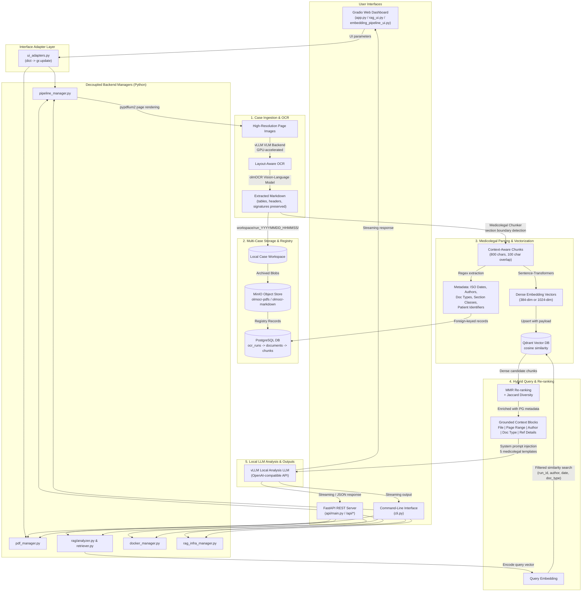
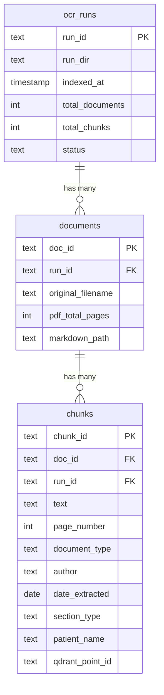

# Medicolegal Document Analysis & RAG Workflow
## A Practitioner's Guide for Legal & Medical Experts

This guide outlines the systematic, layout-aware PDF OCR extraction, indexing, and Retrieval-Augmented Generation (RAG) routine implemented within the **OLMOCR PDF-to-Markdown Suite**. It is written for lawyers, medicolegal assessors, independent medical examiners (IMEs), clinical auditors, and workers' compensation/TAC specialists who routinely manage **3–5 separate client cases per day** and require absolute case isolation, auditability, and structured clinical intelligence.

> **Privacy by Design**: The entire pipeline — from OCR to analysis — runs on **local hardware only**. No documents, vectors, or queries ever leave your workstation. This guarantees compliance with Protected Health Information (PHI) regulations such as HIPAA, the Australian Privacy Act, and professional legal privilege obligations.

> [!SECURITY]
> The PostgreSQL and MinIO credentials are resolved from environment variables (`.env`, which is **git-ignored**) and fall back to documented placeholder defaults. The application prints a **startup security warning** if either credential is still using its default (`change_me_in_production` / `change_me_minio_secret`). Always set strong, unique values in `.env` before exposing the workstation on any network. The Docker services bind to `127.0.0.1` only; the Gradio server listens on `127.0.0.1:7860`.

---

## 🗺️ System Architecture Overview

The diagram below illustrates how unstructured clinical and legal records are ingested, parsed, stored, and queried entirely on local hardware, highlighting the new hybrid architecture supporting **Gradio UI, FastAPI REST API, and CLI interfaces** sharing a decoupled backend logic layer.



---

## 🛠️ Daily Workflow Routine — Step by Step

### Phase 0: Infrastructure Start-Up

Before processing any case, the RAG infrastructure services must be running. This includes four containerised services managed via Docker Compose ([docker-compose.rag.yml](file:///home/owner/KIRAG/docker-compose.rag.yml)):

| Service | Container | Port | Purpose |
|:---|:---|:---|:---|
| **PostgreSQL 16** | `olmocr_postgres` | `127.0.0.1:5432` | Document registry, chunk metadata, run tracking |
| **Redis 7.2** | `olmocr_redis` | `127.0.0.1:6379` | Query result cache, embedding cache, chat sessions |
| **MinIO** | `olmocr_minio` | `127.0.0.1:9000` | Blob storage for PDFs and markdown files |
| **Qdrant 1.10** | `olmocr_qdrant` | `127.0.0.1:6333` | Vector database for semantic search |

**Startup Alternatives:**

*   **Option A: Via Gradio UI**
    1. Open the OLMOCR web application at `http://127.0.0.1:7860`.
    2. Click **💬 RAG Processing** in the left navigation sidebar to open the RAG panel.
    3. Expand the **🔧 RAG Infrastructure** accordion in the RAG sidebar.
    4. Click **▶️ Start**. The [start_and_init_rag()](file:///home/owner/KIRAG/rag_infra_manager.py#L259-L295) function runs `docker compose up -d --wait` and initializes the PostgreSQL schema, MinIO buckets, and Qdrant vector store collection.
    5. Verify all four badges show ✓ (green/healthy).

*   **Option B: Via REST API**
    Send a `POST` request to start and initialize the infrastructure:
    ```bash
    curl -X POST http://localhost:8001/api/rag/infra/start
    ```
    To check service statuses:
    ```bash
    curl http://localhost:8001/api/rag/infra/status
    ```

*   **Option C: Via CLI (Headless)**
    Execute the RAG infrastructure start command:
    ```bash
    python cli.py rag infra start
    ```
    To inspect statuses:
    ```bash
    python cli.py rag infra status
    ```

**Sequential Initialisation Details:**
*   PostgreSQL schema ([rag/db.py → init_schema()](file:///home/owner/KIRAG/rag/db.py#L88)): Creates the `ocr_runs`, `documents`, and `chunks` tables with cascading foreign keys (`ON DELETE CASCADE`) and indexes on `page_number`, `date_extracted`, `author`, and `document_type`.
*   MinIO buckets ([rag/storage.py → init_buckets()](file:///home/owner/KIRAG/rag/storage.py#L52-L60)): Creates `olmocr-pdfs` and `olmocr-markdown` buckets.
*   Qdrant collection ([rag/embedding.py → init_collection()](file:///home/owner/KIRAG/rag/embedding.py)): Creates a cosine-similarity collection with auto-detected vector dimensions based on the configured embedding model.

> [!TIP]
> Start the RAG infrastructure once at the beginning of the day. The containers persist between sessions and survive application restarts (configured with `restart: unless-stopped`).

---

### Phase 1: Layout-Aware PDF-to-Markdown OCR

In medicolegal work, missing a single sentence in a specialist report, or misinterpreting a date, can alter the outcome of a legal case. Standard OCR systems discard visual structures (columns, signature blocks, tabular clinical logs, side-by-side reports). The OLMOCR suite solves this using **vision-language models** (VLMs).

#### 1.1 Start the Inference Engine

*   **Backend**: A local vLLM container ([docker_manager.py](file:///home/owner/KIRAG/docker_manager.py)) launched from the `vllm/vllm-openai:v0.8.5` image (overridable via the `OLMOCR_VLLM_IMAGE` environment variable) with full GPU control (`--gpus all`).
*   **Default OCR Model**: `allenai/olmOCR-2-7B-1025-FP8` — a vision-language model trained specifically to read PDFs and output pristine, layout-aware GitHub-flavored Markdown.

**Inference Engine Startup Alternatives:**

*   **Option A: Via Gradio UI**
    1. Expand the **🐳 Inference Server (Docker)** accordion in the global left navigation sidebar.
    2. Enter your Hugging Face token (required for gated models).
    3. Select the OCR model name (e.g., `allenai/olmOCR-2-7B-1025-FP8`).
    4. Click **🔄 Recreate & Run** to pull and start the inference container. Wait for System Health to show ✓ Ready.

*   **Option B: Via REST API**
    Send a `POST` request to create the inference container:
    ```bash
    curl -X POST http://localhost:8001/api/docker/create \
         -H "Content-Type: application/json" \
         -d '{"hf_token": "hf_...", "port": 8000, "model": "allenai/olmOCR-2-7B-1025-FP8", "gpu_mem": 0.8, "max_model_len": 15360}'
    ```

*   **Option C: Via CLI**
    Run the creation command:
    ```bash
    python cli.py docker create --hf-token "hf_..." --port 8000 --model "allenai/olmOCR-2-7B-1025-FP8"
    ```

#### 1.2 Upload and Process Case PDFs

**Batch OCR Alternatives:**

*   **Option A: Via Gradio UI**
    1. In the **📥 Source Documents** section, upload the target PDFs.
    2. Adjust workers, concurrency, target image dimensions, and retry options.
    3. Click **🚀 Start Batch Processing**.
    4. Monitor progress via the progress bar, completed page counters, and the live system output log.

*   **Option B: Via REST API**
    Trigger the batch process by listing absolute file paths. The API response streams Server-Sent Events (SSE) detailing logs and progress percentages in real-time:
    ```bash
    curl -X POST http://localhost:8001/api/pipeline/start \
         -H "Content-Type: application/json" \
         -d '{"file_paths": ["/absolute/path/to/case_file.pdf"], "workers": 4, "max_concurrent": 20}'
    ```

*   **Option C: Via CLI**
    Start processing files in headless mode:
    ```bash
    python cli.py pipeline start --files "/absolute/path/to/file1.pdf" "/absolute/path/to/file2.pdf" --workers 4
    ```

#### 1.3 The OCR Pipeline Internals

The [pipeline_manager.py → process_pdfs()](file:///home/owner/KIRAG/pipeline_manager.py#L158-L170) function executes the following sequence:

1. **Pre-flight check**: Verifies the vLLM server is reachable via `GET /v1/models`.
2. **Workspace creation**: Creates `workspace/run_YYYYMMDD_HHMMSS_XXXX/` with `inputs/` subdirectory.
3. **PDF copying**: Copies uploaded PDFs into the run's `inputs/` folder.
4. **Pipeline execution**: Spawns `olmocr.pipeline` as a subprocess, passing the server URL, model name, and all configured parameters.
5. **Page rendering**: Uses `pypdfium2` to render each PDF page into high-resolution images.
6. **VLM inference**: The vision-language model reads each page image and generates structured Markdown, preserving:
    * Tables (as Markdown tables)
    * Lists and bullet points
    * Headers (H1–H6)
    * Signature lines and letterhead blocks
    * Multi-column layouts
7. **Output writing**: Saves extracted Markdown to `workspace/run_*/markdown/inputs/`.
8. **Page mapping**: Records character-to-page mappings in JSONL results files for precise source citation.

---

### Phase 2: Reviewing Extracted Output

After processing completes, the results are immediately available for review.

**Routine:**
1. Select a document from the **📄 Select Processed Document** dropdown.
2. The three-panel symmetrical viewer activates:
    * **📄 Original PDF**: Embedded PDF viewer for the source document.
    * **✍️ Raw Markdown Output**: Syntax-highlighted raw Markdown text with a **📋 Copy** button.
    * **👁️ Rendered Preview**: Live HTML render of the Markdown.
3. Use **Page-by-Page** or **Full Document** view mode.
4. Enable **Sync Scroll** (checkbox) to synchronise scroll positions across all three panels — essential for verifying OCR accuracy against the original.
5. Use the ⬅️/➡️ page navigation buttons or the page slider for fine-grained page review.
6. Download individual Markdown files or a **ZIP archive** of all outputs.

> [!IMPORTANT]
> Always spot-check the raw Markdown against the original PDF before proceeding to indexing. The side-by-side viewer is designed specifically for this verification step.

---

### Phase 3: Stage 2 Embedding Engine & Hardware Acceleration

Before indexing, Markdown content is converted into dense 1,024-dimensional vector representations for semantic search. In the **KIRAG** workstation, Stage 2 Embedding runs as a dedicated standalone workspace ([`embedding_pipeline_ui.py`](file:///home/owner/KIRAG/embedding_pipeline_ui.py)), accessible directly via the main left sidebar navigation (**`🧠 Embedding Pipeline`**).

*   **Embedding Client**: Powered by HuggingFace `sentence-transformers` ([rag/embedding.py](file:///home/owner/KIRAG/rag/embedding.py)).
*   **Singleton & Device Control**: The model auto-detects CUDA hardware (`embedding_device: "auto"`) for up to **50x–100x GPU acceleration** (~172 chunks/sec on NVIDIA GB10). Users can toggle between `⚡ Auto CUDA GPU`, `🚀 CUDA GPU Dedicated`, or `💻 CPU Mode`.
*   **Batch Size Slider**: Interactive slider (16 to 512, default 64) for tuning GPU memory utilization and throughput.
*   **Redis Bulk Pipeline Caching**: Uses Redis `mget` and pipeline `mset` ([rag/cache.py](file:///home/owner/KIRAG/rag/cache.py)) for sub-millisecond vector lookup cache hits.
*   **Default Model**: `BAAI/bge-large-en-v1.5` (1024 dimensions) — selected for superior accuracy with complex medical and legal terminology.

| Model | Dimensions | Speed (CUDA) | Accuracy | Best For |
|:---|:---:|:---:|:---:|:---|
| `BAAI/bge-large-en-v1.5` | 1024 | ⚡ Fast (172/s) | **Excellent** | **Default & Recommended**: Complex medical jargon, legal arguments, multi-clinician records |
| `sentence-transformers/all-MiniLM-L6-v2` | 384 | ⚡ Ultra-Fast | Good | Quick prototyping, short documents |

**Collision Prevention**: Different embedding models produce vectors of different dimensionality. The system automatically isolates collections using [get_collection_name(model_name)](file:///home/owner/KIRAG/rag/embedding.py#L44-L60) (e.g. `olmocr_documents_baaibge-large-en-v1.5`).

**Routine:**
1. Click **`🧠 Embedding Pipeline`** on the main left sidebar (3rd navigation button down).
2. Select the **Compute Engine Device** (`auto` for CUDA acceleration) and adjust the **Embedding Batch Size** slider.
3. Select or enter the **Embedding Model Name**.
4. Adjust **Max Chunk Size** (200–2,000 chars) and **Chunk Overlap** (0–500 chars).
5. Click **💾 Save Configuration**. Monitor live Qdrant point count and Redis vector cache telemetry in real-time.

> [!WARNING]
> If you change the embedding model after indexing, previously indexed vectors remain in the old collection. You must re-index all runs with the new model, or queries will return no results.

---

### Phase 4: Medicolegal-Aware Ingestion & Indexing

Generic RAG systems split text strictly by character count, which breaks clinical lists, doctor signatures, and letter boundaries. The OLMOCR system uses a **custom medicolegal chunker** ([rag/chunker.py](file:///home/owner/KIRAG/rag/chunker.py)).

#### 4.1 Intelligent Chunking Strategy

The chunker operates in three stages:

**Stage 1 — Section Boundary Detection** ([_split_into_sections()](file:///home/owner/KIRAG/rag/chunker.py)):
Detects logical document boundaries using six pattern types:
* Date + Letter headers (e.g., `12/02/2018 Letter`)
* "Dear Dr..." salutations at line start
* Electronic Transmission markers
* "Re: Patient Name DOB:" headers
* "Clinical Notes of..." headers
* Scanned Document markers

Minimum section size: 200 characters (prevents micro-fragments).

**Stage 2 — Paragraph-Aware Chunk Splitting** ([_split_section_into_chunks()](file:///home/owner/KIRAG/rag/chunker.py)):
Within each section:
* Splits at double-newlines (paragraph boundaries) first
* Falls back to single newlines
* Falls back to sentence boundaries (`. `)
* Maximum chunk size: **800 characters** (~200 tokens, configurable 200–2000)
* Overlap: **100 characters** between consecutive chunks for narrative continuity (configurable 0–500)

**Stage 3 — Rich Clinical Metadata Extraction** ([chunk_document()](file:///home/owner/KIRAG/rag/chunker.py)):
For every text chunk, regex patterns extract:

| Metadata Field | Extraction Method | Examples |
|:---|:---|:---|
| **ISO Dates** | Multiple patterns via [_parse_date()](file:///home/owner/KIRAG/rag/chunker.py) | `12.02.18` → `2018-02-12`, `Aug 27, 2020` → `2020-08-27` |
| **Authors** | Signature blocks, clinical headers, sender tags via [_extract_author()](file:///home/owner/KIRAG/rag/chunker.py) | `Dr. Jane Smith (Physiotherapist)` |
| **Document Type** | Content pattern scoring via [_classify_document_type()](file:///home/owner/KIRAG/rag/chunker.py) | `specialist_letter`, `clinical_notes`, `referral_letter`, `physiotherapy_report`, `radiology_report`, `medicolegal_report` |
| **Section Type** | Keyword patterns via [_classify_section_type()](file:///home/owner/KIRAG/rag/chunker.py) | `clinical_findings`, `history`, `medications`, `diagnosis`, `treatment_plan`, `allergies`, `correspondence` |
| **Patient Name** | Header patterns via [_extract_patient_name()](file:///home/owner/KIRAG/rag/chunker.py) | `Re: John Doe DOB: ...` → `John Doe` |
| **Page Number** | Character-to-page mapping via [_find_page_for_position()](file:///home/owner/KIRAG/rag/chunker.py) | Maps each chunk to its source PDF page |

#### 4.2 Direct External Markdown Upload & Batch Indexing

All indexing operations — whether for OCR runs or direct markdown file uploads — are managed on the **`🧠 Embedding Pipeline`** page:

**Indexing Alternatives:**

*   **Option A: Direct External Markdown Upload (Via Gradio UI)**
    1. Navigate to **`🧠 Embedding Pipeline`**.
    2. Under **📥 Direct External Markdown Upload & Indexing**, drag & drop `.md` files into the uploader.
    3. Select **Target Case** (`Create New Case` or select an existing case folder).
    4. Click **📥 Upload & Index Markdown**. Monitor progress in the real-time execution log.

*   **Option B: Index Processed OCR Runs (Via Gradio UI)**
    1. Navigate to **`🧠 Embedding Pipeline`**.
    2. Under **⚙️ Batch Indexing Operations & Real-Time Console**, select the target run from the **Select OCR Run** dropdown.
    3. Click **📥 Index Selected Run** (or **📥 Index All Runs** for bulk indexing).
    4. Monitor progress via the live status card and execution log window.

*   **Option C: Via REST API**
    Trigger case indexing by sending a POST request with the run directory:
    ```bash
    curl -X POST http://localhost:8001/api/rag/index \
         -H "Content-Type: application/json" \
         -d '{"run_dir": "/home/owner/.local/share/kirag/workspace/run_20260719_082815"}'
    ```

*   **Option D: Via CLI**
    Run the indexing command on a directory:
    ```bash
    python cli.py rag index /home/owner/.local/share/kirag/workspace/run_20260719_082815
    ```

**Under-the-Hood Sequence:**
The system executes the [CorpusIndexingService.index_run()](file:///home/owner/KIRAG/indexing_service.py#L14-L210) pipeline:
*   **Check skip**: If the run is already indexed (`is_run_indexed(run_id)` returns `True`), it skips immediately.
*   **Chunk**: Invokes [chunk_documents_from_run()](file:///home/owner/KIRAG/rag/chunker.py), which reads all `.md` files from the run, loads JSONL page ranges, and produces chunk dicts.
*   **Register**: Writes run and document records to PostgreSQL via [register_run()](file:///home/owner/KIRAG/rag/db.py) and [register_document()](file:///home/owner/KIRAG/rag/db.py).
*   **Upload**: Archives PDFs and Markdown to MinIO under `run_id/doc_id/filename` keys.
*   **Embed**: Encodes all chunks via [upsert_chunks_generator()](file:///home/owner/KIRAG/rag/embedding.py) using GPU acceleration in batches, normalises embeddings for cosine similarity, and upserts vector points into Qdrant with full metadata payloads (with backoff retries).
*   **Finalise**: Marks documents and the run as indexed, and invalidates the Redis query cache.

---

### Phase 5: Choosing the Analysis LLM

Once documents are indexed, a local LLM is queried through the same vLLM OpenAI-compatible API used for OCR. The analysis model is selected separately from the OCR model.

| Model Category | Recommended Model | Parameters | Max Context | Strengths | Best Used For |
|:---|:---|:---:|:---:|:---|:---|
| **Instruct Models** | `nvidia/Llama-3.3-70B-Instruct-NVFP4` | 70B | 131K | High speed, reliable formatting, strict instruction adherence | Writing reports, structured summaries, listing medications, clean table output |
| **Reasoning Models** | `nvidia/Phi-4-reasoning-plus-NVFP4` | 14B | 32K | Multi-step logical reasoning, hidden chain-of-thought, strong analytical capability | Finding inconsistencies, resolving conflicting dates, complex cross-referencing, IME audits |
| **Balanced (Large)** | `nvidia/NVIDIA-Nemotron-3-Super-120B-A12B-NVFP4` | 120B (12B active) | 1M | Mixture-of-experts architecture, broad knowledge | General-purpose medicolegal analysis |
| **Balanced (Small)** | `nvidia/Qwen3.6-35B-A3B-NVFP4` | 35B (3B active) | 262K | Very fast inference, good accuracy | High-throughput batch queries, quick lookups |
| **Instruction-Tuned** | `google/gemma-4-31B-it` | 31B | 262K | Google's latest instruction-tuned model, strong multilingual capability | Multilingual cases, general analysis |

#### Smart Parameter Handling

The [analyzer.py → query_llm_streaming()](file:///home/owner/KIRAG/rag/analyzer.py#L276-L340) function applies automatic optimisations:

*   **Reasoning Model Detection**: Any model with `reasoning` or `r1` in its name is automatically detected.
*   **Temperature Override**: For reasoning models, the default low temperature (`0.1`) is overridden to `0.7` to prevent logical loops and repetitive output.
*   **Repetition Penalty**: A `1.05` repetition penalty is applied to reasoning models to reduce degenerate output.
*   **Model Equivalence Mapping**: The system maintains an equivalence table ([analyzer.py:L33-L35](file:///home/owner/KIRAG/rag/analyzer.py#L33-L35)) that maps equivalent model identifiers (e.g., `microsoft/Phi-4-reasoning-plus` ↔ `nvidia/Phi-4-reasoning-plus-NVFP4`) to prevent false "model not loaded" warnings.
*   **Automatic Fallback**: If the configured model is not loaded in vLLM, the system automatically falls back to whichever model is actually loaded and displays a warning.
*   **Context Window Truncation**: The [analyze()](file:///home/owner/KIRAG/rag/analyzer.py#L539-L722) function automatically truncates the retrieved context if it exceeds the model's maximum prompt length. Chunks are pre-sorted by relevance, so it drops the least-relevant chunks one at a time until the prompt fits — keeping as many top chunks as the window allows (with a one-chunk floor) rather than collapsing to a single chunk. A note is prepended to the response when truncation occurs.

**Routine:**
1. Expand **⚙️ Analysis Settings**.
2. Select the model from the **Analysis Model Name** dropdown.
3. Set the **Analysis LLM Server URL** (default: `http://localhost:8000/v1`).
4. Adjust **Retrieval Top-K** (default: 15 — the number of chunks retrieved per query; structured modes auto-increase to 50).
5. Configure the **Cross-Encoder Reranker** (see Phase 5.1 below).
6. Click **💾 Save Analysis Configuration**.

> [!TIP]
> **Workflow tip**: Use the **Instruct model** for initial summaries and timelines (where formatting matters), then switch to the **Reasoning model** for inconsistency detection and complex cross-referencing tasks (where analytical depth matters).

#### Phase 5.1: Cross-Encoder Reranking

The retrieval pipeline supports an optional **Cross-Encoder reranking** stage ([rag/retriever.py → search_similar()](file:///home/owner/KIRAG/rag/retriever.py#L30-L270)) that dramatically improves precision by re-scoring candidate chunks against the original query.

| Setting | Default | Description |
|:---|:---|:---|
| **Use Reranker** | ✅ Enabled | Toggle in ⚙️ Analysis Settings; applies a Cross-Encoder model to rerank the top candidate chunks |
| **Reranker Model** | `BAAI/bge-reranker-large` | HuggingFace Cross-Encoder model loaded via [load_reranker_model()](file:///home/owner/KIRAG/rag/embedding.py) |
| **Reranker Device** | `cuda` | Run on GPU for speed; set to `cpu` if GPU memory is needed for the LLM |

**How it works:**
1. The retriever fetches `top_k × 3` candidate chunks from Qdrant (or at least 20).
2. Each candidate is paired with the query and scored by the Cross-Encoder.
3. Logit scores are mapped to probabilities via sigmoid normalisation.
4. Results are re-sorted by the new scores.
5. MMR diversity re-ranking is applied to the reranked results.

> [!TIP]
> The reranker adds ~1–3 seconds per query on GPU but significantly improves relevance, especially for complex medicolegal queries where keyword overlap is low but semantic meaning is critical.

---

### Phase 6: Querying RAG & Saving Outputs

#### 6.1 The RAG Query Pipeline

Each query triggers the full RAG pipeline via [analyze()](file:///home/owner/KIRAG/rag/analyzer.py#L539-L722):

```
Query → Embed → Qdrant Filtered Search → Cross-Encoder Rerank → MMR Diversity → Context Assembly → LLM Streaming → Chat Output
```

**Retrieval** ([rag/retriever.py → search_similar()](file:///home/owner/KIRAG/rag/retriever.py#L30-L270)):
1. Encodes the query using the same embedding model.
2. Applies optional metadata filters: `run_id`, `doc_type`, `author`, `date_from`, `date_to`.
3. Fetches `top_k × 3` candidate chunks from Qdrant (with a `score_threshold` of 0.25; structured modes like Timeline/Injury Summary auto-increase `top_k` to at least 50 with a lowered threshold of 0.05).
4. Enriches results by merging Qdrant payloads with PostgreSQL chunk metadata (joining on `qdrant_point_id`).
5. If the Cross-Encoder reranker is enabled, re-scores all candidates using the configured Cross-Encoder model with sigmoid-normalised logits.
6. Applies **Maximal Marginal Relevance (MMR)** re-ranking ([_mmr_rerank()](file:///home/owner/KIRAG/rag/retriever.py#L278-L400)) with `λ=0.7` to balance relevance with diversity, using Jaccard text similarity for diversity measurement.

**Context Formatting** ([format_context_for_llm()](file:///home/owner/KIRAG/rag/retriever.py#L404-L440)):
Internal context assembly formats retrieved chunks for LLM injection with structured metadata headers:
```
[Source 1] | File: specialist_report.md | Page: 3 | Author: Dr. Smith | Date: 2024-06-15 | Type: Specialist Letter
<chunk text>
```

#### 6.2 Analysis Modes & Prompt Templates

Five specialised system prompts ([rag/analyzer.py → SYSTEM_PROMPTS](file:///home/owner/KIRAG/rag/analyzer.py#L123-L203)) are pre-configured for medicolegal work:

| Mode | Icon | Purpose | Output Format | Ideal LLM |
|:---|:---:|:---|:---|:---|
| **Free Q&A** | 💬 | Answer any question about the records | Cited narrative paragraphs with exact page range citations & verification details | Either |
| **Timeline Generator** | 📅 | Extract every dated clinical event | Markdown table: `Date \| Event \| Provider \| Source (PDF Page Range & Verifying Details)` | Instruct |
| **Injury Summary** | 🏥 | Structured injury/treatment report | Numbered headings: Patient Details → Mechanism → Injuries → Treatment → Status → Medications → Providers → Outstanding Issues | Instruct |
| **Inconsistency Finder** | 🔍 | Cross-reference discrepancies across sources | Table: `Issue \| Source A Says \| Source B Says \| Severity (Minor/Moderate/Major) \| Citations & Verifying Details` | **Reasoning** |
| **Medication Tracker** | 💊 | Track all prescriptions and changes | Table: `Medication \| Dose/Freq \| Date Started \| Date Stopped \| Prescriber \| Source (PDF Page Range & Verifying Details)` | Either |

All modes enforce:
* **No raw system source tags**: The LLM is strictly instructed never to use raw system source tags like `[Source 26]` or `[Source 52]` in final outputs.
* **Exact page range citations**: Every factual claim must cite the exact page number range of the original PDF document where the information is located.
* **Robust verification details**: Each entry includes verification details so users can instantly verify the source when scrolling through the original PDF (exact document type and title e.g. `Operation Record`, exact authoring physician or clinic e.g. `Dr. Gavin Weekes`, and identifying report details e.g. `Ref No: 2024AL0008570-1`, `Accession Number: 77.50382801`).
* Explicit acknowledgement when information cannot be determined from the provided excerpts.
* ISO date format (`YYYY-MM-DD`) throughout.
* Professional language appropriate for medicolegal analysis.

#### 6.3 Querying Alternatives

*   **Option A: Via Gradio UI**
    1. In the **🔍 Search Filters** accordion (RAG sidebar), select the **Active Case** to isolate queries.
    2. (Optional) Apply Document Type, Author, or Date range filters.
    3. Select the desired **Analysis Mode** from the dropdown above the chat window.
    4. Type your question in the chat input field.
    5. Click **🚀 Ask** or press `Ctrl+Enter`.
    6. Click **⏹️ Stop** at any time to cancel in-flight chat inference and halt the LLM response.
    7. Export the chat session or download outputs using the export buttons below the chat window.

*   **Option B: Via REST API**
    Send a `POST` request to `/api/rag/query`. By default, this returns an SSE stream of JSON chunks:
    ```bash
    curl -X POST http://localhost:8001/api/rag/query \
         -H "Content-Type: application/json" \
         -d '{
           "query": "What injuries did the patient sustain?",
           "mode": "injury_summary",
           "case_id": "run_20260719_082815",
           "stream": true
         }'
    ```
    To disable streaming and receive a single, complete JSON response:
    ```bash
    curl -X POST http://localhost:8001/api/rag/query \
         -H "Content-Type: application/json" \
         -d '{
           "query": "What injuries did the patient sustain?",
           "mode": "injury_summary",
           "case_id": "run_20260719_082815",
           "stream": false
         }'
    ```

*   **Option C: Via CLI**
    Run queries headlessly from the console with streaming output:
    ```bash
    python cli.py rag query "Summarize medical history" --mode timeline_generator --case run_20260719_082815
    ```

The system maintains a context buffer of the last 6 messages of chat history ([build_prompt()](file:///home/owner/KIRAG/rag/analyzer.py#L235-L273)) to manage context window limits while allowing follow-up questions during multi-turn conversation.

> [!TIP]
> **Case isolation is critical for medicolegal work.** Always select the specific case from the Active Case dropdown before querying. The system applies the corresponding `run_id` as a filter in [search_similar()](file:///home/owner/KIRAG/rag/retriever.py#L30-L270), restricting semantic lookups strictly to that case's vectors. Use "All Cases" only for deliberate cross-case research.

#### 6.4 Exporting & Saving Outputs

*   **In-Chat Export Buttons**: Five export buttons below the chat window enable one-click downloads ([rag_export.py](file:///home/owner/KIRAG/rag_export.py)):
    * **📝 Export .md**: Full chat session as a Markdown file with mode, case name, and timestamp metadata.
    * **📄 Export .txt**: Plain text version with Markdown formatting stripped — suitable for pasting into Word or email.
    * **📊 Export .csv**: Extracts Markdown tables from Timeline Generator responses into a CSV spreadsheet.
    * **📄 Export .docx**: Full chat session exported as a court-ready DOCX analysis report formatted with firm letterhead.
    * **📊 Timeline .docx**: Clinical timeline tables exported as a branded DOCX document formatted with firm letterhead.
*   **Copy to Clipboard**: Every chat response has a built-in copy button. The `Ctrl+Shift+C` keyboard shortcut copies the last bot response.
*   **Markdown Downloads**: The original extracted Markdown files are available as individual downloads or ZIP archives from the Layout Inspector panel.
*   **Redis Cache**: All queries and responses are cached in Redis for 1 hour ([rag/cache.py → QUERY_CACHE_TTL](file:///home/owner/KIRAG/rag/cache.py#L25)), so repeated queries return instantly.
*   **Chat Session Persistence**: Chat history is stored in Redis for 2 hours per session ([CHAT_HISTORY_TTL](file:///home/owner/KIRAG/rag/cache.py#L27)).
*   **Export Directory**: All exported files are saved to `workspace/exports/` with timestamped filenames (e.g., `analysis_case_name_20260714_091500.md`).

---

## 📂 Case B: Integrating Pre-Existing Markdowns from Prior Conversions

If you have already processed PDF documents into Markdown — either through prior OLMOCR runs, another layout-preserving OCR tool (e.g., Azure Document Intelligence, Mathpix, Nougat), or manual clinical note transcription — you can integrate these files into the RAG system as a separate case **without re-running OCR**.

There are two methods: the **UI-based upload** (recommended) and the **manual directory method** (for advanced users).

### Method A: Upload via the UI (Recommended)

1. Click **💬 RAG Processing** in the left navigation sidebar.
2. Expand the **📥 Upload External Markdown** accordion in the RAG sidebar.
3. Click **Select Markdown Files (.md)** to upload one or more `.md` files.
4. Choose a **Target Case**:
    * **🆕 Create New Case**: Enter a descriptive case name (e.g., `Smith v Jones 2024`). The system creates a `workspace/run_uploaded_YYYYMMDD_HHMMSS_[name]/` directory automatically.
    * **Existing Case**: Select a previously indexed case to append documents to it.
5. Click **📥 Upload & Index**. The system will:
    * Copy all markdown files into the case’s `markdown/inputs/` directory.
    * Chunk, embed, and index them into Qdrant, PostgreSQL, and MinIO.
    * Auto-select the new case in the Active Case Selector.
6. Monitor progress in the **📜 RAG System Log**.

> [!TIP]
> The UI upload method handles all directory creation, chunking, embedding, and registration automatically. Use the manual method below only if you need precise control over directory structure or page-range JSONL metadata.

### Method B: Manual Directory Structure (Advanced)

Create a folder inside the `workspace/` directory that mimics the OLMOCR run output. The folder name **must** start with the prefix `run_` to be detected by the [get_available_runs()](file:///home/owner/KIRAG/settings_manager.py#L250-L317) scanner (a thin wrapper also exists in [rag_ui.py](file:///home/owner/KIRAG/rag_ui.py#L26)).

```
workspace/
└── run_CaseXYZ_Smith_v_Jones_2024/
    ├── inputs/                                ← (Optional) Original PDFs for side-by-side UI preview
    │   ├── specialist_report_dr_brown.pdf
    │   └── physio_progress_notes.pdf
    └── markdown/
        └── inputs/                            ← (Required) Extracted Markdown files
            ├── 0_specialist_report_dr_brown.md
            ├── 1_physio_progress_notes.md
            └── 2_gp_clinical_notes.md
```

> [!IMPORTANT]
> **Naming Convention**: Prefix markdown filenames with a numeric index (`0_`, `1_`, `2_`) followed by a descriptive name. The indexer strips this prefix when storing the `original_filename` in PostgreSQL ([indexing_service.py:L76-L77](file:///home/owner/KIRAG/indexing_service.py#L76-L77)), so your corpus stats display clean filenames.

### Step 2: (Optional) Add Page-Range JSONL Metadata

If you have page-range data from your OCR tool, create a `results/` directory with JSONL files:

```
workspace/
└── run_CaseXYZ_Smith_v_Jones_2024/
    ├── results/
    │   └── output.jsonl       ← Page range metadata
    ├── inputs/
    └── markdown/
        └── inputs/
```

The JSONL format should match the OLMOCR output:
```json
{
  "metadata": {"Source-File": "specialist_report_dr_brown.pdf"},
  "attributes": {"pdf_page_numbers": [[0, 2450, 1], [2450, 4800, 2], [4800, 7200, 3]]}
}
```

Each triple `[char_start, char_end, page_number]` maps character ranges in the markdown to PDF page numbers. Without this, page citations in RAG responses will show `null`.

### Step 3: Register and Index the Case (Manual Method)

1. Open the OLMOCR Web Application.
2. Click **💬 RAG Processing** in the left navigation sidebar.
3. Expand the **📦 Document Indexing** accordion.
4. Click **🔄 Refresh Stats** — this calls [get_available_runs()](file:///home/owner/KIRAG/settings_manager.py#L250-L317) which rescans `workspace/` for any `run_*` directory containing `.md` files under `markdown/inputs/`.
5. Select `run_CaseXYZ_Smith_v_Jones_2024` from the **Select OCR Run** dropdown.
6. Click **📥 Index Selected Run**.
7. Monitor the **📜 RAG System Log**. The pipeline:
     * Generates a deterministic `run_id` via the first 16 characters of a SHA-256 hash of the directory path ([indexing_service.py:L30](file:///home/owner/KIRAG/indexing_service.py#L14)).
    * Chunks all Markdown files using the medicolegal chunker.
    * Extracts clinical metadata (dates, authors, doc types, patient names).
    * Computes vector embeddings and upserts into Qdrant.
    * Writes registry records into PostgreSQL.
    * Uploads copies to MinIO for archival.
8. The case is now queryable via the chat interface — identically to cases processed through the built-in OCR.

### Step 4: Query the Imported Case

Follow the same **Phase 6** query workflow described above. The pre-existing Markdown files are now fully integrated into the vector search corpus with the same metadata extraction, citation formatting, and analysis mode support.

---

## ⚖️ Multi-Case Management for Daily Legal & Medical Practice

Lawyers, clinical auditors, and medicolegal examiners frequently manage **3–5 distinct client cases per day**. Keeping these cases completely isolated is legally and ethically mandatory to prevent cross-contamination of confidential client data.

### 1. Isolated Workspace Directories

Each upload batch or imported conversion is physically isolated in its own `workspace/run_[Case_ID]/` folder. This prevents files from different cases from mixing on disk.

**Recommended naming convention for daily practice:**

```
workspace/
├── run_20260712_091500_Client_A_Jones/       ← Morning case 1
├── run_20260712_103000_Client_B_Smith/       ← Morning case 2
├── run_20260712_140000_Client_C_Williams/    ← Afternoon case 3
├── run_imported_legacy_Client_D_Davis/       ← Pre-converted import
└── run_20260711_160000_Client_E_Wilson/      ← Yesterday's case (still indexed)
```

### 2. Relational Registry & Run Identifiers

Every document and chunk is tagged with a unique `run_id` — the first 16 characters of a deterministic SHA-256 hash of the run's workspace directory path ([indexing_service.py:L14](file:///home/owner/KIRAG/indexing_service.py#L14)). The PostgreSQL schema enforces foreign key relationships (`ON DELETE CASCADE`):



**Cascading deletion**: Deleting a run via [delete_run_data(run_id)](file:///home/owner/KIRAG/rag/db.py) automatically purges all child `documents` and `chunks` records in a single SQL cascade. This is orchestrated from the Case Dashboard via [_delete_selected_cases()](file:///home/owner/KIRAG/rag_ui_dashboard.py#L257-L322) or [_delete_all_cases()](file:///home/owner/KIRAG/rag_ui_dashboard.py#L325-L392), which also remove vectors from Qdrant and blobs from MinIO.

### 3. Vector Database Namespace Isolation

Vector embeddings are upserted into Qdrant with a payload containing the `run_id` field ([embedding.py → upsert_chunks_generator()](file:///home/owner/KIRAG/rag/embedding.py)).

*   **Search Isolation**: During RAG queries, you can isolate searches to a single client by applying a `run_id_filter` in [search_similar()](file:///home/owner/KIRAG/rag/retriever.py#L30-L270). This adds a `FieldCondition(key="run_id", match=MatchValue(value=run_id))` filter to the Qdrant query, restricting semantic lookups strictly to that case's vectors.
*   **Selective Deletion**: Removing a case's vectors from Qdrant is done via [delete_run_vectors(run_id)](file:///home/owner/KIRAG/rag/embedding.py), which issues a filtered delete that leaves all other cases untouched.

### 4. Object Storage Isolation

In MinIO, files are stored under a key structure of `run_id/doc_id/filename` within two separate buckets:
* `olmocr-pdfs`: Original source PDFs.
* `olmocr-markdown`: Extracted Markdown files.

The [delete_run_objects(run_id)](file:///home/owner/KIRAG/rag/storage.py) function recursively removes all objects under the `run_id/` prefix from both buckets.

### 5. Clearing Resources Between Cases

When wrapping up a case and transitioning to the next, experts should clean up intermediate caches and temp files:

1. Click **🖥️ System Diagnostics** in the left navigation sidebar.
2. Expand the **🧹 Reset & Cleanup** accordion.
3. Select components to clean:
    * **Obsolete run directories** (`workspace/run_*`): Removes local workspace files for completed cases.
    * **Gradio upload temp files** (`/tmp/gradio`): These accumulate quickly with multi-hundred-page PDFs.
    * **Python bytecode cache** (`__pycache__`): Minor disk recovery.
    * ⚠️ **Hugging Face model cache** (`~/.cache/huggingface`): Only if switching models permanently — requires re-downloading 10–30GB of model weights.
4. Click **🧹 Clean & Reset**.

> [!CAUTION]
> Cleaning obsolete run directories deletes the local Markdown files permanently. Ensure the case has been fully indexed (archived in MinIO + PostgreSQL + Qdrant) before removing local files, or that you have exported all needed outputs.

Alternatively, individual cases can be selected and deleted from the **📊 Case Dashboard** panel. Experts can click on case cards or check their selection boxes to select one or multiple cases for deletion, then click the **🗑️ Delete Selected** button. All case data can also be deleted in a single step using the **🚨 Delete All Cases** button. Both actions completely remove the case records from PostgreSQL, vectors from Qdrant, and blobs from MinIO.

---

## 🚀 UX/UI Implementation Status & Remaining Roadmap

The following table tracks the status of all planned UI/UX enhancements. Features marked ✅ are fully implemented and available in the current release.

```mermaid
mindmap
  root(("UI/UX Value<br/>Optimisations"))
    Case Isolation
      Active Case Selector Dropdown ✅
      Case Dashboard with Card Grid ✅
      Per-Case Delete & Cleanup ✅
    Granular Search Filtering
      Author Filter Dropdown ✅
      Document Type Filter Dropdown ✅
      Date Range Text Fields ✅
    Symmetrical Workspace
      Side-by-Side PDF & Markdown View ✅
      Synchronized Scroll Toggle ✅
      Text Annotation & Highlighting
      "Disputed" / "Critical" Labels
    Chat Export
      Markdown Export (.md) ✅
      Plain Text Export (.txt) ✅
      CSV Timeline Export (.csv) ✅
      Direct DOCX Export with Firm Letterhead ✅
      PDF Report with Embedded Citations
    Interactive Timelines
      Visual Chronological Plot
      Clickable Events → PDF Page Navigation
      Conflict Highlighting on Timeline
    Productivity Accelerators
      Keyboard Shortcuts ✅
      Saved Query Templates per Case Type
      Batch Query Execution
```

---

### ✅ 1. Active Case Selector — IMPLEMENTED

| | |
|:---|:---|
| **Status** | ✅ Fully implemented. |
| **Location** | **🔍 Search Filters** accordion in the RAG Processing sidebar. |
| **Behaviour** | An **Active Case** dropdown lists all indexed cases (populated from [_get_indexed_run_choices()](file:///home/owner/KIRAG/rag_ui_dashboard.py)). Selecting a case applies the corresponding `run_id` as a `run_id_filter` to [search_similar()](file:///home/owner/KIRAG/rag/retriever.py#L30-L270), isolating semantic lookups to that case's vectors. An **"🌐 All Cases (no filter)"** option allows deliberate cross-case analysis. |
| **Active Case Banner** | A prominent banner above the chat window ([_get_case_banner_html()](file:///home/owner/KIRAG/rag_ui.py)) displays the currently active case name, providing visual confirmation of query scope. |
| **Auto-Population** | When a case is selected, the Author filter and Date Range fields are automatically populated from the case's metadata via [on_case_selected()](file:///home/owner/KIRAG/rag_ui.py#L927-L970). |

### ✅ 2. Interactive Filter Controls — IMPLEMENTED

| | |
|:---|:---|
| **Status** | ✅ Fully implemented in [rag_ui.py](file:///home/owner/KIRAG/rag_ui.py) (Search Filters accordion within `build_rag_chat_ui()`). |
| **Location** | **🔍 Search Filters** accordion, below the Active Case Selector. |
| **Components** | |

*   **Document Type Dropdown**: Filter by `specialist_letter`, `clinical_notes`, `radiology_report`, `physiotherapy_report`, `medicolegal_report`, `referral_letter`, or "All Types".
*   **Author Dropdown**: Dynamically populated from unique `author` values in the selected case's chunks via [get_authors_for_run()](file:///home/owner/KIRAG/rag/db.py).
*   **Date From / Date To**: ISO date text fields (`YYYY-MM-DD`) for time-window isolation. Auto-populated with the case's earliest and latest dates when a case is selected.

All filters are passed through the [analyze()](file:///home/owner/KIRAG/rag/analyzer.py#L539-L722) function to the underlying [search_similar()](file:///home/owner/KIRAG/rag/retriever.py#L30-L270) call.

### ✅ 3. Chat Session Export — IMPLEMENTED

| | |
|:---|:---|
| **Status** | ✅ Implemented via [rag_export.py](file:///home/owner/KIRAG/rag_export.py) with five export buttons below the chat window. |
| **Location** | Below the chat input row in the RAG Processing panel. |
| **Export Formats** | |

*   **📝 Export .md**: Full chat session as a Markdown file with mode, case name, and timestamp metadata ([export_chat_markdown()](file:///home/owner/KIRAG/rag_export.py#L72-L123)).
*   **📄 Export .txt**: Plain text version with Markdown formatting stripped for pasting into Word or email ([export_chat_text()](file:///home/owner/KIRAG/rag_export.py#L125-L183)).
*   **📊 Export .csv**: Extracts Markdown tables from Timeline Generator responses into a CSV spreadsheet ([export_timeline_csv()](file:///home/owner/KIRAG/rag_export.py#L185-L245)).
*   **📄 Export .docx**: Full chat session exported as a court-ready analysis report with firm letterhead ([export_chat_docx()](file:///home/owner/KIRAG/rag_export.py#L401-L460)).
*   **📊 Timeline .docx**: Clinical timeline tables exported as a branded document with firm letterhead ([export_timeline_docx()](file:///home/owner/KIRAG/rag_export.py#L463-L531)).

Exported files are saved to `workspace/exports/` with timestamped filenames and offered as browser downloads.

### ✅ 4. Case Dashboard — IMPLEMENTED

| | |
|:---|:---|
| **Status** | ✅ Implemented as a dedicated **📊 Case Dashboard** panel (Panel 3) accessible from the left navigation sidebar. |
| **Location** | [build_case_dashboard_ui()](file:///home/owner/KIRAG/rag_ui_dashboard.py). |
| **Features** | |

*   All indexed cases displayed in a **card grid layout** ([_build_dashboard_html()](file:///home/owner/KIRAG/rag_ui_dashboard.py)).
*   Rich per-case information: Displays canonical client name, Date of Birth (DOB), and key extracted Injury/Diagnosis bullet points along with document count, chunk count, unique authors, date range, and indexed timestamp.
*   Status indicator: ✅ Indexed badge on each card.
*   **🔄 Refresh Dashboard** button to reload case data via [_refresh_dashboard()](file:///home/owner/KIRAG/rag_ui_dashboard.py#L169-L180).
*   **☑️ Select All** and **⬜ Clear Selection** buttons with JavaScript checkbox management.
*   **🗑️ Delete Selected** button (with dynamic selected case count via [_update_delete_button_label()](file:///home/owner/KIRAG/rag_ui_dashboard.py#L86-L93)) to remove selected cases from PostgreSQL, Qdrant, and MinIO.
*   **🚨 Delete All Cases** button to purge all indexed cases at once via [_delete_all_cases()](file:///home/owner/KIRAG/rag_ui_dashboard.py#L325-L392).

### ✅ 5. Keyboard Shortcuts — IMPLEMENTED

| Shortcut | Action | Status |
|:---|:---|:---:|
| `Ctrl+Enter` | Submit chat query | ✅ |
| `Ctrl+Shift+C` | Copy last bot response to clipboard | ✅ |
| `Ctrl+Shift+N` | Clear chat and start new analysis session | ✅ |

Shortcut hints are displayed below the chat input row. Implementation is in [assets/accessibility.js](file:///home/owner/KIRAG/assets/accessibility.js), loaded at application start.

---

### Remaining Roadmap Items

The following features remain as future enhancements:

#### 🔲 Annotation Workspace

| | |
|:---|:---|
| **Current State** | The three-panel symmetrical view (PDF / Raw Markdown / Rendered Preview) with synchronized scrolling is implemented in the Layout Inspector panel ([app.py](file:///home/owner/KIRAG/app.py)). Scroll synchronisation is handled by [assets/accessibility.js](file:///home/owner/KIRAG/assets/accessibility.js). |
| **Proposed Enhancement** | Extend with in-document annotation capabilities: |

*   Allow users to **highlight text** directly on the rendered Markdown or PDF panel.
*   Highlights can be tagged with labels: `Disputed`, `Critical`, `Prior Condition`, `Key Evidence`, `Inconsistency`.
*   Tagged highlights are saved as annotated metadata and become searchable/filterable in RAG queries.
*   Export annotations as a summary report for inclusion in legal submissions.

#### 🔲 Interactive Clinical Timeline Visualisation

| | |
|:---|:---|
| **Current State** | The Timeline Generator (📅 mode) outputs a static Markdown table (now exportable to CSV via the Export .csv button). |
| **Proposed Enhancement** | Render events as interactive nodes on a visual timeline; clicking an event scrolls the PDF viewer to the cited source page; overlay conflict markers for inconsistencies. |

#### ✅ Advanced Structured Report Export (DOCX / PDF)

| | |
|:---|:---|
| **Current State** | Full chat sessions and clinical timelines can be exported as branded Word/DOCX documents with customizable firm letterhead (`export_chat_docx`, `export_timeline_docx`), in addition to `.md`, `.txt`, and `.csv`. |
| **Proposed Enhancement** | PDF report compilation for court submission with embedded visual citations. |

#### 🔲 Additional Productivity Accelerators

*   `Ctrl+1` through `Ctrl+5` mode switching shortcuts.
*   Saved query templates per case type.
*   Batch query execution across multiple analysis modes.

---

## ⚖️ Best Practices for Medicolegal Experts & Lawyers

### Document Verification
1. **Always verify OCR output** against the original PDF using the synchronised side-by-side viewer (Layout Inspector panel) before indexing. Pay particular attention to handwritten notes, low-contrast scans, and multi-column layouts.
2. **Cross-reference citations**: Every RAG answer includes exact PDF page number range citations along with verifying report details (document type/title, authoring physician/clinic, reference or accession numbers). Always verify critical claims by navigating to the cited page range in the Layout Inspector side-by-side viewer.

### Case Management
3. **One case = one run**: Upload each client's documents as a separate batch. Name imported runs descriptively: `run_imported_Smith_v_Jones_2024`. Alternatively, use the **📥 Upload External Markdown** accordion to create named cases directly.
4. **Always select the active case**: Before querying, select the specific case from the **Active Case** dropdown in the **🔍 Search Filters** accordion. Never analyse with "All Cases" selected unless performing deliberate cross-case research.
5. **Use metadata filters**: Apply document type, author, and date range filters to narrow queries and reduce noise, especially in large multi-clinician cases.
6. **Clean up after each case**: Check the case card's checkbox and click the **🗑️ Delete Selected** button on the Case Dashboard (or use **🚨 Delete All Cases** to purge all cases), or use the **🧹 Reset & Cleanup** tool in the System Diagnostics panel to purge temporary files.

### Analysis Strategy
7. **Use the right model for the task**: Use Instruct models for structured reports and timelines; use Reasoning models for inconsistency detection and complex analysis.
8. **Start broad, then narrow**: Begin with Free Q&A to explore the records, then use specialised modes for structured output.
9. **Adjust Top-K for case size**: Small cases (2–3 documents) may work well with Top-K = 5; large cases (10+ documents) benefit from Top-K = 12–15.
10. **Export your work**: Use the `.md`, `.txt`, or `.csv` export buttons to save analysis sessions for your case file before clearing the chat.

### Security & Compliance
11. **Local deployment for PHI**: The entire application runs on local hardware. No documents, vectors, or queries traverse the network. This guarantees compliance with HIPAA, the Australian Privacy Act, and professional legal privilege. The backing services bind to `127.0.0.1` and the Gradio server listens on `127.0.0.1:7860`.
12. **Credential hygiene**: All service credentials are read from environment variables (`.env`, which is git-ignored) and never hard-coded in source. The application emits a **startup security warning** if PostgreSQL or MinIO is still running with its default placeholder password — rotate these before any networked use.
13. **Audit trail**: PostgreSQL maintains a complete registry of all indexed documents, chunks, and their metadata. This provides a defensible chain of custody for litigation purposes.
14. **Data retention**: Configure Redis TTLs and MinIO lifecycle policies according to your firm's data retention policies. The default Redis query cache TTL is 1 hour; chat history TTL is 2 hours.

