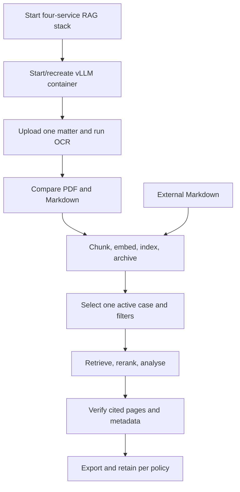
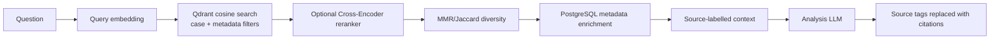

# Medicolegal document analysis and RAG workflow

This guide describes the workflow KIRAG actually implements for practitioners
reviewing legal and medical records. For installation, deployment, API, CLI,
and test commands, see [`README.md`](README.md).

> KIRAG is a document-review aid. OCR, heuristic metadata extraction, semantic
> retrieval, and LLM generation can all fail. Verify every material statement
> against the original record before relying on it.

## Operational boundaries

KIRAG is **local-first**, not unconditionally offline:

- The supplied Docker services and managed vLLM port bind to `127.0.0.1`.
- Model downloads contact Hugging Face.
- OCR and analysis URLs are configurable. A remote URL sends prompts, images,
  or document-derived context to that service.
- PostgreSQL, Redis, MinIO, and Qdrant hosts are also configurable.
- KIRAG does not encrypt data at rest or certify compliance with HIPAA, the
  Australian Privacy Act, privilege rules, or an organisation's retention
  policy. Compliance depends on deployment and operational controls.

Use full-disk encryption, restricted filesystem permissions, protected backups,
separate API/admin secrets, and a documented retention policy. Do not expose
the backing-service ports publicly.

## The implemented workflow



The four RAG services are distinct from the `olmocr` vLLM inference container:

| Service | Loopback port | Role |
|---|---:|---|
| PostgreSQL | 5432 | Run, document, and chunk registry |
| Redis | 6379 | Active embedding cache and counters; query/chat cache helpers also exist |
| MinIO | 9000/9001 | PDF and Markdown object storage/console |
| Qdrant | 6333/6334 | Dense vectors and payload filters |
| vLLM (`olmocr`) | 8000 by default | OCR and analysis model endpoint |

The Compose images are digest-pinned in
[`docker-compose.rag.yml`](docker-compose.rag.yml). Persistent service data is
stored beneath `workspace/` in a checkout deployment.

## 1. Start and initialise the RAG services

Preferred options:

- Gradio: RAG Processing → **RAG Infrastructure** → **Start**.
- CLI: `kirag rag infra start`.
- API: `POST /api/rag/infra/start` with a configured API key.

KIRAG runs `docker compose up -d --wait`, then initialises the PostgreSQL
schema, the `olmocr-pdfs` and `olmocr-markdown` MinIO buckets, and the active
embedding model's Qdrant collection. Starting Compose directly does not invoke
those application initialisers.

API example:

```bash
curl -H "X-API-Key: $KIRAG_API_KEY" \
  -X POST http://127.0.0.1:8001/api/rag/infra/start
curl -H "X-API-Key: $KIRAG_API_KEY" \
  http://127.0.0.1:8001/api/rag/infra/status
```

Infrastructure **stop** is an admin-authorised API action. Infrastructure
**start** currently requires general API authentication but not the additional
admin dependency.

## 2. Start the inference model

The Gradio sidebar manages one labelled Docker container named `olmocr`. The
default model is `allenai/olmOCR-2-7B-1025-FP8`. The manager:

- requires an allowlisted model unless the advanced override is enabled;
- requires an immutable digest-pinned image;
- refuses to remove a foreign, unlabelled container that happens to use the
  `olmocr` name;
- refuses a host-port conflict rather than deleting the occupying container;
- binds the chosen host port to `127.0.0.1`;
- passes `--gpus all`, a configured GPU-memory fraction, maximum model length,
  and tensor-parallel size to vLLM;
- disables remote model code unless the separate fail-closed controls are met.

In Gradio, choose the model and resource settings, then use **Recreate & Run**.
Use **Start** only when a managed container already exists. API create/start,
stop, and shutdown operations require the dedicated admin key.

One managed container can serve the selected OCR or analysis model at a time.
If the requested analysis model is not loaded, the analyser probes `/models`,
uses a known equivalent where possible, otherwise falls back to the first
loaded model and emits a warning. For reproducible work, confirm the loaded
model rather than relying on fallback.

## 3. Ingest a PDF matter

### Gradio

In **Ingestion Pipeline**:

1. Upload PDFs for one matter only.
2. Confirm the vLLM URL and OCR model.
3. Adjust workers, concurrent requests, image dimension, retries, and guided
   decoding only when required.
4. Start batch processing and monitor per-page/per-file status and logs.
5. Use Stop to request termination if necessary.

The process checks `GET <server_url>/models`, creates a directory named
`run_<timestamp>_<uuid-prefix>`, copies the PDFs into `inputs/`, and starts
`python -m olmocr.pipeline` in the run directory. Successful Markdown is
expected under `markdown/inputs/`; JSONL under `results/` supplies character to
PDF-page mappings.

The in-memory pipeline `run_id` used to stop or monitor an OCR process is a UUID.
It is different from the 16-character path-derived `run_id` created later for
the indexed case.

### REST API

The API never accepts an arbitrary client filesystem path. Upload first, then
pass only the opaque filenames returned by the upload endpoint:

```bash
curl -H "X-API-Key: $KIRAG_API_KEY" \
  -F 'files=@report-a.pdf;type=application/pdf' \
  -F 'files=@report-b.pdf;type=application/pdf' \
  http://127.0.0.1:8001/api/pipeline/upload

curl -N -H "X-API-Key: $KIRAG_API_KEY" \
  -H 'Content-Type: application/json' \
  -d '{
    "file_paths": ["OPAQUE_A.pdf", "OPAQUE_B.pdf"],
    "server_url": "http://localhost:8000/v1",
    "model_name": "allenai/olmOCR-2-7B-1025-FP8",
    "workers": 4,
    "max_concurrent": 20,
    "max_retries": 8,
    "target_dim": 1288,
    "guided_decoding": true
  }' \
  http://127.0.0.1:8001/api/pipeline/start
```

The start response is Server-Sent Events. Upload defaults are at most 20 PDFs,
100 MiB per PDF, and 500 MiB aggregate; environment variables in
[`.env.example`](.env.example) can change them. File count, aggregate size,
per-file size, content type, PDF magic, and parseability are validated.

The CLI can list, inspect, and stop runs, but it does not start OCR ingestion.

## 4. Verify the OCR output

Use **Layout Inspector** after OCR:

1. Select the processed Markdown file.
2. Compare the original PDF, raw Markdown, and rendered Markdown.
3. Review page-by-page and use the page controls. Full Document is useful for
   structure; it is not a substitute for page-level comparison.
4. Check tables, multi-column reading order, negatives, dates, decimal values,
   dosages, names, signatures, and handwritten or low-contrast material.
5. Download the individual Markdown or the run ZIP if it belongs in the matter
   record.

“Sync Scroll” is a browser-side convenience and is not a verified coordinate
alignment. A correct-looking Markdown render is not proof that source text was
captured accurately.

Do not index a material OCR error merely to continue the workflow. Correct the
source/extraction process and retain an audit note explaining any manual
correction required by local policy.

## 5. Configure chunking and embeddings

The **Embedding Pipeline** persists these settings:

- embedding model;
- `auto`, `cuda`, or `cpu` device;
- embedding batch size (Gradio range 16–512);
- maximum chunk size (Gradio range 200–2,000 characters);
- chunk overlap (Gradio range 0–500 characters).

The default is `BAAI/bge-large-en-v1.5`, device `auto`, batch size 64, chunk
size 800 characters, and overlap 100 characters. `auto` uses CUDA when PyTorch
reports it available, otherwise CPU.

Chunk size and overlap are **characters**, despite legacy constant names that
refer to tokens. The splitter:

1. detects heuristic letter/report boundaries and avoids boundaries closer
   than 200 characters;
2. splits oversized sections near paragraph, sentence, or newline boundaries;
3. overlaps adjacent chunks by the configured character count;
4. extracts metadata with regular expressions and classifiers.

Extracted dates, authors, document types, section types, and patient names are
heuristics. A missing or incorrect value affects filters, dashboard summaries,
and citations; it does not change the source record.

Each embedding model uses a collection name derived from its model ID. Changing
the model switches the active collection. Existing vectors are not converted or
copied, so re-index the relevant runs into the new collection before querying.
Clearing the embedding cache clears Redis embeddings; it does not delete the
Qdrant collection.

## 6. Index an OCR run

Use Embedding Pipeline → **Index Selected Run** or **Index All Runs**, or:

```bash
kirag pipeline runs
kirag rag index /exact/configured/workspace/run_name
```

The CLI path must resolve exactly to a direct child of KIRAG's configured
workspace. The API differs: it takes the run directory **name** and is admin
protected:

```bash
curl -H "X-Admin-API-Key: $KIRAG_ADMIN_API_KEY" \
  -H 'Content-Type: application/json' \
  -d '{"run_dir":"run_20260726_120000_ab12cd34"}' \
  http://127.0.0.1:8001/api/rag/index
```

Indexing performs the following logic:

1. Validate that the run is directly beneath the configured workspace.
2. Derive the indexed `run_id` from the first 16 hex characters of SHA-256 of
   the resolved run path.
3. Read every safe `.md` file under `markdown/inputs/` and match JSONL page maps
   by source filename.
4. Produce deterministic document, chunk, and Qdrant point identifiers.
5. Create/use the embedding model's Qdrant collection.
6. In one PostgreSQL pending-to-indexed transaction, replace the affected
   documents/chunks while journalling exact Qdrant point mutations.
7. Restore overwritten points and remove newly created points if vector/database
   indexing fails.
8. After commit, upload available Markdown and matching PDFs to MinIO.
9. Invalidate the query cache.

Ordinary indexing skips a run already reported as indexed. API indexing and
`index-all` force processing of the documents present. `--full-reindex` is the
explicit CLI operation that also removes documents/vector points no longer
present in the run. Use it only after confirming that the run directory is the
authoritative complete matter set.

MinIO is non-authoritative in this transaction: an upload failure is reported
as a warning after PostgreSQL/Qdrant commit. Confirm storage separately if your
retention procedure requires it.

Use the read-only reconciliation report to identify PostgreSQL/Qdrant drift:

```bash
kirag rag reconcile
kirag rag reconcile --run-id RUN_ID --fail-on-drift
```

Reconciliation reports drift; it does not repair it.

## 7. Add external Markdown

Use **Direct External Markdown Upload & Indexing** to create a new case or add
files to an indexed case. The API equivalent is multipart
`POST /api/rag/upload-markdown`. Defaults are 20 files, 10 MiB each, and 50 MiB
aggregate. Uploaded content must be valid UTF-8 without NUL bytes.

For a new case, KIRAG sanitises the supplied case name and creates
`run_<sanitised-name>_<timestamp>`. For an existing case, the selected value is
the indexed 16-character run ID. The staged filename used by an ingestion path
deterministically identifies a document within a case; replacing that stored
filename replaces its database rows, vectors, and local Markdown after
successful staging. The REST upload route assigns an opaque stored filename, so
re-uploading the same client-side filename is not an update-by-name contract.

External Markdown is always indexed with:

- `provenance_type = external_markdown`;
- no PDF page mapping;
- zero recorded PDF pages;
- Markdown-only MinIO archival.

Do not claim PDF page provenance for direct Markdown uploads, even if the text
contains typed page labels. The generated citation must say that no
original-PDF page provenance exists.

### Advanced manual run structure

A manually prepared run can be discovered when it is a safe directory directly
beneath the configured workspace and contains:

```text
run_matter_name/
├── inputs/
│   └── source.pdf
├── markdown/
│   └── inputs/
│       └── source.md
└── results/
    └── output.jsonl
```

A page-map line uses the olmOCR structure:

```json
{"metadata":{"Source-File":"source.pdf"},"attributes":{"pdf_page_numbers":[[0,2450,1],[2450,4800,2]]}}
```

Each triple is `[character_start, character_end, PDF_page_number]`. KIRAG
matches `Source-File`'s basename with the corresponding `.md` filename; it also
tries the Markdown name after removing a leading numeric prefix such as `0_`.
Without a matched, non-empty map, the provenance is “Markdown without PDF page
map” and citations must state that original-PDF page provenance is absent.

The direct external-Markdown uploader does not consume a separately supplied
JSONL map or PDF. Use a correctly structured manual run if preserved page
provenance is required.

## 8. Scope and run a RAG query

In RAG Processing:

For Qwen3-family analysis models, KIRAG disables thinking in its chat requests so
responses and exports contain only the user-facing answer. The managed vLLM
container also enables the `qwen3` reasoning parser for advanced callers that
explicitly opt into reasoning. Use the verified `Qwen/Qwen3.6-35B-A3B` model;
the incompatible NVIDIA NVFP4 checkpoint is intentionally excluded from the
managed selector.

1. Select a specific **Active Case**. “All Cases” deliberately removes the
   `run_id` filter and can mix matters.
2. Optionally filter by document type, author, and inclusive ISO date range.
3. Confirm analysis server/model, Top-K, reranker model/device, and reranker
   checkbox.
4. Choose an analysis mode and submit a precise question.
5. Stop streaming if necessary; then verify the answer.

The retrieval path is:



Structured modes (Timeline, Injury Summary, Inconsistency Finder, Medication
Tracker) raise retrieval to at least 50 chunks and use a 0.05 score threshold.
The configured/query Top-K therefore does not cap those modes at a smaller
value. If context exceeds the analysis model budget, least-relevant chunks are
dropped until the prompt fits, and KIRAG emits a warning.

The five modes are prompt templates, not deterministic report generators:

| Mode | Intended output |
|---|---|
| Free Q&A | A source-grounded answer to the question |
| Timeline | Chronological Markdown table |
| Injury Summary | Structured injury/treatment summary |
| Inconsistency Finder | Compared discrepancies and gaps |
| Medication Tracker | Medication references and changes |

For high-stakes work, ask narrow questions and repeat searches with appropriate
filters. Absence from a RAG response does not prove absence from the record.

## 9. Citation and verification rules

Internally, retrieved excerpts are labelled `[Source N]`. The final streaming
layer replaces recognised tags with available metadata. A final practitioner
report must not expose raw source-number tags.

For every material event or claim:

1. Cite the exact original PDF page or page range only when the character map
   supplies both endpoints for the chunk.
2. Include the original filename.
3. Include document type, date, and author/clinic only when supplied by source
   metadata/extraction; remember those fields are heuristic.
4. Include a reference, claim, or accession number only when it is present in
   the retrieved excerpt.
5. If only a start page exists, state that the end page is not present.
6. If page provenance is absent, say so. For direct external Markdown, say
   “external Markdown; no original-PDF page provenance”.
7. Open the original PDF and verify the page, heading/title, authoring
   practitioner or clinic, patient identity, date, and identifying number.

The replacement logic can leave malformed or unrecognised model-generated
source text unchanged. Before export, search the answer for `[Source`, bare
`Source N`, unsupported pages, and invented verification details.

## 10. Export and retain outputs

KIRAG writes exports beneath `workspace/exports/` (or the fallback workspace):

- `.md`: full chat with mode/case metadata;
- `.txt`: plain-text chat;
- `.csv`: tables extracted from timeline-style Markdown responses;
- `.docx`: formatted chat report with configurable firm letterhead;
- timeline `.docx`: formatted extracted timeline tables.

CSV/DOCX exports transform model output; they do not independently validate it.
Review the exported artifact, not just the chat view. No direct PDF export is
implemented.

## 11. Case isolation and deletion

Isolation is implemented by separate run directories, a `run_id` on database
rows and Qdrant payloads, run-prefixed MinIO keys, and an optional retrieval
filter. It is not a multi-tenant security system: users with workstation/API
access can select All Cases and see corpus-wide information.

Case Dashboard metadata (names, DOB, injuries, authors, and dates) is extracted
heuristically from indexed text. Treat the cards as navigation aids, not
verified case facts.

Deleting selected cases or all cases removes:

- Qdrant vectors;
- PostgreSQL run/document/chunk records;
- MinIO objects;
- matching local run directories.

Delete All additionally sweeps valid run directories from the configured
workspace. The operation logs warnings and can continue when one backing-store
deletion fails, so confirm all stores after deletion when defensible erasure is
required.

System Diagnostics cleanup is different: selecting obsolete run directories
deletes inactive local run folders but does not delete indexed PostgreSQL,
Qdrant, or MinIO data. It can also clear `/tmp/gradio`, repository
`__pycache__` directories, or the user's Hugging Face cache. Model-cache cleanup
causes later downloads. These operations are destructive and not an archival
workflow.

## Daily close-out checklist

- Confirm the active case was correct for every saved query.
- Verify each material claim against the original PDF page(s).
- Remove raw `[Source N]` text and unsupported/invented metadata.
- Record OCR corrections and unresolved discrepancies under local procedure.
- Review exports for formatting or extraction loss.
- Confirm required MinIO objects exist if MinIO is part of the retention plan.
- Apply the matter's retention/deletion policy to run files, indexes, exports,
  audit logs, model caches, and backups.
- Do not treat UI roles, case filters, database registration, or an audit JSONL
  record as a complete authorisation or chain-of-custody system.
