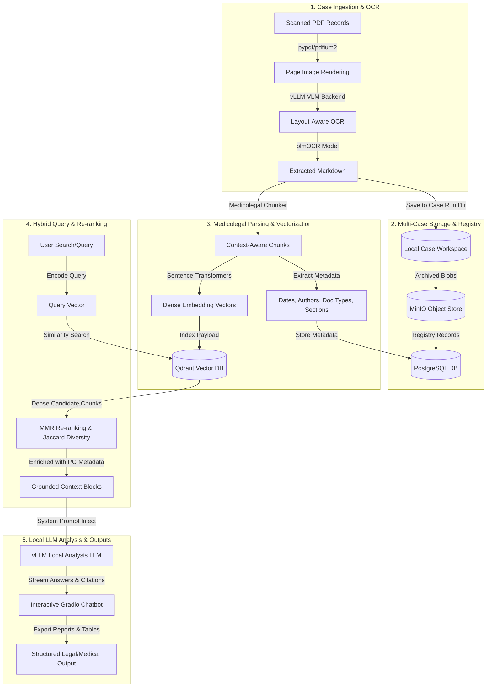
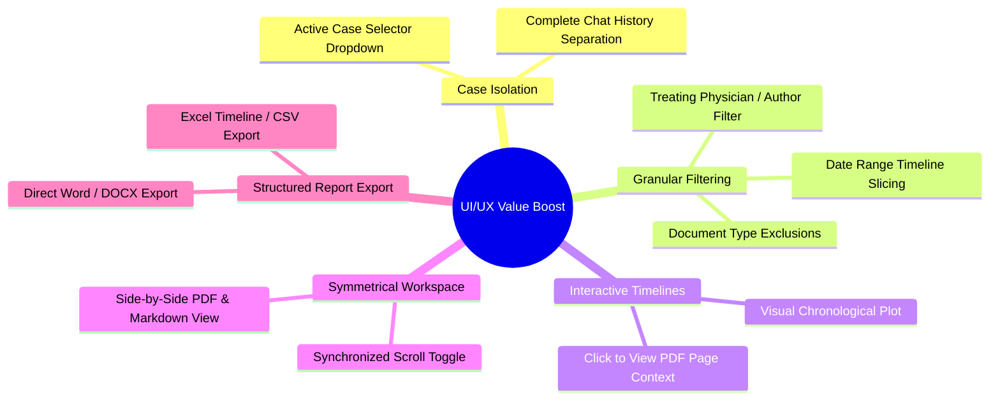

# Medicolegal Document Analysis & RAG Workflow: A Guide for Legal & Medical Experts

This guide outlines the systematic, layout-aware PDF OCR extraction, indexing, and Retrieval-Augmented Generation (RAG) routine implemented within the OLMOCR suite. It is designed to guide lawyers, medicolegal assessors, independent medical examiners (IMEs), and clinical auditors who manage a high volume of cases (3-5 cases per day) and require absolute case isolation, auditability, and structured clinical intelligence.

---

## 🗺️ System Workflow Overview

The diagram below illustrates how unstructured clinical and legal records are ingested, parsed, stored, and queried securely on local hardware.



---

## 🛠️ Step-by-Step Workflow Routine

### 1. Layout-Aware PDF-to-Markdown OCR
In medicolegal work, missing a single sentence in a specialist report, or misinterpreting a date, can alter the outcome of a legal case. Standard OCR systems discard visual structures (such as columns, signature blocks, tabular clinical logs, and side-by-side reports). The OLMOCR suite solves this using **vision-language models** (VLMs).

*   **Inference Engine**: Handled via a local vLLM container ([docker_manager.py](file:///home/owner/OLMOCR/docker_manager.py)) running under `vllm/vllm-openai` with complete GPU control.
*   **Default OCR Model**: `allenai/olmOCR-2-7B-1025-FP8`, a vision-language model trained specifically to read PDFs and output pristine, layout-aware Github-flavored Markdown.
*   **The Routine**:
    1. PDFs are uploaded through the Gradio dashboard ([app.py](file:///home/owner/OLMOCR/app.py)).
    2. The pipeline manager ([pipeline_manager.py](file:///home/owner/OLMOCR/pipeline_manager.py)) renders the pages into high-resolution images via `pypdfium2`.
    3. The pipeline executes the `olmocr.pipeline` subprocess.
    4. **Settings Control**: You can configure workers, max concurrent requests, and **Target Longest Image Dimension** (e.g. `2048px` is highly recommended for reading fine print in clinical handwritten notes or low-contrast scans).
    5. The engine converts pages into structured markdown text, preserving tables, lists, bullet points, headers, and signature lines.

---

### 2. Output Architecture & Case Registry
To establish a clear chain of custody and case isolation, the extracted markdown is archived both locally and in a robust storage stack.

*   **Local Storage**: Every run is compiled in `workspace/run_YYYYMMDD_HHMMSS_XXXX/`. Raw Markdown files are saved under `markdown/inputs/`. Symmetrical page rendering in the dashboard allows you to view the original PDF, raw Markdown, and HTML rendered output side-by-side.
*   **Object Storage**: Backed by a containerized MinIO server ([rag/storage.py](file:///home/owner/OLMOCR/rag/storage.py)), files are stored inside two persistent buckets:
    *   `olmocr-pdfs`: Original source files.
    *   `olmocr-markdown`: Extracted Markdown logs.
    *   Both are indexed under a unique key structure: `run_id/doc_id/filename`.
*   **PostgreSQL Registry**: Configured in [rag/db.py](file:///home/owner/OLMOCR/rag/db.py), this relational database tracks runs, documents, and chunk-level metadata.

---

### 3. Selecting the Embedding Model
Before indexing, the markdown must be converted into numerical vectors to allow semantic searches.

*   **Embedding Client**: Powered by HuggingFace `sentence-transformers` ([rag/embedding.py](file:///home/owner/OLMOCR/rag/embedding.py)).
*   **Default Choice**: `sentence-transformers/all-MiniLM-L6-v2` (Fast, lightweight, 384-dimensional vectors).
*   **Medicolegal Recommended Choice**: `BAAI/bge-large-en-v1.5` (1024-dimensional vectors). This model is highly recommended for legal/clinical applications because it captures complex medical jargon and legal arguments more effectively.
*   **Collision Prevention**: Different embedding models generate vectors of different lengths. If you change models in the settings, the system automatically isolates collections using `get_collection_name(model_name)` (e.g., `olmocr_documents_all-minilm-l6-v2`), avoiding data corruption or vector dimension clashes in Qdrant.

---

### 4. Medicolegal-Aware Ingestion & Indexing
Generic RAG systems split text strictly by character length, which breaks clinical lists or doctor signatures. The OLMOCR system uses a **custom medicolegal chunker** ([rag/chunker.py](file:///home/owner/OLMOCR/rag/chunker.py)).

*   **Section Boundary Detection**: Detects letters, reports, transmission headers, and GP clinical note headers (`_split_into_sections`) and splits them into distinct logical document sections.
*   **Overlap Chunks**: Splitting is done at double newlines (paragraphs) and sentences with a max length of `800` characters and `100` characters of overlap to maintain narrative continuity.
*   **Clinical Metadata Extraction**: For every text chunk, regex patterns and rules extract:
    1.  **ISO Dates**: Standardizes dates (e.g., `12.02.18`, `Aug 27, 2020`) to `YYYY-MM-DD`. This is essential for timeline generation.
    2.  **Authors**: Extracts name and title (e.g. `Dr. Jane Smith (Physiotherapist)`) from signature blocks and clinical headers.
    3.  **Document Classifications**: Classifies documents as `specialist_letter`, `clinical_notes`, `referral_letter`, `physiotherapy_report`, `radiology_report`, or `medicolegal_report`.
    4.  **Section Classifications**: Categorizes chunks into `clinical_findings`, `history`, `medications`, `diagnosis`, or `treatment_plan`.
    5.  **Patient Identifiers**: Captures patient name from headers (e.g. `Re: John Doe DOB: ...`).
    6.  **Page Mapping**: Maps each chunk to its source PDF page number.
*   **Database Ingestion**:
    *   **PostgreSQL Registry**: Stores the run registry, documents, and rich chunk metadata.
    *   **Qdrant Vector DB**: Stores the vector embeddings alongside metadata payloads for rapid, filtered semantic lookups.

---

### 5. Selecting a Local Analysis LLM
Once context is retrieved, a local LLM is queried through an OpenAI-compatible API served by vLLM.

| Model Type | Recommended Model | Strengths | Best Used For |
| :--- | :--- | :--- | :--- |
| **Instruct Models** | `nvidia/Llama-3.3-70B-Instruct-NVFP4` | High speed, reliable formatting, strict instruction adherence. | Writing reports, structured summaries, and listing medications. |
| **Reasoning Models** | `nvidia/Phi-4-reasoning-plus-NVFP4` | Multi-step logical thinking, hidden chain-of-thought analysis. | Finding record inconsistencies, resolving conflicting dates, complex audits. |

*   **Smart LLM Parameters**:
    *   **Reasoning Optimization**: For reasoning models, the analyzer ([rag/analyzer.py](file:///home/owner/OLMOCR/rag/analyzer.py)) overrides low temperatures (correcting `0.1` to `0.7`) to prevent logical loops, and adds a `1.05` repetition penalty.
    *   **Model Normalization**: Maps equivalent model tags (e.g., `microsoft/Phi-4-reasoning-plus` and `nvidia/Phi-4-reasoning-plus-NVFP4`) to prevent false-offline alerts.

---

### 6. Querying RAG & Saving Outputs
The RAG retrieval pipeline ([rag/retriever.py](file:///home/owner/OLMOCR/rag/retriever.py)) merges vector similarity with metadata constraints, utilizing **Maximal Marginal Relevance (MMR)** and Jaccard distance to retrieve relevant, diverse text chunks.

#### Analysis Modes & Prompt Templates
The system supports five specialized prompts ([rag/analyzer.py](file:///home/owner/OLMOCR/rag/analyzer.py)) tailored for medical and legal workflows:

1.  **💬 Free Q&A**: Answers user questions based strictly on the retrieved medical records.
    *   *Constraint*: Must cite source number, filename, page, and date for every factual claim. Hallucinations are prohibited.
2.  **📅 Timeline Generator**: Compiles a strict chronological table of clinical events.
    *   *Output format*: Markdown table: `Date | Event | Provider/Author | Source`.
3.  **🏥 Injury Summary**: Extracts details regarding the injury's mechanism, diagnoses, outcomes, treatments, and outstanding issues.
    *   *Output format*: A structured legal report with numbered headings.
4.  **🔍 Inconsistency Finder**: Compares reports to highlight contradictions between clinicians (e.g. differing ranges of motion, conflicting injury dates, or discordant treatment recommendations).
    *   *Output format*: Table displaying: `Issue | Source A Claims | Source B Claims | Severity (Minor/Moderate/Major)`.
5.  **💊 Medication Tracker**: Tracks prescriptions, changes, and drug lists.
    *   *Output format*: Table listing: `Medication | Dose/Frequency | Date Started | Date Stopped | Prescriber | Source`.

#### Exporting & Saving Outputs
*   **Chatbot Logs**: Outputs are generated in the Gradio chat window ([rag_ui.py](file:///home/owner/OLMOCR/rag_ui.py)) with quick-copy buttons.
*   **Persistent Runs**: All search queries, retrieved chunks, and conversation logs are cached in PostgreSQL and Redis. The results can be compiled into PDF reports or Word documents for legal submissions.

---

## 📂 Integrating Saved Markdowns from Previous Conversions

If you have already processed PDF documents into Markdown (either through prior OLMOCR runs or another layout-preserving OCR tool), you can easily integrate these files into the RAG system as a separate case. 

### 1. Prepare the Case Directory Structure
Create a folder structure inside the `workspace` directory that mimics the OLMOCR run output. The folder name must start with the prefix `run_` to be auto-detected by the scanner:

```
workspace/
└── run_previous_conversion_case_xyz/
    ├── inputs/
    │   └── [Case_Documents].pdf        <-- (Optional: Place original PDFs here to enable side-by-side UI preview)
    └── markdown/
        └── inputs/
            ├── 0_medical_report.md     <-- Extracted Markdown files (required)
            └── 1_radiology_scan.md
```

### 2. Register and Index the Case
1.  Open the OLMOCR Web Application.
2.  Navigate to the **🧠 Document Analysis (RAG)** section at the bottom of the page.
3.  Expand the **📦 Document Indexing** accordion.
4.  Click the **🔄 Refresh Stats** button. This rescans the `workspace/` directory.
5.  Select `run_previous_conversion_case_xyz` from the **Select OCR Run** dropdown menu.
6.  Click the **📥 Index Selected Run** button.
7.  Monitor progress in the **📜 RAG System Log** box below the chat window. The system will:
    *   Initialize/load the configured Embedding model (`SentenceTransformer`).
    *   Chunk the Markdown files at clinical section boundaries.
    *   Extract Patient Name, Dates, Authors, and Doc Types.
    *   Compute vector embeddings and upsert them to Qdrant.
    *   Write metadata records into PostgreSQL (`ocr_runs`, `documents`, and `chunks`).

---

## ⚖️ Multi-Case Management for Legal & Medical Experts

Lawyers, clinical auditors, and medicolegal examiners frequently manage **3-5 distinct cases per day**. Keeping these cases separated is crucial to avoid cross-contamination of client data and preserve confidentiality.

### 1. Isolated Workspace Directories
Each upload batch or imported conversion is isolated to its own `workspace/run_[Case_ID]/` folder. This physical separation prevents files from different cases from mixing on disk.

### 2. Relational Registry and Run Identifiers
Every document and chunk in the system is tagged with a unique `run_id` (which is a deterministic hash of the run's workspace directory path). In PostgreSQL, the foreign key relationships guarantee that:
*   A query can target a specific run.
*   Deleting a run via `delete_run_data(run_id)` automatically cascades and purges all documents and chunk metadata records associated with that case.

### 3. Vector Database Namespace Isolation
Vector embeddings are upserted into Qdrant alongside a payload containing the `run_id`.
*   **Search Isolation**: During RAG queries, you can isolate searches to a single client by passing the `run_id_filter` parameter. This instructs Qdrant to perform semantic lookups strictly on points matching that specific run, avoiding leakage of clinical details from other cases.
*   **Deletion**: Deleting a case removes its vectors from Qdrant via `delete_run_vectors(run_id)`, leaving other cases unaffected.

### 4. Clearing Resources Between Cases
When wrapping up a case and transitioning to the next, experts should clean up intermediate caches and temp files to reclaim system memory and disk space:
1.  Expand the **🧹 Reset & Cleanup** accordion in the left sidebar.
2.  Select **Obsolete run directories** (if you no longer need the local files) and **Gradio upload temp files** (which build up quickly when uploading multi-hundred-page PDFs).
3.  Click **🧹 Clean & Reset**.

---

## 🚀 Crucial UI/UX Enhancements to Increase Project Value

To scale the RAG pipeline for high-throughput daily workflows, the following UI/UX elements are critical to optimize lawyer productivity and accuracy:



### 1. Active Case Selector in RAG Chat
*   **Current State**: The chat interface queries the entire indexed corpus.
*   **UX Optimization**: Add an "Active Case" dropdown directly above the chat window. When a case is selected, the frontend automatically applies the corresponding `run_id` as a `run_id_filter` in the background search query.
*   **Value**: Prevents critical clinical details from Client A from showing up in a report summary generated for Client B.

### 2. Interactive Filter Controls (Date, Author, Doc Type)
*   **Current State**: Advanced metadata filtering is implemented in python (`retriever.py`) but not exposed to the user.
*   **UX Optimization**: Add a collapsible "Search Filters" panel to the chat interface:
    *   **Author list**: A multi-select checklist populated dynamically from unique authors in the case.
    *   **Document type list**: Checklist filtering for radiology scans, clinical notes, or specialist letters.
    *   **Timeline Slider**: A double-ended date slider to isolate searches to specific time ranges (e.g. post-accident treatment vs pre-existing history).
*   **Value**: Dramatically increases RAG accuracy by filtering out irrelevant historical notes or unrelated clinical records.

### 3. Symmetrical, Synchronized Annotation Workspace
*   **Current State**: Symmetrical scrolling is available for side-by-side PDF and Markdown, but annotation is read-only.
*   **UX Optimization**: Allow users to highlight text directly on the rendered markdown preview or the PDF. These highlights can be labeled as "Disputed", "Critical", or "Prior Condition", and instantly saved as annotated metadata chunks.
*   **Value**: Enables legal teams to flag key evidence directly within the case records for later extraction.

### 4. Interactive Clinical Timelines
*   **Current State**: The Timeline Generator outputs a static markdown table.
*   **UX Optimization**: Display the generated timeline as an interactive graphical flow. Clicking an event on the timeline should highlight the source node and automatically scroll the side-by-side PDF viewer to the exact page where the event was cited.
*   **Value**: Saves hours of manual verification, making the RAG system an auditable source of truth for litigation.

### 5. Single-Click Structured Report Export
*   **Current State**: Output is text in the Gradio chat window.
*   **UX Optimization**: Add direct download buttons under the chat window:
    *   `Export Medical Chronology (Excel)`
    *   `Export IME Injury Summary (Word - DOCX format with firm letterhead)`
*   **Value**: Converts raw RAG answers into finalized deliverables instantly, saving hours of copy-pasting and formatting.

---

## ⚖️ Best Practices for Medicolegal Experts & Lawyers

1.  **Verify Citations**: Always cross-reference the generated answer with the cited source page using the side-by-side document viewer.
2.  **Isolate Cases**: When starting a new case, run a separate upload batch, and index it as an isolated run. Keep your active case filter enabled during analysis.
3.  **Local Deployment for PHI**: Ensure the application is deployed on a secure, local network or offline workstation. This guarantees that Protected Health Information (PHI) never leaves your custody, satisfying data privacy compliance (such as HIPAA).
